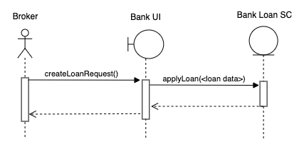

Save Values to Smart Contract
===============================

In this section we discuss about how to save values in smart contract.
We use apply loan use case as example in this section..

.. image:: ../images/apply_loan.png

Brokers can apply for loans. You can see the Apply Loan menu item in the Brokers menu.
Apply Loan menu item will direct the user to ``/broker/apply-loans``.
In Next.js it means the code placed inside the ``pages/broker/apply-loans.js``

In ``apply-loans.js`` it loads the ``LoanForm`` from ``components/loan`` directory as below. ::

    import React from 'react';
	import { Row, Col } from 'antd';
	import LoanForm from '../../components/loan/LoanForm';
	...

	function ApplyLoans() {
		return (
			<>
				<Row gutter={[16, 16]}>
					<Col span={24}>
						<LoanForm />
					</Col>
					...
				</Row>
			</>
		);
	}

	export default ApplyLoans;

*LoanForm* component contains all the functions and to create a new loan entry in the *BankLoan* smart contract.
Inside the LoanForm first it imports the neccessary dependencies and UI components.

We access the *BankLoanContract* smart contract object within the *LoanForm* using React Context as follows. ::

    const { BankLoanContract } = useContext(AuthContext);

Using this *BankLoanContract* smart contract we can access call the Bank Loan smart contract methods.
Next we discuss about how to add a new entry to the Bank Loan smart contract using *applyLoan* smart contract method.

Sequence diagram for create new loan request. 

First we define the form to submit loan details as follows. ::

		<Card title="Loan Request">
			<Form
				...
				onFinish={createLoanRequest} // createLoanRequest function will execute when user submit the loan form.
			>
				{/* Name property value(amount) will use to capture the Input field value when submit the form */}
				<Form.Item label="Amount" name="amount" rules={[{ required: true, message: 'Please enter amount!' }]}>
					<InputNumber
						min="0"
						style={{ width: '100%' }}
						placeholder="Enter amount"
					/>
				</Form.Item>
				<Form.Item label="Period" name="period" rules={[{ required: true, message: 'Please enter period!' }]}>
					<InputNumber
						min="0"
						style={{ width: '100%' }}
						placeholder="Enter loan period"
					/>
				</Form.Item>
				<Form.Item label="Interest" name="interest" rules={[{ required: true, message: 'Please enter interest!' }]}>
					<InputNumber
						min="0"
						style={{ width: '100%' }}
						placeholder="Enter interest rate"
					/>
				</Form.Item>
				<Form.Item label="Plan ID" name="planId" rules={[{ required: true, message: 'Please enter plan id!' }]}>
					<Input
						placeholder="Enter plan id"
					/>
				</Form.Item>
				<Form.Item label="Borrower" name="borrower" rules={[{ required: true, message: 'Please enter borrower!' }]}>
					<Input
						min="0"
						style={{ width: '100%' }}
						placeholder="Enter plan id"
					/>
				</Form.Item>
				<Form.Item label="Broker Fee" name="brokerFee" rules={[{ required: true, message: 'Please enter Broker Fee!' }]}>
					<InputNumber
						min="0"
						style={{ width: '100%' }}
						placeholder="Enter broker fee"
					/>
				</Form.Item>
				<Form.Item wrapperCol={{
					lg: { span: 14, offset: 3 },
					xl: { span: 14, offset: 2 },
					xxl: { span: 14, offset: 2 } }}
				>
					{/* Form submit button */}
					<Button type="primary" htmlType="submit">Request loan</Button>
				</Form.Item>
			</Form>
		</Card>

Each form item has name attribute.
When user submits the form it will execute the function pass to the ``onFinish`` property of the form.
It will pass the form field valus as an object to the ``onFinish`` function.
In our case we set ``createLoanRequest`` method as the ``onFinish`` function.

Then we discuss about the ``createLoanRequest`` function in the *LoanForm*.

The ``createLoanRequest`` function will create new loan in the Bank Loan smart contract. ::

    const createLoanRequest = async (values) => {
		try {
			const accounts = await window.ethereum.enable(); // Get the selected account from the metamask plugin.

			// Call applyLoan method of the Bank Loan Contract.
			// Following parameters can be captured using their name property on the form item.
			// Parameters:
			// 		amount - loan amount
			//		period - loan duration
			//		interest - loan interest
			//		planId - loan plan id
			//		borrower - borrower of the loan
			//		brokerFee - broker fee of the loan
			await BankLoanContract.methods.applyLoan(
				values.amount,
				values.period,
				values.interest,
				values.planId,
				values.borrower,
				values.brokerFee,
			).send({ from: accounts[0] }); // Meta mask will return the selected account as an array. This array contains only one account address.
			message.success('New loan requested successfully');
		} catch (err) {
			console.log(err);
			message.error('Error creating loan request');
		}
	};

This uses Async/await functionality and save data on the blockchain. 
``values`` parameter contains the form field values submitted through the form.
Field values can access using their name property. 
As an exapmle; ``values.amount`` will return the value submitted through the ``Amount`` field in the form.
First it will identify the account which is selected in MetaMask.
Then it will call the *applyLoan* method of Bank Loan smart contract.
Since this method will change the blockchain state it may use GAS and we should use send method to execute the *applyLoan* method.
Account selected in the metamask will provide GAS for this transaction and account will pass as from account.

When submit the form Metamask will show a popup message to confirm the transaction.
Gas fees will reduced from the selected account in the Metamask.

If there is any error while trying to save new loan in the blockchain Metamask will warn you before you confirm the transaction.

If loan saved in the Bank Loan smart contract successfully it will show success message in top center of the page.

This is how we save data to smart contracts using form submisson.

Complete LoanForm react component. ::

	import React, { useState, useContext } from 'react';
	import { Card, Form, InputNumber, Input, Button, message } from 'antd';
	import AuthContext from '../../stores/authContext';

	function LoanForm() {
		const { BankLoanContract } = useContext(AuthContext); // Get the Bank Loan Contract instance defined in the 'stores/authContext.js'

		const createLoanRequest = async (values) => {
			try {
				const accounts = await window.ethereum.enable(); // Get the selected account from the metamask plugin.

				await BankLoanContract.methods.applyLoan(
					values.amount,
					values.period,
					values.interest,
					values.planId,
					values.borrower,
					values.brokerFee,
				).send({ from: accounts[0] }); // Meta mask will return the selected account as an array. This array contains only one account address.
				message.success('New loan requested successfully');
			} catch (err) {
				console.log(err);
				message.error('Error creating loan request');
			}
		};

		return (

			<Card title="Loan Request">
				<Form
					labelCol={{
						lg: 3,
						xl: 2,
						xxl: 2,
					}}
					wrapperCol={{
						lg: 14,
						xl: 12,
						xxl: 10,
					}}
					layout="horizontal"
					size="default"
					labelAlign="left"
					onFinish={createLoanRequest} // createLoanRequest function will execute when user submit the loan form.
				>
					{/* Name property value(amount) will use to capture the Input field value when submit the form */}
					<Form.Item label="Amount" name="amount" rules={[{ required: true, message: 'Please enter amount!' }]}>
						<InputNumber
							min="0"
							style={{ width: '100%' }}
							placeholder="Enter amount"
						/>
					</Form.Item>
					<Form.Item label="Period" name="period" rules={[{ required: true, message: 'Please enter period!' }]}>
						<InputNumber
							min="0"
							style={{ width: '100%' }}
							placeholder="Enter loan period"
						/>
					</Form.Item>
					<Form.Item label="Interest" name="interest" rules={[{ required: true, message: 'Please enter interest!' }]}>
						<InputNumber
							min="0"
							style={{ width: '100%' }}
							placeholder="Enter interest rate"
						/>
					</Form.Item>
					<Form.Item label="Plan ID" name="planId" rules={[{ required: true, message: 'Please enter plan id!' }]}>
						<Input
							placeholder="Enter plan id"
						/>
					</Form.Item>
					<Form.Item label="Borrower" name="borrower" rules={[{ required: true, message: 'Please enter borrower!' }]}>
						<Input
							min="0"
							style={{ width: '100%' }}
							placeholder="Enter plan id"
						/>
					</Form.Item>
					<Form.Item label="Broker Fee" name="brokerFee" rules={[{ required: true, message: 'Please enter Broker Fee!' }]}>
						<InputNumber
							min="0"
							style={{ width: '100%' }}
							placeholder="Enter broker fee"
						/>
					</Form.Item>
					<Form.Item wrapperCol={{
						lg: { span: 14, offset: 3 },
						xl: { span: 14, offset: 2 },
						xxl: { span: 14, offset: 2 } }}
					>
						{/* Form submit button */}
						<Button type="primary" htmlType="submit">Request loan</Button>
					</Form.Item>
				</Form>
			</Card>
		);
	}

	export default LoanForm;
