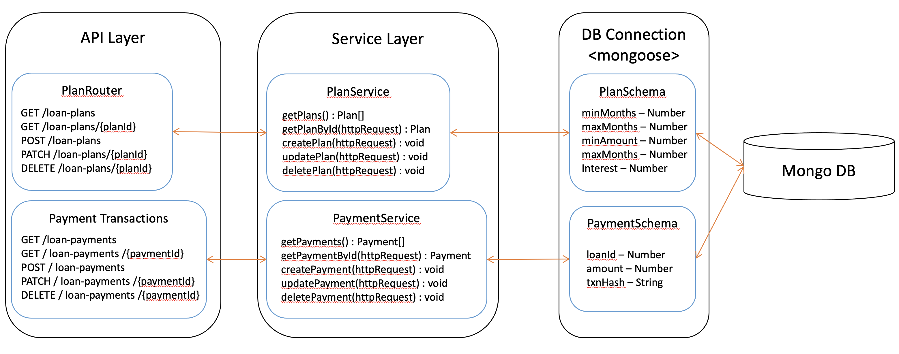

Layered Architecture
====================

The **Bank Web Server** follows a layered architecture.
It consists of three layers.

* API Layer - APIs for the Bank Web Server.
* Service Layer - Implemet server side logic.
* Data Layer - Implement database logic.

This diagram shows the layered architecture of the **Bank Web Server**.

API Layer
---------

The **Bank Web Server** servers two routes (incoming requests): ``/loan-plans`` and ``/loan-payments``.
As mentioned in the :ref:`bank-indexjs` section, requests coming to these routes directed to
the ``routes/plans`` and ``routes/payments`` scripts.

Both routes work in the same manner. 
We use the Plan route as an example to illustrate how it is handled.

The ``routes/plans`` script first import required dependencies: ::

    const Express = require('express') // Define Express web framework
    const router = Express.Router() // Import router module from Express.
    const planService = require('../services/planService'); // Import plan service script.

The ``plans`` router serves 4 HTTP request methods **GET**, **POST**, **PATCH**, and **DELETE**.

**Get All Loan Plans**

This function return all loan plans from the bank, stored in MongoDB.
When a user sends a GET request to the ``/loan-plans`` url in **Bank Web Server** via the web app, the function is invoked and calls ``planService.getPlans()``, returns loan plans to the user. ::

    router.get('/', async (req, res) => {
        try {
            const plans = await planService.getPlans();
            res.json(plans);
        }
        catch (err) {
            res.json({
                message: err
            })
        }
    })

This request has no parameter in the url and no json objects in the request body.

**Get Loan Plan By Loan Plan Id**

This function return a loan plan corresponding to the given plan id.
It passes the GET request to the ``planService.getPlanById()`` function and returns the loan plan. ::

    router.get('/:planId', async (req, res) => {
        try{
            const plan = await planService.getPlanById(req);
            res.json(plan);
        }
        catch(err){
            res.json({
                message: err
            })
        }
    })

This request has the Loan Plan Id as a parameter in the url, but no json object in the request body.

**Save Loan Plan**

When a user sends a POST request to the ``/loan-plans`` via the web app, this function passes the request to ``planService.createPlan()`` which returns the saved loan plan. ::

    router.post('/', async (req, res) => {
        try {
            const savedPlan = await planService.createPlan(req);
            res.json(savedPlan);
        }
        catch (err) {
            res.json({
                message: err
            })
        }
    })

This request has no parameter in the url but has a json object in the request body.

**Update Loan Plan**

When a user sends a PATCH request to the ``/loan-plans`` via the web app, the function updates the existing Loan Plan corresponding to Loan Plan Id stored in MongoDB.  It calls the ``planService.updatePlan()`` function, which returns the 
updated Loan Plan. ::

    router.patch('/:planId', async (req, res) => {
        try {
            const updatedPlan = await planService.updatePlan(req)
            res.json(updatedPlan);
        }
        catch (err) {
            res.json({
                message: err
            })
        }
    })

This request has the Loan Plan Id as a parameter in the url and the Loan Plan json object in the request body.

**Delete Loan Plan**

When user sends a DELETE request to the ``/loan-plans`` url it will delete the Loan Plan specified by the Loan Plan Id
in the request url. It will call the ``planService.deletePlan()`` function with the request 
and returns the deleted Loan Plan. ::

    router.delete('/:planId', async (req, res) => {
        console.log(req.params.planId);
        try {
            const plan = await planService.deletePlan(req);
            if(plan.deletedCount==0){
                res.status(404).send('Loan Plan not found');
            }
            res.json(plan);
        }
        catch (err) {
            res.json({
                message: err
            })
        }
    })

This request has the Loan Plan Id as a parameter in the url, but no json object in the request body.

With **Bank Web Server** up and running, we can navigate to ``localhost:9091/api-docs`` to see the
full Swagger API documentation for all APIs served by **Bank Web Server**.  This is not an essential feature but nice to have it.

Service Layer
-------------

We use service layer to implement business logic in the server.
The requests coming to the route will sends to the respective service layer methods.
As we mentioned before we will discuss about Loan Plans Service Layer implementation in this section.

First we import the model defined in the ``models/Plans`` script.
It defines the Mongoose Schema to interact MongoDB. ::

    const Plan = require('../models/Plans')

Then we define the planService as follows. ::
    
    const planService = {
        getPlans: async () => {
            const plans = await Plan.find()
            return plans;
        },
        getPlanById: async (req) => {
            const plans = await Plan.findById(req.params.planId);
            return plans;
        },
        createPlan: async (req) => {
            const plan = new Plan({
                minMonths: req.body.minMonths,
                maxMonths: req.body.maxMonths,
                minAmount: req.body.minAmount,
                maxAmount: req.body.maxAmount,
                interest: req.body.interest,
            })
            const savedPlan = await plan.save();
            return savedPlan;
        },
        updatePlan: async (req) => {
            const updatedPlan = await Plan.updateOne({ _id: req.params.planId },
                {
                    $set: {
                        minMonths: req.body.minMonths,
                        maxMonths: req.body.maxMonths,
                        minAmount: req.body.minAmount,
                        maxAmount: req.body.maxAmount,
                        interest: req.body.interest
                    }
                });
            return updatedPlan;
        },
        deletePlan: async (req) => {
            const deletedPlan = await Plan.deleteOne({ _id: req.params.planId });
            return deletedPlan;
        },
    }

``planService`` functions will use Mongoose Schema Queries to interact with the MongoDB.
You can learn more about these queries in `Mongoose Queries page <https://mongoosejs.com/docs/queries.html>`_

**getPlans()**

This method will find and return all Loan Plans from the MongoDB using Plan schema. 
It will use ``find`` Mongoose Query to get all loan plans from the MongoDB.

**getPlanById()**

This function will get the Loan Plan Id from the request url, find and return the Loan Plan using Plan schema.
It will use ``findById`` Mongoose Query to get the Loan Plan by Id from the MongoDB.

**createPlan()**

In this function it will create new Loan Plan in the MongoDB.
First it will create a Plan object using json object received from the request body.
Then it will use ``save`` Mongoos Query to save the new Loan Plan in the MongoDB.

**updatePlan()**

In this function it will update the existing Loan Plan specified by the Loan Plan Id.
It will get the Loan Plan Id from the request url and updated fields from the request body.
It will use the ``updateOne``Mongoose Query to update the object in the MongoDB.

**deletePlan()**

This function will delete the Loan Plan in the MongoDB using ``deleteOne`` Mongoose Query.
The Loan Plan Id will send as a request url parameter.

Data Layer
-----------

Data Layer represent the MongoDB.
This node server uses Mongoose to interact with the MongoDB.
It defines the schemas in the ``models`` directory.

We defined the Plans Schema as follows. ::

    const mongoose = require('mongoose')

    const PlanSchema = mongoose.Schema({
        minMonths: {
            type: Number,
            required: true
        },
        maxMonths: {
            type: Number,
            required: true
        },
        minAmount: {
            type: Number,
            required: true
        },
        maxAmount: {
            type: Number,
            required: true
        },
        interest: {
            type: Number,
            required: true
        },
    })

    module.exports = mongoose.model('Plans', PlanSchema)

We use the auto generated ``_id`` field for the Loan Plans.
Other than that Loan Plan has 5 fields. 

* ``minMonths`` - Minimum duration of a Loan.
* ``maxMonth`` - Maximum duration of a Loan.
* ``minAmount`` - Minimum tokens amount of the Loan.
* ``maxAmount`` - Maximum tokens amount of the Loan.
* ``interest`` - Interest rate of a Loan.

Each field was defined with it's type and required status.
These Schemas were used in the ``planService`` to query the MongoDB.
