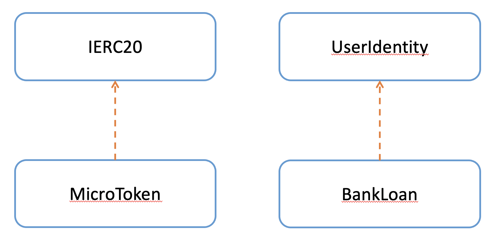
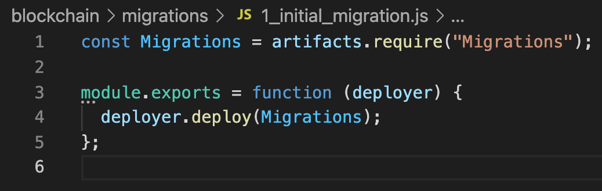

Smart Contract Migration
========================

Smart Contract Dependency Diagram
----------------------------------

The following diagram shows the dependency between smart contracts.
``MicroToken`` smart contract implements the ERC20 Token Interface (``IERC20``). 
``UserIdentity`` smart contract stores the stake holders' details.
``BankLoan``, ``InsurancePolicy``, ``LoanPayment`` smart contracts make use of the ``UserIdentity`` smart contract to verify users.

Migration
----------

Initial Migration
~~~~~~~~~~~~~~~~~

Truffle uses a migration contract to help manage the migration feature. 
This contract must contain a specific interface, but you're free to edit this contract at will. 
For most projects, this contract will be deployed initially as the first migration and won't be updated again.
You will also receive this contract by default when creating a new project with ``truffle init``.

Filename: ``contracts/Migrations.sol``

You must deploy this contract inside your first migration in order to take advantage of the migration feature. 
The following migration is provided by default when creating a new project with ``truffle init``:

Filename: ``migrations/1_initial_migration.js``

You can find more details in 
`Truffle Running Migration Page <https://www.trufflesuite.com/docs/truffle/getting-started/running-migrations>`_.

Micro Token Smart Contract Migration
~~~~~~~~~~~~~~~~~~~~~~~~~~~~~~~~~~~~

Migration code for the ``MicroToken`` smart contract: ::

    const MicroToken = artifacts.require("MicroToken");

    module.exports = function(deployer) {
        deployer.deploy(MicroToken);
    };

Filename: ``migrations/2_micro_token_migration.js``

At the beginning of the migration, we tell Truffle we'd like to interact with MicroToken via the ``artifacts.require()`` method. 
The name specified should match the name of the contract definition within that source file. 
Do not pass the name of the source file, as files can contain more than one contract.
Then we can use ``deployer.deploy`` method to deploy the ``MicroToken`` smart contract.

User Identity and Bank Loan Smart Contract Migration
~~~~~~~~~~~~~~~~~~~~~~~~~~~~~~~~~~~~~~~~~~~~~~~~~~~~

We use the following code to deploy UserIdentity and other smart contracts. ::

    const UserIdentity = artifacts.require("UserIdentity");
    const BankLoan = artifacts.require("BankLoan");

    module.exports = async function(deployer, network, accounts) 
    {
        await deployer.deploy(UserIdentity);
        const userIdentityInstance = await UserIdentity.deployed();

        await deployer.deploy(BankLoan, userIdentityInstance.address);
    };

Filename: ``migrations/3_user_identity_migration.js``

As describe in above migration, first we insert all the contracts we'd like to interact with
(UserIdentity and BankLoan).
As shown in the above *Smart Contract Dependency Diagram*, ``BankLoan`` smart contract needs the ``UserIdentity`` smart contract address to deploy. 
To achieve this first, we deploy the ``UserIdentity`` smart contract. 
We use async/await methods to deploy these contracts.
After deploying the ``UserIdentity`` smart contract, we wait for it to complete the deployment.
Then we deploy other three smart contracts with the ``UserIdentity`` smart contract address as a parameter.

Bank is the owner of the ``UserIdentity``, ``BankLoan``, and ``LoanPayment`` smart contracts.
For the ``InsurancePolicy`` smart contract, Insurance Company is the owner.
To fulfill this requirement, we deploy the ``InsurancePolicy`` smart contract using a different account.
We can define optional parameters as the third argument for the ``deployer.deploy`` function.
We specify the second account of the accounts array as the deployer account for the ``InsurancePolicy`` smart contract.
If we did not specify the deployer account, it will take the first account as the deployer account.

