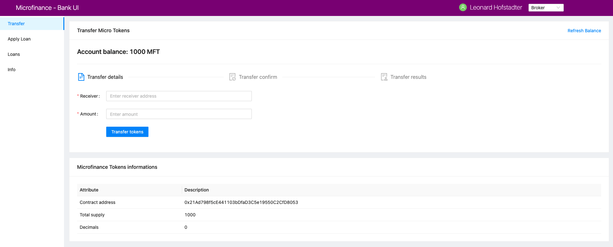
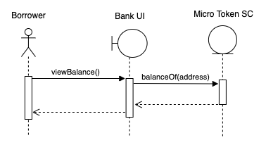

Read Values from Smart Contract
===============================

We discuss about how to read values from a smart contract.
We're gonna to see how to read account balance from the MicroToken smart contract as an example.

As shown in the screenshot above, the ``Transfer`` item in the left menu is common to all users (Bank, Broker, Borrower). 
It directs the user to ``/public/transfer``.
In Next.js, this means directing to the ``pages/public/transfer.js`` file.

``transfer.js`` loads the ``TransferController`` from the ``components/transfer/`` directory as follows: ::

    import React from 'react';
    import { Row, Col } from 'antd';
    import TransferController from '../../components/transfer/TransferController';
    import TokenInfo from '../../components/TokenInfo';

    function Transfer() {
        return (
            <>
                <Row gutter={[16, 16]}>
                    <Col span={24}>
                        <TransferController />
                    </Col>
                    <Col span={24}>
                        <TokenInfo />
                    </Col>
                </Row>
            </>
        );
    }

    export default Transfer;

``TransferController`` is the controller function for token transactions.  In ``TransferController.js``, 
it first imports the neccessary dependencies and UI components.
Then it defines the ``balance`` state  and assign the initial value of 0: ::

    const [balance, setBalance] = useState('0');

We access the **MicroToken** smart contract object within *TransferController* using React Context as follows. ::

    const { MicroTokenContract } = useContext(SmartContractContext);

Using this **MicroToken** smart contract, we can call functions in the smart contract.
Next we discuss about how to fetch the account balance from the **MicroTokenContract** account using its *balanceOf* method.

The sequence diagram for get token balance for a user. 

The *getBalance* function fetches the account balance from *MicroTokenContract* smart contract. ::

    const getBalance = async () => {
		try {
			const accounts = await window.ethereum.enable();
			const response = await MicroTokenContract.methods.balanceOf(accounts[0]).call();
			setBalance(response);
		} catch (err) {
			message.error('Error occured while reading balance');
		}
	};

    useEffect(() => {
		getBalance();
	});

This uses async/await functionality and fetch the account balance from smart contract. 
First it will identify the account which is selected in MetaMask.
Then it will call the *balanceOf* function of *MicroToken* smart contract.
Selected account address will pass as a patameter to this function.
Later it uses ``call()`` method.
This is the function we use to fetch data via ``view`` functions of smart contracts.
It will return the account balance and we update the balance state in our application.

In React we can use ``useEffect`` hook call external calls.
It will invoke when web page is rendered to the browser.
We configured a *useEffect* hook and call the *getBalance* method.
It will fetch the account balance when loan the user navigate to *Transfer* page.

In return function we have the following line. ::

    <Title level={4}>Account balance: {balance}</Title>

It will show the account balance as shown in the above screenshot.
*Title* is a component from Ant design and ``{balance}`` is render the *balance* React state value.
When it change React will automatically change the broswer as well.

This is how we fetch data from smart contracts and render it in the broswer using smart contract, call method and React states.

