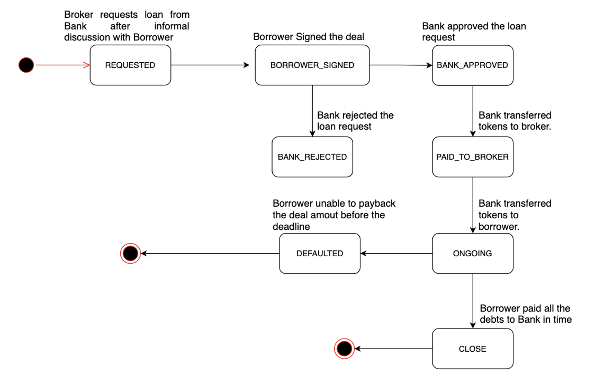

Smart Contracts
===============

This project has three smart contracts. 
They reside in the ``contracts`` directory. ::

    Microfinance
        |--blockchain
        |  |--contracts
        |  |  |--BankLoan.sol
        |  |  |--MicroToken.sol
        |  |  |--Migrations.sol
        |  |  |--UserIdentity.sol
        |  |--migrations
        |  |--test
        |  |--truffle-config.js

Micro Token Smart Contract - MicroToken.sol
-------------------------------------------

This smart contract handles the **ERC20** token in the system. 
ERC20 is a technical standard used for smart contracts on the Ethereum blockchain for implementing tokens. It defines a common list of rules and constraints that an Ethereum token has to implement, giving developers a standard pattern to program how new tokens will function within the Ethereum ecosystem. 
All ERC20 token-related information such as token name, total supply, and functionalities like transfer tokens, account balances, are handled through this contract. 
More information `here <https://github.com/OpenZeppelin/openzeppelin-contracts/blob/master/contracts/token/ERC20/ERC20.sol>`_.

The ``MicroToken`` smart contract implements the ``IERC20`` smart contract interface.

Attributes
~~~~~~~~~~

The ``MicroToken`` smart contract has these token related attributes: ::

    string public constant symbol = "MFT";
    string public constant name = "Microfinance Token";
    uint8 public constant decimals = 0;
    uint private constant __totalSupply = 1000;
    mapping (address => uint) private __balanceOf;
    mapping (address => mapping (address => uint)) private __allowances;

* ``symbol``: Symbol of the ERC20. This symbol will show in wallets and other places.
* ``name``: Name of the token. In this project, our token name is ``Microfinance Token (MFT)``.
* ``decimals``: This attribute configures the number of decimal places we use in our token. We set it to 0 as we don't use decimal values.
* ``__totalSupply``: This attribute holds the total number of tokens in circulation in the system.
* ``__balanceOf``: This mapping contains the token balance of each account holder.
* ``__allowances``: Account owner may grant permission to another account to do the token transfers on behalf of him. But owner can grant permission for limited token amount only. This mapping holds the number of tokens allowed to transfer from one account to another by third party account.

Constructor
~~~~~~~~~~~

The following code segment is the ``constructor`` of the MicroToken smart contract: ::

    constructor() {
            __balanceOf[msg.sender] = __totalSupply;
    }

It assigns all the tokens (``__totalSupply``) to the smart contract deployer's (``msg.sender``) account, which in the **Microfinance** system is the Bank.  The Bank owns all the tokens.  So the Bank account (in MetaMask/blockchain) should deploy this smart contract to assume ownership.

Functions
~~~~~~~~~

We discuss the various things the ``MicroToken`` smart contract should do.
Since ``MicroToken.sol`` contract implements the ``IERC20`` interface form **OpenZeppelin**, you can find more about these functions 
from the `github IERC20 repo <https://github.com/OpenZeppelin/openzeppelin-contracts/blob/master/contracts/token/ERC20/IERC20.sol>`_.

totalSupply
^^^^^^^^^^^

Returns the ``__totalSupply`` of the token. 
It is a public function: ::

    function totalSupply() public pure override returns (uint _totalSupply) { 
        _totalSupply = __totalSupply;
    }

balanceOf
^^^^^^^^^

Returns the token balance of given account. An account address should be passed as a parameter to this function. 
It is a public function: ::

    function balanceOf(address _addr) public view override returns (uint balance) {
        return __balanceOf[_addr];
    }

transfer
^^^^^^^^

Transfers tokens from one account to another. 
Tokens are transferred from the caller's (``msg.sender``) account. ``_to`` is the receiving account and ``_value `` is the token amount. 
This function returns true if transfer is successful and false otherwise. ::

    function transfer(address _to, uint _value) public override returns (bool success) {
        if (_value > 0 && _value <= balanceOf(msg.sender)) {
            __balanceOf[msg.sender] -= _value;
            __balanceOf[_to] += _value;
            return true;
    }
        return false;
    }

transferFrom
^^^^^^^^^^^^

Transfer tokens from one account to another via a third-party account. 
Sender's account address is the ``_from`` parameter and receiver's account address is the ``_to`` parameter.
Token amount is the ``_value`` parameter.
Note the various conditions it checks before performing the transfer.
It return ``true`` if successful or ``false`` otherwise. ::

    function transferFrom(address _from, address _to, uint _value) public override returns (bool success) {
        if (__allowances[_from][msg.sender] > 0 &&
            _value > 0 &&
            __allowances[_from][msg.sender] >= _value &&
            __balanceOf[_from] >= _value) {
            __balanceOf[_from] -= _value;
            __balanceOf[_to] += _value;
                __allowances[_from][msg.sender] -= _value;
            return true;
    }
        return false;
    }

approve
^^^^^^^

An owner may grant permission to a spender to transfer tokens from his account. 
To grant permission, the owner should ``approve`` the ``_spender``'s account address  and the token ``_value``.
This function returns ``true`` if it is successful. ::

    function approve(address _spender, uint _value) public override returns (bool success) {
        __allowances[msg.sender][_spender] = _value;
        return true;
    }

allowance
^^^^^^^^^

Returns the remaining token allowance from ``_owner`` to ``_spender``, 
the two account addresses passed as parameters to the function. ::

    function allowance(address _owner, address _spender) public view override returns (uint remaining) {
            return __allowances[_owner][_spender];
    }

User Identity Smart contract - UserIdentity.sol
------------------------------------------------

This contract holds User details. It  registers  Broker, Borrower and Insurance Company details.

enum
~~~~

We capture different roles of users in the system using enum.  There are 3 user roles in the system. ::

    enum Role { GUEST, BROKER, BORROWER }

struct
~~~~~~~

User - This struct holds user attributes. ::

    struct User{
        uint id; 
        string socialSecurityId; // each property has an unique social security id
        address userAddress;
        string name;
        Role role;
        bool isBankApproved;
    }

* ``id`` - System assigned id  for the user. This is an incremental number.
* ``socialSecurityId`` - This attribute holds the social security number.
* ``userAddress`` - User wallet account address. Wallet acount address from Ganache.
* ``name`` - User name.
* ``role`` - User role (BROKER, BORROWER).
* ``isBankApproved`` - Whether Bank approves of the user.

Modifiers
~~~~~~~~~

The following modifiers are used in the ``UserIdentity.sol`` functions.

* ``isAdmin()`` - Checks that the function caller is the admin of the contract.

Attributes
~~~~~~~~~~

``UserIdentity.sol`` contains the following attributes. 

* ``admin`` - Deployer account address of the smart contract. 
* ``brokersCount`` - Total brokers in the system. 
* ``borrowersCount`` - Total borrowers in the system.
    
* ``borrowers`` - Borrowers  in the system (address to Borrower mapping).
* ``brokers`` - Brokers  in the system (address to User mapping).
    
* ``brokersAddresses`` - Broker addresses.
* ``borrowersAddresses`` - Borrower addresses.

Constructor
~~~~~~~~~~~

The constructor assigns the contract deployer (``msg.sender``) as the admin. ::

    constructor()
    {
        admin = msg.sender;
    }

Functions
~~~~~~~~~

addBroker
^^^^^^^^^

Adds new Broker account to the system: ::

    function addBroker(string memory _socialSecurityId, address _address, string memory _name) 
        public isAdmin()

Parameters:
    * ``_socialSecurityId`` - Social Security ID of the Broker.
    * ``_address`` - Wallet account address of the Broker.
    * ``_name`` - Broker name.

Modifiers:
    * ``isAdmin()`` - Checks function caller is the Admin of the smart contract.

addBorrower
^^^^^^^^^^^

Adds new Borrower account to the system: ::

    function addBorrower(string memory _socialSecurityId, address _address, string memory _name) 
        public isAdmin()

Parameters:
    * ``_socialSecurityId`` - Social Security ID of the Broker.
    * ``_address`` - Wallet account address of the Borrower.
    * ``_name`` - Borrower name.

Modifiers:
    * ``isAdmin()`` - Checks function caller is the Admin of the smart contract.

verifyIsBroker
^^^^^^^^^^^^^^

Verifies whether the given account address is a Broker account or not. ::

    function verifyIsBroker(address _address) public view returns(bool)

Parameters:
    * ``_address`` - The account address of the user

This function is used by other smart contracts to verify a Broker account. 
It returns ``true`` if the broker exists on the given address or ``false`` otherwise.

verifyIsBorrower
^^^^^^^^^^^^^^^^^

Verifies whether the given account address is a Borrower account or not. ::

    function verifyIsBorrower(address _address) public view returns(bool)

Parameters:
    * ``_address`` - The account address of the user

This function is used by other smart contracts to verify a Borrower account. 
It returns ``true`` if the Borrower exists on the given address or ``false`` otherwise.

getAllBrokers
^^^^^^^^^^^^^

Returns all the Brokers as an array. ::

    function getAllBrokers() public view returns (User[] memory)

Return: 
    * ``User []`` - Return all Brokers as an array.

getAllBorrowers
^^^^^^^^^^^^^^^

Returns all the Borrowers as an array. ::

    function getAllBorrowers() public view returns (User[] memory)

Return: 
    * ``User []`` - Return all Borrowers as an array.

Bank Loan Smart Contract - BankLoan.sol
---------------------------------------

This smart contract stores Bank Loan details. 
The Bank is the owner of this smart contract.

State Transition Diagram of The Bank Loan
~~~~~~~~~~~~~~~~~~~~~~~~~~~~~~~~~~~~~~~~~

The following diagram shows the state transition of a Bank Loan.
We use this state transition diagram to implement Bank Loan state changes in the ``BankLoan`` smart contract.

enum
~~~~

1. LoanState - This enum holds individual loan states. There are 14 loan states. ::

    enum LoanState{
        REQUESTED, 
        BORROWER_SIGNED,
        BANK_APPROVED, 
        BANK_REJECTED,
        PAID_TO_BROKER, 
        ONGOING, 
        DEFAULT, 
        CLOSE
    }

* ``REQUESTED`` - Initial state of a loan. Broker requests a loan on behalf of a Borrower. 
* ``BORROWER_SIGNED`` - Borrower agrees to the Loan. 
* ``BANK_APPROVED`` - Bank approves the Loan
* ``BANK_REJECTED`` - Bank rejects the Loan
* ``PAID_TO_BROKER`` - Bank gives fee to Broker.
* ``ONGOING`` - Bank transfers tokens to the Borrower's account. 
* ``DEFAULT`` - Borrower is unable to pay back the Loan. 
* ``CLOSE`` - Borrower paid back the Loan.

struct
~~~~~~~

1. Loan - This structure holds Loan attributes. ::

    struct Loan
    {
        uint id;
        uint amount;
        uint months;
        uint interest;
        string planId;
        LoanState state;
        address broker;
        address borrower;
        bool bankApprove;
        bool isBorrowerSigned;
    }

* ``id`` - Loan Id.
* ``amount`` - Loan amount.
* ``months`` - Loan duration in months.
* ``interest`` - Loan interest.
* ``planId`` - Loan plan Id.
* ``state`` - Current state of the loan.
* ``broker`` - Address of the Broker who applied the Loan.
* ``borrower`` - Address of the Borrower of the Loan.
* ``bankApprove`` - Status of the Bank approval for the Loan.
* ``isBorrowerSigned`` - Borrower Signed status.

Events
~~~~~~

These events are defined in the ``BankLoan`` smart contract.

loanRequest
^^^^^^^^^^^

This event will be emitted when Broker creates a loan request. ::

    event loanRequest(
        uint id,
        uint amount,
        uint months, 
        uint interest,
        uint planId, 
        LoanState state, 
        address broker, 
        address borrower,
        bool bankApprove, 
        bool isBorrowerSigned,
    );

Parameters:
    * ``id`` -  Loan Id.
    * ``amount`` - Loan amount.
    * ``months`` - Duration of the loan.
    * ``interest`` - Loan interest.
    * ``planId`` - Loan plan Id.
    * ``state`` - Current state of the loan.
    * ``broker`` - Broker of the loan.
    * ``borrower`` - Borrower address of the loan.
    * ``bankApprove`` - Bank approval status.
    * ``isBorrowerSigned`` - Borrower signed status.

Modifiers
~~~~~~~~~

The following modifiers are used in the ``BankLoan.sol`` functions.

* ``isAdmin()`` - Checks whether the function caller is the owner of the smart contract.
* ``isBroker()`` - Checks whether the function caller is registered as a Broker in the system.
* ``isLoanBorrower(uint _loanId)`` - Checks whether the function caller is the Borrower of a given Loan.
* ``isValidLoan(uint _loanId)`` - Checks whether the Loan exist in the system.
* ``isLoanIn(uint _loanId, LoanState _state)`` - Checks whether the given Loan is in specific Loan State.

Attributes
~~~~~~~~~~

* ``UserIdentity: identitySC`` -  Stores UserIdentity smart contract object.
* ``address: admin`` - Store smart contract deployer’s address.
* ``Loan[]: loans`` - Stores loan data.

Constructor
~~~~~~~~~~~

The constructor assigns the admin address as the contract deployer's (``msg.sender``) address. 
It requires the ``UserIdentity`` smart contract address to deploy the smart contract. 
The ``UserIdentity`` smart contract address object instance will be set as the ``identitySC``. ::

    constructor (address _identitySC) {
            admin = msg.sender;
            identitySC = UserIdentity(_identitySC);
    }

Functions
~~~~~~~~~

applyLoan(...)
^^^^^^^^^^^^^^

Creates a Loan request. ::

    function applyLoan(uint _amount, uint _months, uint _interest, uint _planId, address _borrower) public isBroker()

Parameters: 
    * ``_amount`` - Loan amount.
    * ``_months`` - Duration of the loan.
    * ``_interest`` - Loan interest.
    * ``_planId`` -  Loan plan Id.
    * ``_borrower`` - Borrower address.

Modifiers:
    * ``isBroker`` - Checks the function caller registered as a Broker.

signByBorrower(...)
^^^^^^^^^^^^^^^^^^^

This function is used to sign the Loan by Borrower. ::

    function signByBorrower(uint _loanId) public isLoanBorrower(_loanId) isValidLoan(_loanId) isLoanIn(_loanId, LoanState.INSURANCE_APPROVED)
    
Parameters:
    * ``_loanId`` -  Loan Id

Modifiers:
    * ``isLoanBorrower()`` - The function caller should be the Borrower of the Loan.
    * ``isValidLoan(_loanId)`` - Checks Loan's validity.
    * ``isLoanIn(_loanId, LoanState.INSURANCE_APPROVED)`` - Checks whether Loan is in INSURANCE_APPLIED state.

approveLoan(...)
^^^^^^^^^^^^^^^^

Changes the ``bankApprove`` value to ``True`` and changes the Loan state to ``BANK_APPROVED`` state. ::
    
    function approveLoan(uint _loanId) public isAdmin() isValidLoan(_loanId) isLoanIn(_loanId, LoanState.BORROWER_SIGNED)

Parameters:
    * ``_loanId`` -  Loan Id

Modifiers:
    * ``isAdmin()`` - The function caller should be the Bank.
    * ``isValidLoan(_loanId)`` - Checks Loan's validity.
    * ``isLoanIn(_loanId, LoanState.BORROWER_SIGNED)`` - Checks whether Loan is in BORROWER_SIGNED state.

rejectLoan(...)
^^^^^^^^^^^^^^^

Changes the ``bankApprove`` value to ``False`` and changes the Loan state to ``BANK_REJECTED`` state. ::

    function rejectLoan(uint _loanId) public isAdmin() isValidLoan(_loanId) isLoanIn(_loanId, LoanState.BORROWER_SIGNED)

Parameters:
    * ``_loanId`` -  Loan Id

Modifiers:
    * ``isAdmin()`` - The function caller should be the Bank.
    * ``isValidLoan(_loanId)`` - Checks Loan's validity.
    * ``isLoanIn(_loanId, LoanState.BORROWER_SIGNED)`` - Checks whether Loan is in BORROWER_SIGNED state.

confirmTokenTrasferToBroker(...)
^^^^^^^^^^^^^^^^^^^^^^^^^^^^^^^^
Changes the Loan state to PAID_TO_BROKER. ::

    function confirmTokenTrasferToBroker(uint _loanId) public isAdmin() isValidLoan(_loanId) isLoanIn(_loanId, LoanState.BANK_APPROVED)

Parameters:
    * ``_loanId`` -  Loan Id

Modifiers:
    * ``isAdmin()`` - The function caller should be the Bank.
    * ``isValidLoan(_loanId)`` - Checks Loan's validity.
    * ``isLoanIn(_loanId, LoanState.PAID_TO_INSURANCE)`` - Checks whether Loan is in PAID_TO_INSURANCE state.

confirmTokenTrasferToBorrower(...)
^^^^^^^^^^^^^^^^^^^^^^^^^^^^^^^^^^

Changes the Loan state to ONGOING. ::

    function confirmTokenTrasferToBorrower(uint _loanId) public isAdmin() isValidLoan(_loanId) isLoanIn(_loanId, LoanState.PAID_TO_BROKER)

Parameters:
    * ``_loanId`` -  Loan Id

Modifiers:
    * ``isAdmin()`` - The function caller should be the Bank.
    * ``isValidLoan(_loanId)`` - Checks Loan's validity
    * ``isLoanIn(_loanId, LoanState.PAID_TO_BROKER)`` - Checks whether Loan is in PAID_TO_BROKER state.

closeLoan(...)
^^^^^^^^^^^^^^ 

Changes the Loan state to CLOSE. ::

    function closeLoan(uint _loanId) public isAdmin() isValidLoan(_loanId) isLoanIn(_loanId, LoanState.ONGOING)

Parameters:
    * ``_loanId`` -  Loan Id

Modifiers:
    * ``isAdmin()`` - The function caller should be the Bank.
    * ``isValidLoan(_loanId)`` - Checks Loan's validity.
    * ``isLoanIn(_loanId, LoanState.ONGOING)`` - Checks whether Loan is in ONGOING state.

markAsDefaulted(...)
^^^^^^^^^^^^^^^^^^^^

Changes the Loan state to DEFAULT. ::

    function markAsDefaulted(uint _loanId) public isAdmin() isValidLoan(_loanId) isLoanIn(_loanId, LoanState.ONGOING)

Parameters:
    * ``_loanId`` -  Loan Id

Modifiers:
    * ``isAdmin()`` - The function caller should be the Bank.
    * ``isValidLoan(_loanId)`` - Checks Loan's validity
    * ``isLoanIn(_loanId, LoanState.ONGOING)`` - Checks whether Loan is in ONGOING state.

viewLoan(...)
^^^^^^^^^^^^^

This function returns the Loan. ::

    function viewLoan(uint _loanId) public view returns(Loan memory loan)

Parameters:
    * ``_loanId`` -  Loan Id

Return:
    * ``Loan`` - Return Loan registered in ``_loanId``.

getLoans()
^^^^^^^^^^^^^

This function returns all the Loans. ::

    function getLoans() public view returns(Loan [] memory)

Return:
    * ``Loan []`` - Return all Loans as an object array.
