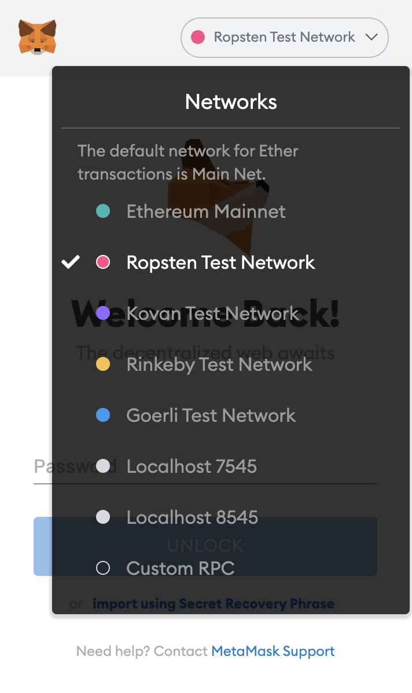
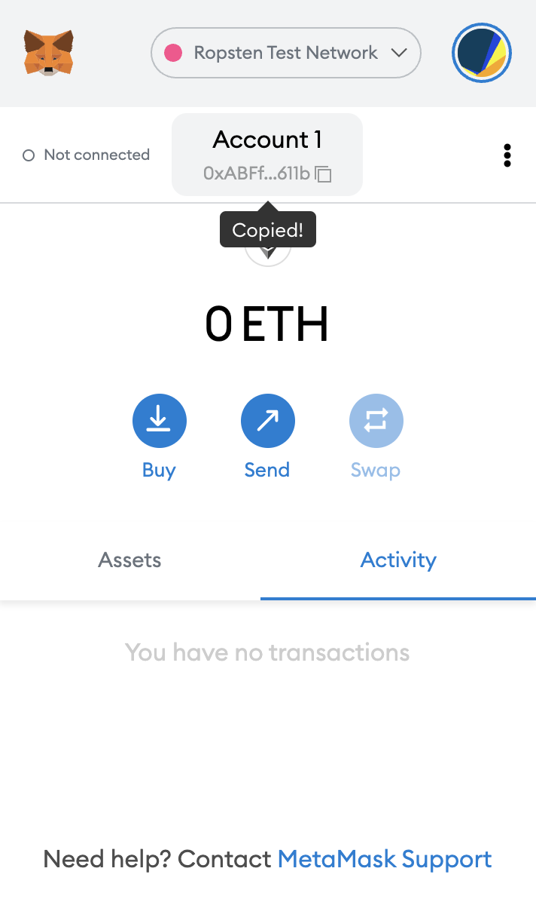
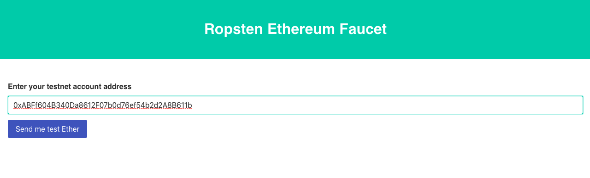
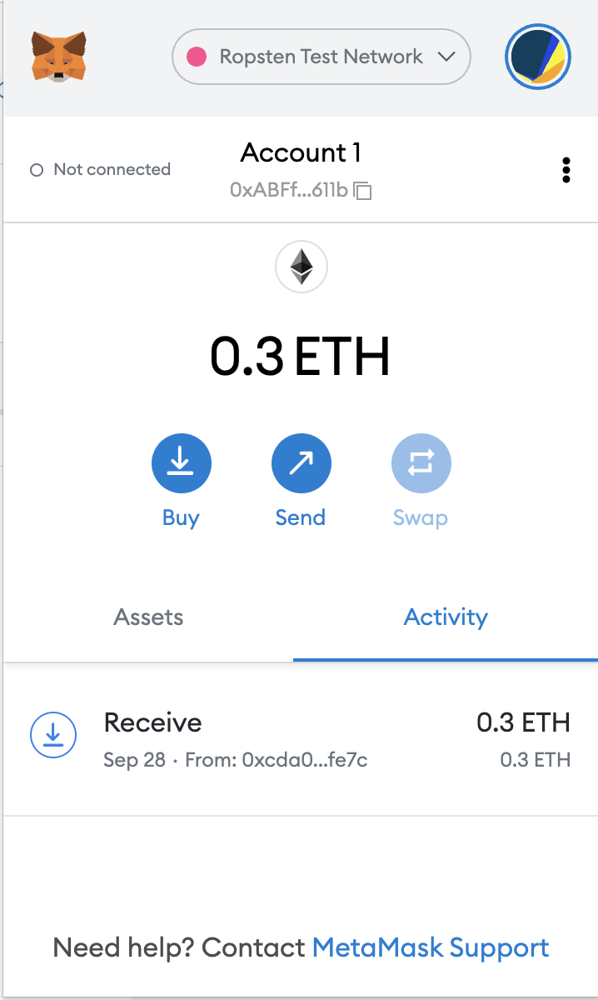
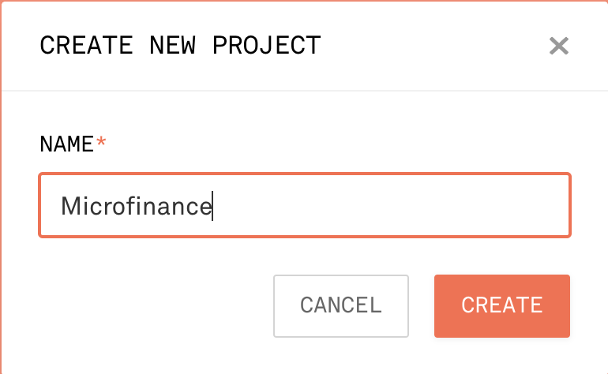
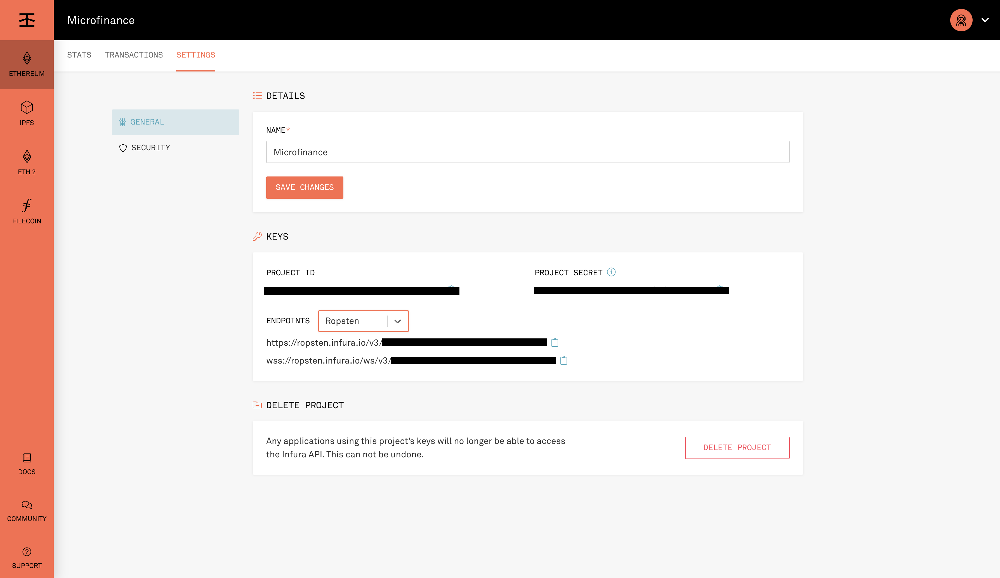

.. _deploy-to-ropsten:

Deploy Smart Contracts to Ropsten
==================================

Dependencies
~~~~~~~~~~~~

You must have Metamask Extension installed. 

Step 1 - Get Fake Ethers for your Account
~~~~~~~~~~~~~~~~~~~~~~~~~~~~~~~~~~~~~~~~~

1. Select Ropsten network in you MetaMask plugin.

2. Navigate to `Ropsten Ethereum Faucet <https://faucet.ropsten.be/>`_ and enter your metamask first account address there 
to have ethers transferred in your account. 

You can copy your account address from metamask like this,

3. After a few minutes, you’ll see ethers reflected in your account.

Step 2 - Create Infura Project
~~~~~~~~~~~~~~~~~~~~~~~~~~~~~~

1. Sign in to `Infura <https://infura.io/>`_.

2. Navigate to Etehereum from left pannel -> CREATE NEW PEOJECT.
Insert a name of the project and create one.

3. Select "Ropsten" as the Endpoint under the Keys section. Copy the ``PROJECT ID``

4. Create a secret file

Note in the first line that we are loading the project id and mnemonic from a secrets.json file, 
which should look like the following, but using your own values. Make sure to .gitignore it! ::

    {
        "mnemonic": "planet auto sign choice ...",
        "projectId": "305c137050..."
    }

TIP: Instead of a secrets.json file, you can use whatever secret-management solution you like for your project. 
A popular and simple option is to use dotenv for injecting secrets as environment variables.

We can now test out that this configuration is working by listing the accounts we have available for the Ropsten network. 
Remember that yours will be different, as they depend on the mnemonic you used. ::

    $ truffle console --network ropsten
    truffle(ropsten)> await web3.eth.getAccounts()
    [
    '0xABFf604B340Da8612F07b0d76ef54b2d2A8B611b',
    '0x3e4Cdd143b1C8FFb129Bb81f81B2B8835Ea03Cff',
    ...
    ]
    truffle(ropsten)> await web3.eth.getBalance('0xABFf604B340Da8612F07b0d76ef54b2d2A8B611b')
    '300000000000000000'

Step 3 - Truffle Configurations
-------------------------------

Since we are using public nodes, we will need to sign all our transactions locally. 
We will use ``@truffle/hdwallet-provider`` to do this, setting it up with our ``mnemonic``. 
We will also tell the provider how to connect to the test network by using the Infura endpoint.

Let’s start by installing the provider. ::

    install --save-dev @truffle/hdwallet-provider

``truffle-config.js`` ::

    const { projectId, mnemonic } = require('./secrets.json');
    const HDWalletProvider = require('@truffle/hdwallet-provider');

    module.exports = {

    networks: {
        development: {
            host: "127.0.0.1",     // Localhost (default: none)
            port: 8545,            // Standard Ethereum port (default: none)
            network_id: "*",       // Any network (default: none)
        },
        // Useful for deploying to a public network.
        // NB: It's important to wrap the provider as a function.
        ropsten: {
            provider: function() {
            return new HDWalletProvider(mnemonic, `https://ropsten.infura.io/v3/${projectId}`)
            },
            network_id: 3,
            gas: 4000000         // Any network (default: none)
        },
    };

Step 4 - Deploy smart contracts to Ropsten network
~~~~~~~~~~~~~~~~~~~~~~~~~~~~~~~~~~~~~~~~~~~~~~~~~~

With a project configured to work on a public testnet, we can now finally deploy our contracts. 
The command here, other than specifying the network, is the same as if you were on your local development network, 
though it will take a few seconds to run as new blocks are mined. ::

    truffle migrate --reset --network ropsten

Step 5 - Check availability
~~~~~~~~~~~~~~~~~~~~~~~~~~~

That’s it! Our contract instances will be stored in the testnet, and publicly accessible to anyone.

You can see your contract on a block explorer such as `Etherscan <https://etherscan.io/>`_. 
Remember to access the explorer on the testnet where you deployed your contract, such as `ropsten.etherscan.io <https://ropsten.etherscan.io/>`_ for Ropsten.

TIP: You can check out the contract we deployed in the example above, along with all transactions sent to it, `here <https://ropsten.etherscan.io/address/0xABFf604B340Da8612F07b0d76ef54b2d2A8B611b>`_.

You can also interact with your instance as you regularly would, either using truffle console, or programmatically using web3. ::

    $ truffle console --network ropsten
    truffle(ropsten)> micro = await MicroToken.deployed()
    truffle(ropsten)> (await micro.totalSupply()).toString()

Step 6 - Refer to Smart Contracts addreses in Ropsten network
~~~~~~~~~~~~~~~~~~~~~~~~~~~~~~~~~~~~~~~~~~~~~~~~~~~~~~~~~~~~~

This deployment information will record in the build files inside ``build\contracts\`` directory

Ex: ``MicroToken.json`` ::

    "networks": {
        "3": {
        "events": {},
        "links": {},
        "address": "0x17c591C75978E90786E581c683Bf596D94199db7",
        "transactionHash": "0x082fd2bce39eb95178ab78588252c71a2d3d01eba4840264aa556b18ea275f3e"
        },
        "5777": {
        "events": {},
        "links": {},
        "address": "0xe0F3B6602962630d182EC424FbfBAd24119988da",
        "transactionHash": "0x3f3d7ca9cf5be97e2899118d48e7c0e299ea5e5ea8800d8298a43f4b1b7c7114"
        }
    },

All React web applications configured to ``5777`` local blockchain. 
Now we are going to change the network to Ropsten and refer to the smart contract addresses in the Ropsten network.

1. Refer ``bank-web-application`` to Ropsten
open ``bank-web-app/stores/smartContractContext.js`` navigate to ``Smart Contract Addresses``
change the ``5777`` value to ``3``. ::

    // Smart Contract Addresses
    const microTokenAddress = MicroTokenArtifact.networks[3].address;
    const userIdentityAddress = UserIdentityArtifact.networks[3].address;
    const bankLoanAddress = BankLoanArtifact.networks[3].address;

This will refer the smart contract adderesses of Ropsten network used in ``bank-web-app``

You may need more fake ETHERS to other accounts (Wallet accounts for Broker and Borrower users) in MetaMask to use the system.

