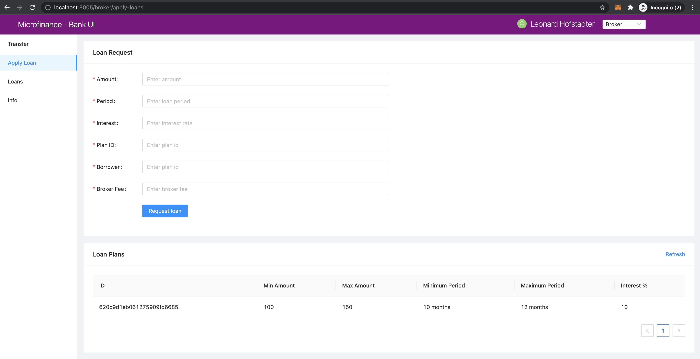

Apply Loan Event Flow
=====================

The second menu item of the ``BrokerMenu`` is ``Apply Loan``.
Brokers can click on this menu item and navigate to ``Loan Request`` page and apply for a loan on behalf of a Broker.

As you can see in the address bar of above screenshot it loads the page in ``/pages/broker/apply-loans.js``.

We illustrate the flow of events from React web app (UI) to 
``bank-web-app/pages/broker/apply-loans.js`` to ``bank-web-app/components/loan/LoanForm.js``.

apply-loans.js
--------------

The script of the ``apply-loans.js``. ::

    import React from 'react';
    import { Row, Col } from 'antd';
    import LoanForm from '../../components/loan/LoanForm';
    import PlansTable from '../../components/plan/PlansTable';

    function ApplyLoans() {
        return (
            <>
                <Row gutter={[16, 16]}>
                    <Col span={24}>
                        <LoanForm />
                    </Col>
                    <Col span={24}>
                        <PlansTable />
                    </Col>
                </Row>
            </>
        );
    }

    export default ApplyLoans;

In this ``apply-loans.js`` script, it first imports the dependencies.
Then it defines the ``ApplyLoans()`` function.
In this React Component it load the ``<LoanForm />`` and ``<PlansTable />`` React Components.
``<Row>`` and ``<Col>`` Ant design components help to arrange These React component in the browser.
As you can see in above screenshot first it diplays the ``Loan Request`` form and later ``Loan Plans`` table.

The ``LoanForm`` imported from the ``../../components//loan/LoanForm``.

Next we discuss about important code snippets of the ``LoanForm.js`` script.

LoanForm.js
-----------

In the top of the ``LoanForm.js`` it imports following dependencies. ::

    import React, { useContext } from 'react';
    import { Card, Form, InputNumber, Input, Button, message } from 'antd';
    import SmartContractContext from '../../stores/smartContractContext';

it imports ``SmartContractContext`` to use some smart contracts related context objects.

``LoanForm.js`` returns the following html form. ::

  return (
    <Card title="Loan Request Form">
      <Form
        ...
        onFinish={createLoanRequest}
      >
        <Form.Item label="Amount" name="amount" rules={[{ required: true, message: 'Please enter amount!' }]}>
          <InputNumber
            min="0"
            style={{ width: '100%' }}
            placeholder="Enter amount"
          />
        </Form.Item>
        <Form.Item label="Period" name="period" rules={[{ required: true, message: 'Please enter period!' }]}>
          <InputNumber
            min="0"
            style={{ width: '100%' }}
            placeholder="Enter loan period"
          />
        </Form.Item>
        <Form.Item label="Interest" name="interest" rules={[{ required: true, message: 'Please enter interest!' }]}>
          <InputNumber
            min="0"
            style={{ width: '100%' }}
            placeholder="Enter interest rate"
          />
        </Form.Item>
        <Form.Item label="Plan ID" name="planId" rules={[{ required: true, message: 'Please enter plan id!' }]}>
          <Input
            placeholder="Enter plan id"
          />
        </Form.Item>
        <Form.Item label="Borrower" name="borrower" rules={[{ required: true, message: 'Please enter borrower!' }]}>
          <Input
            min="0"
            style={{ width: '100%' }}
            placeholder="Enter plan id"
          />
        </Form.Item>
        <Form.Item label="Broker Fee" name="brokerFee" rules={[{ required: true, message: 'Please enter Broker Fee!' }]}>
          <InputNumber
            min="0"
            style={{ width: '100%' }}
            placeholder="Enter broker fee"
          />
        </Form.Item>
        <Form.Item wrapperCol={{
          lg: { span: 14, offset: 3 },
          xl: { span: 14, offset: 2 },
          xxl: { span: 14, offset: 2 } }}
        >
          {/* Form submit button */}
          <Button type="primary" htmlType="submit">Request Loan</Button>
        </Form.Item>
      </Form>
    </Card>
  );

First it defines a ``Card``Ant design component with ``Loan Request`` as the title.

Then it defines the ``Form`` component. In for it has a propert ``onFinish={createLoanRequest}``.
This will call the ``createLoanRequest`` when user submits the form with ``values`` object.
This values object contains the form field values.
These values can be accessed using their names in ``createLoanRequest`` function.
We will discuss more about ``createLoanRequest`` function later.

Then it defines the ``Form.Item`` components.
It has ``Form.Item`` for each field of the form.
All these ``Form.Item`` have ``label`` and ``name`` attributes.
``label`` attribut will display before the input area and ``name`` propert will use in the ``createLoanRequest`` 
function to get the submitted form field value by user.

``Input`` and ``InputNumber`` components defines the type of the input accept by the form field.

Finally it defines the ``Form.Item`` with the ``Button`` component to submit the form.
When user click the submit button first it will check all the ``required`` fields have values and then call the ``createLoanRequest``
with ``values`` object which contains the form fields values.

In ``LoanForm`` component it access the ``BankLoanContract`` smart contract object as follows. ::

	const { BankLoanContract } = useContext(SmartContractContext);

Then it defines the ``createLoanRequest`` function we discuss before to submit the loan request to the 
``BankLoan`` smart contract. ::

	const createLoanRequest = async (values) => {
		try {
			const accounts = await window.ethereum.request({ method: 'eth_requestAccounts' });

			await BankLoanContract.methods.applyLoan(
				values.amount,
				values.period,
				values.interest,
				values.planId,
				values.borrower,
				values.brokerFee,
			).send({ from: accounts[0] });
			message.success('New loan requested successfully');
		} catch (err) {
			console.log(err);
			message.error('Error creating loan request');
		}
	};

``createLoanRequest`` is an asynchronous function. 
It has the ``values`` parameter which contains the form fields values when user submits the form.

``const accounts = await window.ethereum.request({ method: 'eth_requestAccounts' });`` helps to get the selected account from the MetaMask browser plugin.
This function will return selected account as an array.

Then it will call the ``applyLoan`` method in the ``BankLoan`` smart contract using ``BankLoanContract`` smart contract context object.
``values.amount`` will return the amout submitted from the form. Like ``values.amount`` all the form field values
passed through the ``values`` oject will pass to the ``applyLoan`` method as parameters.

Since ``applyLoan`` method will change the blockchain smart contract state we have to use ``send`` method to
call the ``applyLoan`` function.
``send({ from: accounts[0] })`` passes the MetaMask selected account as the smart contract methos caller.

If These functions executed successfully it will display the ``New loan requested successfully`` message in the 
to of the UI. else it will displays ``Error creating loan request`` message.

