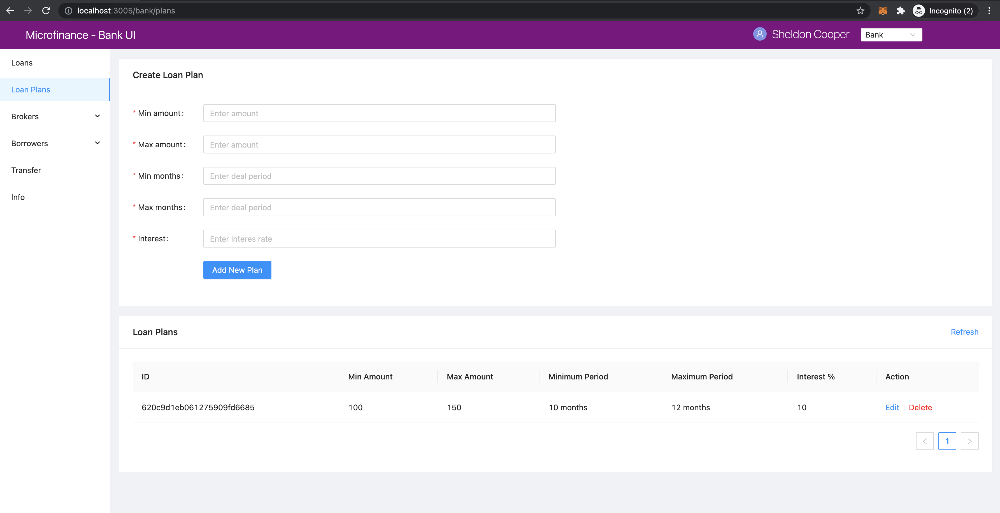

Fetch Loan Plans from Bank Web Server
=====================================

In this section we discuss about ho to fetch Loan Plans from **Bank Web Server**
As we disccuss in the :ref:`create-loan-plan-target`, **Microfinance -Bank UI** displays a ``Loan Plans`` table
at the bottom of the ``Loan Plans`` page.

We illustrate the flow of events from React web app (UI) to 
``bank-web-app/pages/bank/plans.js`` to ``bank-web-app/components/plan/PlansTable.js``.

This plan table will be rendered according to the user role.
for ``Bank`` user role it displays ``Action`` column with ``Edit`` and ``Delete`` options for each Loan Plan.
It will display for ``Broker``s at the bottom of the ``Apply Loan`` page in ``BrokerMenu``.

    .. image:: ../images/apply_loan.png

plans.js
--------

The script of the ``plans.js``. ::

    import React, { useState } from 'react';
    import { Row, Col } from 'antd';
    import PlansTable from '../../components/plan/PlansTable';
    import CreatePlanForm from '../../components/plan/CreatePlanForm';

    function BankPlans() {
        const [togglePlan, setTogglePlan] = useState(true);
        return (
            <Row gutter={[16, 16]}>
                <Col span={24}>
                    <CreatePlanForm setTogglePlan={setTogglePlan} togglePlan={togglePlan} />
                </Col>
                <Col span={24}>
                    <PlansTable togglePlan={togglePlan} />
                </Col>
            </Row>
        );
    }

    export default BankPlans;

In this ``plan.js`` script uses ``PlanTable`` component and pass props ``togglePlan``.
It will render the ``PlansTable`` component in ``bank-web-app/components/plan/PlansTable.js``.

PlansTable.js
-------------

in ``PlansTable.js`` script, first it imports following dependencies. ::

    import React, { useState, useContext, useEffect } from 'react';
    import { Table, Form, InputNumber, Card, Divider, Modal, Button, message } from 'antd';
    import { CloseCircleOutlined } from '@ant-design/icons';
    import { getApi, patchApi, deleteApi } from '../../util/fetchApi';
    import PropTypes from 'prop-types';
    import UserContext from '../../stores/userContext';

* It imports ``getApi``, ``patchApi``, ``deleteApi`` from ``fetchApi`` to get, edit and delete Loan Plans.
* ``PropTypes`` to check prop types in the component.
* ``UserContext`` for access the user.

Then it defines the ``PlansTable`` component as follows. ::

    function PlansTable({ togglePlan }) 

It gets ``togglePlan`` prop when create the component.

``PlansTable`` has following states. ::

    const { user } = useContext(UserContext);
	const [isModalVisible, setIsModalVisible] = useState(false);
	const [data, setData] = useState([]);

* ``user`` state has the selected user role.
* ``isModalVisible`` stores the Loan Plan Edit Modal visibility state.
* ``data`` state contains the Loan Plans details.

following states use when Edit and Delete the Loan Plans. ::

	const [id, setId] = useState(''); // Loan id state.
	const [minAmount, setMinAmount] = useState(''); // Minimum amount of the loan
	const [maxAmount, setMaxAmount] = useState(''); // Maximum amount of the loan
	const [minMonths, setMinMonths] = useState(''); // Minimum duration of the loan in months.
	const [maxMonths, setMaxMonths] = useState(''); // Maximum duration of the loan in months.
	const [interest, setInterest] = useState(''); // Loan interest.

It uses ``cofirm`` Modal component from Ant design to display confirmation messages. ::

    const { confirm } = Modal;

``fetchPlan`` function will load the Loan Plans from **Bank Web Server** using ``getApi`` method from ``fetchApi`` script. ::

    const fetchPlans = async () => {
		try {
			const plans = await getApi({
				url: 'loan-plans',
			});

			setData([]);
			// Add all Loan Plans to the data array.
			for (let i = 0; i < plans.length; i++) {
				const row = {
					key: plans[i]._id,
					id: plans[i]._id,
					minAmount: plans[i].minAmount,
					maxAmount: plans[i].maxAmount,
					minMonths: plans[i].minMonths,
					maxMonths: plans[i].maxMonths,
					interest: plans[i].interest,
				};

				setData((prev) => {
					// Spread operator(...) helps to update the states.
					// Append each Loan Plan to the data array.
					return [...prev, row]; 
				});
			}
		} catch (err) {
			console.log(err);
			message.error('Error occured while loading Loan Plans');
		}
	};

In the above method first it loads the Loan Plans from ``loan-plans`` api end point. ::

    const plans = await getApi({
        url: 'loan-plans',
    });

After reset the ``data`` state it will map the resulting Loan Plans in to a objects and appent in the ``data`` state. ::

    setData([]);
    for (let i = 0; i < plans.length; i++) {
        const row = {
            key: plans[i]._id,
            id: plans[i]._id,
            minAmount: plans[i].minAmount,
            maxAmount: plans[i].maxAmount,
            minMonths: plans[i].minMonths,
            maxMonths: plans[i].maxMonths,
            interest: plans[i].interest,
        };

        setData((prev) => {
            return [...prev, row]; 
        });
    }

The spread operator ``...prev`` will return the exisiting data in the ``data`` state and then append the next Loan Plan 
object to the ``data`` state.

In the middle of this ``PlansTable`` component it defines the ``columns`` object. ::

  const columns = [
    {
      title: 'ID',
      dataIndex: 'id',
      key: 'id',
    },
    {
      title: 'Min Amount',
      dataIndex: 'minAmount',
      key: 'minAmount',
    },
    {
      title: 'Max Amount',
      dataIndex: 'maxAmount',
      key: 'maxAmount',
    },
    {
      title: 'Minimum Period',
      dataIndex: 'minMonths',
      key: 'minMonths',
      render: text => text + ' months',
    },
    {
      title: 'Maximum Period',
      dataIndex: 'maxMonths',
      key: 'maxMonths',
      render: text => text + ' months',
    },
    {
      title: 'Interest %',
      key: 'interest',
      dataIndex: 'interest',
    },
  ];

This column object has all coomon columns details of the ``Loan Plans`` table.
``columns`` is an object array. 
Each object of this array represent on column and all obejcts have ``title``, ``dataIndex`` and ``key`` keys.

* ``title`` - Column name
* ``dataIndex`` - Key name of the data object which will display on this column.
* ``key`` - Unique id for each element in the data array.

In addition to these key values some of the objects has ``render`` value.

This helps to add additional information or make changes to the data which will display in column.
As an example ``Minimum Period`` column has a ``render`` method. ::

    {
        title: 'Minimum Period',
        dataIndex: 'minMonths',
        key: 'minMonths',
        render: text => text + ' months',
    },

``Minimum Period`` contains a integer value in data object.
``render`` method helps to add `` months`` key word to every data onject in the ``Minimum Period`` column.

This columns object array doesn't contain any ``Action`` column.
This ``Action`` column displays only for ``Bank`` users.
We can add ``Action`` column to the ``columns`` object array as follows. ::

  if (user.role === 'bank') {
      columns.push({
          title: 'Action',
          dataIndex: '', // Not specify the Data property. Data object will use in render method.
          key: 'id',
          render: (record) => 
              
                  <a href onClick={() => showModal(record.id)}>Edit</a>
                  <Divider type="vertical" />
                  <a href onClick={() => deletePlan(record.id)} style={{ color: 'red' }}>Delete</a>
              
          ),
      });
  }

Using ``if`` condition first we check the selected user role.
Then we push ``Action`` column to the ``columns`` object array.
This ``Action`` column object has ``title`` value but no ``dataIndex`` value.
Since we don't have any specific data value to display in this column we do not specify the ``dataIndex``

In ``render`` method it will get the ``Loan Plan`` object as ``record`` parameter.
This column displays ``Edit`` and ``Delete`` links.

When user click on the ``Edit`` link it will open a Ant design Modal with the selected Loan Plan details.
It facilitates to edit the each Loan Plan values but ``Loan Plan Id``.

``Delete`` link will open a ``confirm`` Ant design Modal to delete the Loan Plan.

In the return section of the ``PlansTable`` component first it defines the Loan Plans Table in a Ant design ``Card`` component. ::

    <Card
        title="Loan Plans"
        extra={<a href onClick={() => fetchPlans()}>Refresh</a>}
    >
      <Table columns={columns} dataSource={data} />
    </Card>

This card displays ``Loan Plans`` as the card title.
``extra`` prop will display ``Refresh`` link at the right top corner of the ``Card`` coponent.
By clicking this ``Refresh`` link user can update the Loan Plans Table.
``Refresh`` link will trigger the ``fetchPlans`` function.

Later in the ``Table`` Ant design component we pass the ``columns`` and ``dataSource`` prop.
``columns`` prop value set to ``columns`` object array and ``data`` object array set as the ``dataIndex`` prop.

If there are any changes in the ``data`` state may reflect in the Loan Plans Table.
