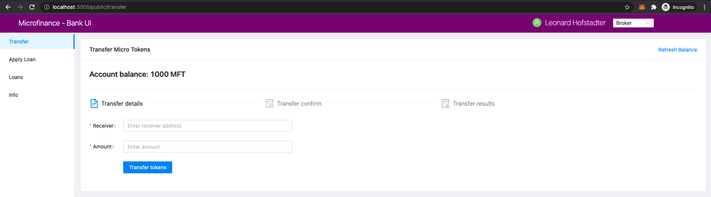

Page Navigation with Menu Items
===============================

There are three menu loads in the **Microfinance - Bank UI**, each according to the user role.
These menu loads are defined in the ``bank-web-app/components/menu`` directoy.

* ``BankMenu.js`` - Menu for Bank users.
* ``BorrowerMenu.js`` - Menu for Borrowers.
* ``BrokerMenu.js`` - Menu for Brokers.

Each menu item loads ``pages`` from the ``bank-web-page/pages`` directory.
You can get idea about which page loads which menu item by looking at the address bar.
Refer to the following screenshot of the ``Microfinance - Bank UI``.

As you can see in the screeshot, the selected user role is ``Broker``; ``BrokerMenu`` loads in the left panel.
The ``BrokerMenu`` has four menu items. The ``Transfer`` menu item has been selected.
The browser's address bar shows ``localhost:3005/public/transfer``. 
This means the ``Transfer`` menu item loads the script in ``pages/public/transfer.js``.

We will discuss more about persisting the Layout and loanding pages in across the **React Web Application** in ``level2``
