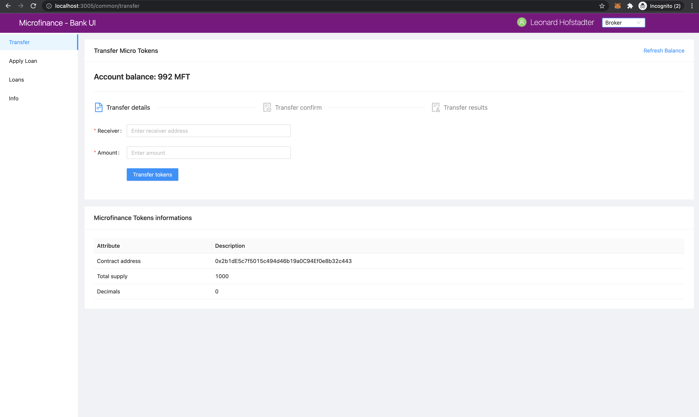
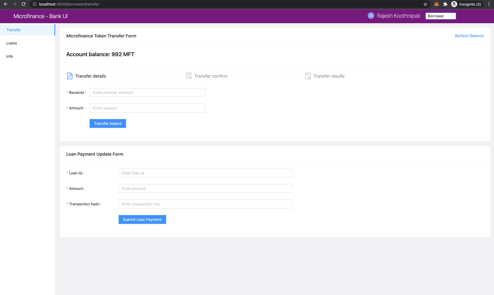
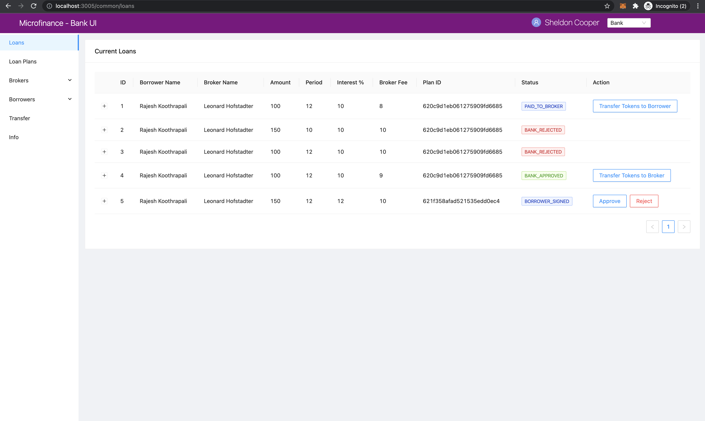
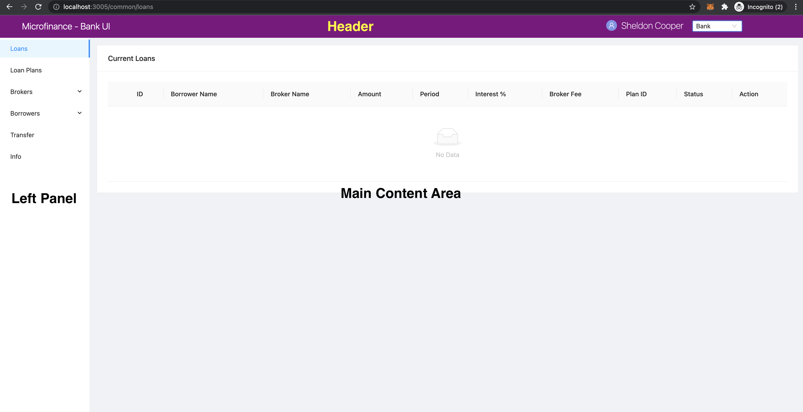

Page Navigation with Menu Items
===============================

There are three menu loads in the **Microfinance - Bank UI**, each according to the user role.
These menu loads are defined in the ``bank-web-app/components/menu`` directoy.

* ``BankMenu.js`` - Menu for Bank users.
* ``BorrowerMenu.js`` - Menu for Borrowers.
* ``BrokerMenu.js`` - Menu for Brokers.

Each menu item loads ``pages`` from the ``bank-web-page/pages`` directory.
You can get idea about which page loads which menu item by looking at the address bar.
Refer to the following screenshot of the ``Microfinance - Bank UI``.

As you can see in the screeshot, the selected user role is ``Broker``; ``BrokerMenu`` loads in the left panel.
The ``BrokerMenu`` has four menu items. The ``Transfer`` menu item has been selected.
The browser's address bar shows ``localhost:3005/public/transfer``. 
This means the ``Transfer`` menu item loads the script in ``pages/public/transfer.js``.

Above screenshot displays the ``Transfer`` page of the ``Borrower`` view.
``BorrowerMenu`` is displyed in the left hand side of the UI and ``Transfer`` menu item is selected.
This page displays ``Microfinance Token Transfer Form`` and ``Loan Payment Update Form``.
The browser address bar shows `localhost:3005/borrower/transfer``. 
This means the ``Transfer`` menu item loads the script in ``pages/borrower/transfer.js``.
This ``transfer.js`` script loads the ``Microfinance Token Transfer Form`` and ``Loan Payment Update Form`` in the UI.

``Bank`` users' ``Microfinance - Bank UI``view:

The ``BankMenu`` is displyed in the left hand side of the UI.
The address bar contains the value ``localhost:3005/common/loans``.
Application loads the script in ``pages/common/loans.js`` script in the browser.
This script displys the ``Current Loans`` table in the broswer.

As shown in the above screenshots **Microfinance - Bank UI** layout common for all users.
There are three main areas in the **Microfinance - Bank UI** layout; Header, Left Panel and Main Content Area. 

``Left Panle`` loads the menu according to the selected user role.
``Main Content Area`` loads the scripts according to the selected menu item.

We will discuss more about 
 - How to persist the layout across the **Microfinance - Bank UI** 
 - How to load pages according to route displyed in the browser address bar.
using Next.js ``_app`` component and ``BasicLayout`` component in ``level2`` documentation.
