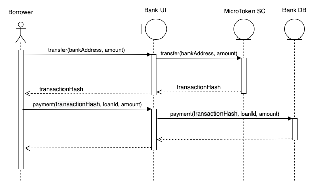

Loan Payment Update Event Flow
==============================

Borrower pays back the loan amount and interest at the end of the loan period.
Borrower pays back the loan by ``Microfinance ERC20 tokens`` using ``MicroToken`` smart contract.
When Borrower pay the loan back, he should update the Bank using ``Loan Payment Update Form``.
Sequence diagram for pay back loans. 

As shown in the above diagram Borrower transfer the pay back token amount to Bank wallet using ``MicroToken`` smart contract.
Then Borrower updates the Bank and the loan payment details are saved in the Bank DB.

We illustrate the flow of events from bank web app (UI) 
to ``bank-web-app/pages/borrower/transfer.js`` 
to ``bank-web-app/components/transfer/TransferController`` 
to ``bank-web-app/components/payment/LoanPaymentForm``.

Borrower's view of ``Transfer`` page.

.. figure:: ../images/borrower_transfer_page.png

Borrower uses the ``Microfinance Token Transfer Form`` to transfer tokens to the Bank and ``Loan Payment Update Form`` to update the 
Bank about Loan Payments.

The browser address bar contains the ``localhost:3005/borrower/transfer``.
This means UI loads the ``bank-web-app/pages/borrower/transfer.js`` component. ::

  import React from 'react';
  import { Row, Col } from 'antd';
  import TransferController from '../../components/transfer/TransferController';
  import LoanPaymentForm from '../../components/payment/LoanPaymentForm';

  function Transfer() {
    return (
      <Row gutter={[16, 16]}>
        <Col span={24}>
          <TransferController />
        </Col>
        <Col span={24}>
          <LoanPaymentForm />
        </Col>
      </Row>
    );
  }

  export default Transfer;

As shown in the above screenshot, ``Transfer`` component loads the ``TransferController`` at the top and 
``LoanPaymentForm`` at the bottom.

First Borrower transfer the pay back token amount to the ``Bank`` using ``TransferController`` component as
dscribed in :ref:`token transfer evet target` section.

As described in the :ref:`token transfer success target` section, It displays the ``transactionHash`` value 
in the success message when token transaction success.

``Borrower`` copies the transactionHash and submits it to the Bank using ``Loan Payment Update Form``

Loan Payment Form Component
---------------------------

As shown above ``Transfer`` component, it displays the ``LoanPaymentForm`` from ``bank-web-app/components/payment/LoanPaymentForm.js``
In ``LoanPaymentForm.js`` first it imports the dependencies. ::

  import React from 'react';
  import { Card, Form, Input, Button, InputNumber, message } from 'antd';
  import { postApi } from '../../util/fetchApi';

``postApi`` method is used to send new Loan Payment Transaction to **Bank Web Server**.

As shown in the above screenshot ``LoanPaymentForm`` displays a form in the UI. 
This was defined in the return section of the ``LoanPaymentForm`` component. ::

  return (
    <Card title="Loan Payment Update Form">
      <Form
        ....
        onFinish={submitLoanPayment}
      >
        <Form.Item label="Loan Id" name="loanId" rules={[{ required: true, message: 'Please enter loan id!' }]}>
          <InputNumber min="1" style={{ width: '100%' }} placeholder="Enter loan id" />
        </Form.Item>
        <Form.Item label="Amount" name="amount" rules={[{ required: true, message: 'Please enter amount!' }]}>
          <InputNumber min="0" style={{ width: '100%' }} placeholder="Enter amount" />
        </Form.Item>
        <Form.Item label="Transaction hash" name="transactionHash" rules={[{ required: true, message: 'Please enter transaction hash!' }]}>
          <Input style={{ width: '100%' }} placeholder="Enter transaction hash" />
        </Form.Item>
        <Form.Item wrapperCol={{ .... }}
        >
          <Button type="primary" htmlType="submit">Submit Loan Payment</Button>
        </Form.Item>
      </Form>
    </Card>
  );

In this ``Form`` component it has 3 fields to input ``Loan Id``, ``Payment Amount`` and ``Transaction Hash`` value.
Borrower inputs the relavent ``Loan Id`` and ``Amount``.
Borrower can obtain the ``Transaction Hash`` value from the ``Transaction Success`` component described in :ref:`token transfer success target`
section.

When Borrower clicks the ``Submit Loan Payment`` button it triggers the ``submitLoanPayment`` function. ::

  const submitLoanPayment = async (values) => {
    try {
      const body = {
        loanId: values.loanId,
        amount: values.amount,
        transactionHash: values.transactionHash,
      };

      await postApi({
        url: 'loan-payments',
        params: body,
      });

      message.success('Loan Payment added successfully');
    } catch (err) {
      message.error('Error while adding the Loan Payment');
      console.log(err);
    }
  };

``submitLoanPayment`` defined the HTTP Request body using submitted Form Field values.
It sends the request to ``loan-payment`` path in the **Bank Web Server** api.

When **Bank Web Server** saves the new Loan Payment entry in the Bank DB, ``submitLoanPayment`` displays the
success message. If not it displays the ``error`` message.

More about ``postApi`` described in the :ref:`post api target` section.

Complete Loan Payment Form Component
------------------------------------

Complete ``LoanPaymentForm`` component: ::

  import React from 'react';
  import { Card, Form, Input, Button, InputNumber, message } from 'antd';
  import { postApi } from '../../util/fetchApi';

  function LoanPaymentForm() {
    const submitLoanPayment = async (values) => {
      try {
        const body = {
          loanId: values.loanId,
          amount: values.amount,
          transactionHash: values.transactionHash,
        };

        await postApi({
          url: 'loan-payments',
          params: body,
        });

        message.success('Loan Payment added successfully');
      } catch (err) {
        message.error('Error while adding the Loan Payment');
        console.log(err);
      }
    };

    return (
      <Card title="Loan Payment Update Form">
        <Form
          labelCol={{ lg: 5, xl: 4, xxl: 3 }}
          wrapperCol={{ lg: 16, xl: 14, xxl: 10 }}
          layout="horizontal"
          size="default"
          labelAlign="left"
          onFinish={submitLoanPayment}
        >
          <Form.Item label="Loan Id" name="loanId" rules={[{ required: true, message: 'Please enter loan id!' }]}>
            <InputNumber
              min="1"
              style={{ width: '100%' }}
              placeholder="Enter loan id"
            />
          </Form.Item>
          <Form.Item label="Amount" name="amount" rules={[{ required: true, message: 'Please enter amount!' }]}>
            <InputNumber
              min="0"
              style={{ width: '100%' }}
              placeholder="Enter amount"
            />
          </Form.Item>
          <Form.Item label="Transaction hash" name="transactionHash" rules={[{ required: true, message: 'Please enter transaction hash!' }]}>
            <Input
              style={{ width: '100%' }}
              placeholder="Enter transaction hash"
            />
          </Form.Item>
          <Form.Item wrapperCol={{
            lg: { span: 14, offset: 5 },
            xl: { span: 14, offset: 4 },
            xxl: { span: 14, offset: 3 } }}
          >
            <Button type="primary" htmlType="submit">Submit Loan Payment</Button>
          </Form.Item>
        </Form>
      </Card>

    );
  }

  export default LoanPaymentForm;

