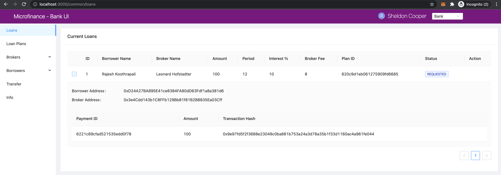

Loans Table Event Flows
=======================

Loans table is displayed for ``Broker``, ``Borrower``, ``Bank`` users.

``Broker`` view. 

``Bank`` view. 

.. figure:: ../images/bank_loan.png

``Borrower`` view. 

``Loans`` menu item is common for all 3 user roles.
These Menus are defined in the ``/component/menu/`` directory.
All ``BrokerMenu``, ``BankMenu``, and ``BorrowerMenu`` components defined the ``Loans`` menu item as follows. ::

  <Menu.Item key="/loans" onClick={() => router.push('/common/loans')}>
    Loans
  </Menu.Item>

As you can see on the address bars of the above 3 screenshots it contains the address value ``localhost:3005/common/loans``
These 3 distinct menu items will load ``bank-web-app/pages/common/loans.js`` page.

We illustrate the flow of events from React web app (UI) to 
``bank-web-app/pages/common/loans.js`` to ``bank-web-app/components/loan/LoansTable.js``.

loans.js
--------

script of the ``loans.js``. ::

  import React from 'react';
  import { Row, Col } from 'antd';
  import LoansTable from '../../components/loan/LoansTable';

  function Loans() {
    return (
      <Row gutter={[16, 16]}>
        <Col span={24}>
          <LoansTable />
        </Col>
      </Row>
    );
  }

  export default Loans;

In the above script, first it imports dependencies. 
In addition to the React and Ant design dependencies it imports ``LoansTable`` component 
from the ``/components/loan/LoansTable``.
It specify the relative path to the ``LoansTable`` in the ``import`` line.

This script defines the ``Loans`` component and it displays the ``LoansTable`` component and 
aligns it using ``Row`` and ``Col`` Ant design components.

LoansTable.js
-------------

Since ``LoansTable`` common for all users it contains many functions and conditional rendering compenents.

First, ``LoansTable`` component imports dependencies. ::

  import React, { useState, useContext, useEffect } from 'react';
  import { Table, Tag, Card, Divider, message, Modal, Form, Space, Button } from 'antd';
  import { getApi } from '../../util/fetchApi';
  import UserContext from '../../stores/userContext';
  import SmartContractContext from '../../stores/smartContractContext';

* ``getApi`` to fetch data from **Bank Web Server**
* ``UserContext`` to get the selected user role.
* ``SmartContractContext`` to access smart contract related context objects to interact with them.

It gets the selected user from ``UserContext``. ::

  const { user } = useContext(UserContext);

It uses the ``MicroTokenContract``, ``BankLoanContract``, and ``UserIdentityContract`` 
smart contract objects and access them from ``SmartContractContext``. ::

	const { MicroTokenContract, BankLoanContract, UserIdentityContract } = useContext(SmartContractContext);

Loan has different states.
These states maintain usin ``ENUM`` in ``BankLoan`` smart contract.
But these states will return from ``BankLoan`` smart contract as integer values.
To add meaning to these integer states we keep same states array by keeping the same order in the ``LoansTable`` as 
they defined in the ``BankLoan`` smart contract. ::

  const state = ['REQUESTED', 'BORROWER_SIGNED', 'BANK_APPROVED', 'BANK_REJECTED',
		'PAID_TO_BROKER', 'ONGOING', 'DEFAULT', 'CLOSE'];

Integer values returning from ``BankLoan.sol`` states are equal to the ``states`` index values.

``LoansTable`` has following states. ::

  const [isApproveModalVisible, setIsApproveModalVisible] = useState(false); // Loan approve confirmation modal visibility state.
  const [isRejectModalVisible, setIsRejectModalVisible] = useState(false); // Loan remove modal visibility state.
  const [isBrokerTransferModalVisible, setIsBrokerTransferModalVisible] = useState(false);
  const [isBorrowerTransferModalVisible, setIsBorrowerTransferModalVisible] = useState(false);
  const [id, setId] = useState(0);
  const [loanRecord, setLoanRecord] = useState({});
  const [current, setCurrent] = useState(0);
  const [payments, setPayments] = useState([]);
  const [data, setData] = useState([]);

* ``isApproveModalVisible`` - Loan Approval Modal visibility state.
* ``isRejectModalVisible`` - Loan Reject Modal visibility state.
* ``isBrokerTransferModalVisible`` - Visibility state of the Modal which is transfering tokens from ``Bank`` to ``Broker``.
* ``isBorrowerTransferModalVisible`` - Visibility state of the Modal which is transfering loan token amount from ``Bank`` to ``Broker``.
* ``id`` - Loan id state.
* ``loanRecord`` - Active Loan state.
* ``current`` - Current stage state of transfering tokens and update loan process.
* ``payments`` - Loan Payments state.
* ``data`` - Loan data.

Following 2 objects will store the registered ``Brokers`` and ``Borrowers`` details.
We use plain objects to keep a map of users wallet addresses and their names.
We use Plain JavaScript object instead of using JavaScript ``Maps`` because we just store and retrive data from this map objects. ::

  const brokers = {};
  const borrowers = {};

Get Brokers Data
~~~~~~~~~~~~~~~~~~

``LoansTable`` component contains a ``getBrokers`` function to get registered ``Brokers`` details from the ``UserIdentity`` smart contract.
It gets the ``Brokers`` data using ``UserIdentityContract`` smart contract object from the ``SmartContractContext`` and
``getAllBrokers`` public method defined in the ``UserIdentity.sol`` smart contract.

When ``getBrokers`` function gets the results from the smart contract call it will map ``Broker`` names to their wallet addresses as 
follows. ::

  const getBrokers = async () => {
    const response = await UserIdentityContract.methods.getAllBrokers().call();
    for (let i = 0; i < response.length; i++) {
      brokers[response[i].walletAddress] = response[i].name;
    }
  };

Get Borroers Data
~~~~~~~~~~~~~~~~~

``getBorrowers`` function will get the registered Borrowers details from the ``UserIdentity`` smart contract 
using ``UserIdentityContract`` smart contract object and ``getAllBorrowers`` method of the `UserIdentity.sol`` smart contract.

This function will update the ``borrowers`` object by mapping the ``Borrowers`` names in to their wallet addresses. ::

  const getBorrowers = async () => {
    const response = await UserIdentityContract.methods.getAllBorrowers().call();
    for (let i = 0; i < response.length; i++) {
      borrowers[response[i].walletAddress] = response[i].name;
    }
  };

Get Loan Payments Data
~~~~~~~~~~~~~~~~~~~~~~

``LoansTable`` defines a ``getPayments`` method to fetch Loan Payment data from the **Bank Web Server**.
``getPayments`` method fech data from ``loan-payments`` api end point using GET method.
It uses the ``getApi`` function in the ``/util/fetchApi.js`` script.

Results will be set to the ``payments`` state defined above using ``setPayments`` method. ::

  const getPayments = async () => {
    try {
      const response = await getApi({
        url: 'loan-payments',
      });
      const paymentsResult = await response;
      setPayments(paymentsResult);
    } catch (err) {
      console.log(err);
      message.error('Error occured while loading Loan Payments');
    }
  };

Get Loans Data
~~~~~~~~~~~~~~

``getLoans`` function will fetch ``Loans`` datafrom the ``BankLoan`` smart contract using ``getLoans`` method defined in the 
``BankLoan.sol`` smart contract.
We use ``BankLoanContract`` from the ``SmartContractContext`` to call the ``getLoans`` method.

After fetching data from ``BankLoan`` smart contract, then it resets the ``data`` state.
Then map each Loan data into a JavaScript object and append it to the ``data`` array state.
In addition to returned Loan data values from the ``BankLoan`` smart contract this JavaScript object 
keeps the ``brokerName`` and ``borrowerName`` properties.
``brokerName`` and ``borrowerName`` value will be updated using ``broker`` and ``borrower`` objects respectively. 
We can pass the ``Broker's`` and ``Borrower's`` wallet addresses in to these objects and get the names of them.

It uses the spread operator ``...prev`` in the ``setData`` method below. ::

  const getLoans = async () => {
    try {
      const response = await BankLoanContract.methods.getLoans().call();

      setData([]);

      for (let i = 0; i < response.length; i++) {
        const row = {
          key: response[i].id,
          id: response[i].id,
          amount: response[i].amount,
          period: response[i].months,
          interest: response[i].interest,
          planId: response[i].planId,
          borrowerName: borrowers[response[i].borrower],
          borrower: response[i].borrower,
          brokerFee: response[i].brokerFee,
          brokerName: brokers[response[i].broker],
          broker: response[i].broker,
          status: response[i].state,
        };

        setData((prev) => {
          return [...prev, row];
        });
      }
    } catch (err) {
      console.log(err);
      message.error('Error occured while loading current Loans');
    }
  };

.. _initial loan data target:

Load Initial Data
~~~~~~~~~~~~~~~~~

Above 4 functions will load the essential data to be displayed in the ``Loans Table``.
``LoansTable`` component has ``loadData`` function to trigger those 4 functions. ::

  const loadData = async () => {
    await getBrokers();
    await getBorrowers();
    await getPayments();
    await getLoans();
  };

Then later part of the ``LoansTable`` component it uses ``useEffect`` hook to load those essential data at the
``LoansTable`` component mounting time. ::

  useEffect(() => {
    loadData();
    ...
  }, []);

This ``useEffect`` hook will triggers the ``loadData`` function at the ``LoansTable`` mounting time.
Since this ``useEffect`` hook dependency array is empty, it will execute one time only.

Registering for loanRequest event of the BankLoan Smart contract
~~~~~~~~~~~~~~~~~~~~~~~~~~~~~~~~~~~~~~~~~~~~~~~~~~~~~~~~~~~~~~~~

After executing the ``loadData`` function, ``useEffect`` hook will register an event listner to ``loanRequest`` event of the 
``BankLoan`` smart contract.

we pass 2 parameters to this ``loanRequest`` event funcion.
First parameter object contains the ``fromBlock`` property value.
This property specify the events staring block of the blockchain.
This event listner gets the events emit after the ``latest`` block of the blockchain.

Second parameter defines the callback function.
This function gets the event results of the ``loanRequest`` event.
This ``loanRequest`` events returns the newly created ``Loan`` data.
These new ``Loan`` data will map to a JavaScript object and append to the ``data`` state array.
This event helps to update the ``Loans Table`` with newly created ``Loans``. ::

  const emitter = BankLoanContract.events.loanRequest({ fromBlock: 'latest' }, (error, response) => {
    const result = response.returnValues;

    const row = {
      key: result.id,
      id: result.id,
      amount: result.amount,
      period: result.months,
      interest: result.interest,
      planId: result.planId,
      borrower: result.borrower,
      brokerFee: result.brokerFee,
      broker: result.broker,
      status: result.state,
    };

    setData((prev) => {
      return [...prev, row];
    });
  });

  return () => {
    emitter.unsubscribe();
  };

To unsubscribe to this event we call the ``unsubscribe`` method in the ``return`` section.
This return method will execute when ``LoansTable`` dismount from the UI.

Complete ``useEffect`` hook script. ::

  useEffect(() => {
    loadData();
    const emitter = BankLoanContract.events.loanRequest({ fromBlock: 'latest' }, (error, response) => {
      const result = response.returnValues;

      const row = {
        key: result.id,
        id: result.id,
        amount: result.amount,
        period: result.months,
        interest: result.interest,
        planId: result.planId,
        borrower: result.borrower,
        brokerFee: result.brokerFee,
        broker: result.broker,
        status: result.state,
      };

      setData((prev) => {
        return [...prev, row];
      });
    });

    return () => {
      emitter.unsubscribe();
    };
  }, []);

Initial Loan Table Columns
~~~~~~~~~~~~~~~~~~~~~~~~~~

As we mentioned above Loans Table is displayed for all 3 user roles.
``LoansTable`` component defines the ``columns`` array which contains the Loans Table columns. ::

  const columns = [
    {
      title: 'ID',
      dataIndex: 'id',
      key: 'id',
    },
    {
      title: 'Borrower Name',
      dataIndex: 'borrowerName',
      key: 'borrowerName',
    },
    {
      title: 'Broker Name',
      dataIndex: 'brokerName',
      key: 'brokerName',
    },
    {
      title: 'Amount',
      dataIndex: 'amount',
      key: 'amount',
    },
    {
      title: 'Period',
      dataIndex: 'period',
      key: 'period',
    },
    {
      title: 'Interest %',
      key: 'interest',
      dataIndex: 'interest',
    },
    {
      title: 'Broker Fee',
      key: 'brokerFee',
      dataIndex: 'brokerFee',
    },
    {
      title: 'Plan ID',
      key: 'planId',
      dataIndex: 'planId',
    },
    {
      title: 'Status',
      key: 'status',
      dataIndex: 'status',
      render: tag => {
        let color = 'geekblue';
        if (tag === '3' || tag === '6') {
          color = 'red';
        } else if (tag === '2' || tag === '5') {
          color = 'green';
        }
        return (
          <Tag color={color} key={tag}>
            {state[tag]}
          </Tag>
        );
      },
    },
  ];

All columns objects have following properties.

* ``title`` - Column name.
* ``dataIndex`` - Loan object property to disply in the column.
* ``key`` - Unique identifier for the column.

``Status`` column has ``render`` property to do a conditional rendering. ::

  render: tag => {
    let color = 'geekblue';
    if (tag === '3' || tag === '6') {
      color = 'red';
    } else if (tag === '2' || tag === '5') {
      color = 'green';
    }
    return (
      <Tag color={color} key={tag}>
        {state[tag]}
      </Tag>
    );
  },

This ``Status`` column displays the Loan state using ``Tag`` Ant design component and change the color of the ``Tag`` according to 
the ``loanState`` value. 

Initial Loan Table view for ``Borrower``. 

Initial Loan Table view for ``Bank``.

.. figure:: ../images/bank_loan_row.png

Initial Loan Table view for ``Broker``.

.. figure:: ../images/broker_loan_row.png

In the above screenshots you may see ``Action`` column only enbled for ``Bank`` and ``Borrower`` users only.
No actions enabled for ``Bank`` user for the current ``Loan`` listed in the Loan Table.
``Sign Loan`` action enbled for the current Loan in the Loans Table for ``Broker``.

These conditional redering is done using following 2 ``if`` conditions. ::

  if (user.role === 'borrower') {
    columns.push({
      title: 'Action',
      dataIndex: '',
      key: 'x',
      render: (record) => {
        if (record.status === '0') {
          return (
            
              <a href onClick={() => signLoan(record.id)}>Sign Loan</a>
            
          );
        }
      },
    });
  }

  if (user.role === 'bank') {
    columns.push({
      title: 'Action',
      dataIndex: '',
      key: 'x',
      render: (record) => {
        let actionBlock = '';
        if (record.status === '1') {
          actionBlock =
            
              <a href onClick={() => showModal(record.id)}>Approve</a>
              <Divider type="vertical" />
              <a href onClick={() => showRejectModal(record.id)} style={{ color: 'red' }}>Reject</a>
            ;
        } else if (record.status === '2') {
          actionBlock =
            
              <a href onClick={() => showBrokerTransferModal(record)}>
                Transfer Tokens to Broker
              </a>
            ;
        } else if (record.status === '4') {
          actionBlock =
            
              <a href onClick={() => showBorrowerTransferModal(record)}>
                Transfer Tokens to Borrower
              </a>
            ;
        } else if (record.status === '5') {
          actionBlock =
            
              <a href onClick={() => closeLoan(record.id)}>Close</a>
              <Divider type="vertical" />
              <a href onClick={() => markAsDefaulted(record.id)} style={{ color: 'red' }}>Defaulted</a>
            ;
        }
        return actionBlock;
      },
    });
  }

These 2 ``if`` condition statements add ``Action`` column to the Loan Table depending on user roles ``Bank`` and ``Borrower``.
Before adding the action to the ``Action`` colunm they check the Loan ``status``.

Below table describes ``Actions`` enabled for ``User Roles`` depending on the current Loan State.
``Next Loan State`` column contains the ``Loan State`` values which is held by Loan after user taking the action.

.. list-table::
   :header-rows: 1

   * - Current Loan State
     - ENUM
     - Action
     - User Role
     - Next Loan State
   * - REQUESTED
     - 0
     - Sign Loan
     - Borrower
     - BORROWER_SIGNED
   * - BORROWER_SIGNED
     - 1
     - Approve / Reject
     - Bank
     - BANK_APPROVED / BANK_REJECTED
   * - BANK_APPROVED
     - 2
     - Transfer Tokens to Broker
     - Bank
     - PAID_TO_BROKER
   * - PAID_TO_BROKER
     - 4
     - Transfer Tokens to Borrower
     - Bank
     - ONGOING
   * - ONGOING
     - 5
     - Cloase / Defaulted
     - Bank
     - CLOSE / DEFAULT

For more information you can refer :ref:`loan state diagram target`

``LoansTable`` component displays the Loan Table in a ``Card`` Ant design component.
Following code snippet resides inside the ``return`` section of ``LoansTable`` component. ::

  <Card title="Current Loans">
    <Table
      pagination="true"
      columns={columns}
      dataSource={data}
      expandable={{
        expandedRowRender,
      }}
    />
  </Card>

It passes the ``columns`` array and ``data`` state to a Ant desing ``Table`` component.
This component will display table including the columns and Loan data we passed as props.

Expand Loan Table Rows.
~~~~~~~~~~~~~~~~~~~~~~~

In addition above mentioned props there is another prop ``expandable``.
Using this prop we can expand the rows and display more information related to the data row.
You can learn more about this in `Ant Design Table Component page <https://ant.design/components/table/>`_

We can set object to this ``expandable`` including ``expandedRowRender`` key.

Following code snnipet is equal to the ``expandable`` prop code snippet. ::

  expandable={{
    expandedRowRender: expandedRowRender,
  }}

We used property shorthand mechanism in our project code.

We can set any method to this object key which will be executed when user clicks on the ``+`` button 
at the begining of the table row.

``expandedRowRender`` funcion gets selected row record as a parameter. ::

  const expandedRowRender = (record) => {
    const expandedPayments = payments.filter(item => item.loanId == record.id);

    const expandedPaymentColumns = [
      { title: 'Payment ID', dataIndex: '_id', key: 'id' },
      { title: 'Amount', dataIndex: 'amount', key: 'amount' },
      { title: 'Loan ID', dataIndex: 'loanId', key: 'loanId' },
      { title: 'Transaction Hash', dataIndex: 'transactionHash', key: 'transactionHash' },
    ];

    return (
      <>
        <Form ... >
          <Form.Item label="Borrower address" style={{ marginBottom: '0px' }}>
            {record.borrower}
          </Form.Item>
          <Form.Item label="Broker address">
            {record.broker}
          </Form.Item>
        </Form>
        <Table
          columns={expandedPaymentColumns}
          dataSource={expandedPayments}
          pagination={false}
        />
      </>
    );
  };

In ``expandedRowRender``, first it filter out the Loan Payment data from the ``payment`` state.
The defines columns of the Loan Payments Table.

``expandedRowRender`` function returns the html to be displayed in the expanded area.
In return section it defines a ``Form`` component to display ``Borrower Address`` and ``Broker Address``.
The adds the Loan Payment Table.
If there is no Payment data related to this Loan, Loan Payments Table displays ``No Data`` message in the table.

When ``Borrower`` pays loan amount back, He/She may submit the Loan Payment details including blockchain transaction hash value
using ``Update Loan Payment`` in the ``Transfer`` page. Those payment data will list down in the Payment Table in the expanded view.

.. note::
   Following event flows refer to the actions defined in the ``Action`` column.
   status integer values refer to the ENUM values returened from the ``BankLoan`` smart contract.
   
   ``await window.ethereum.enable();`` line in the functions describe in the following sections 
   returns the selected account address from the ``MetaMask``. 
   
   This selected account address is returned as an array and it contains only the selected account address. 
   ``accounts[0]`` returns the account address.

   ``send`` methos is used to call smart contract methods which are adding or changing existing data in the blockchain.
   
   This ``send`` method contains object parameter. It passes the function caller address as ``from`` property.

   ``BankLoanContract`` is the smart contract object defined in the ``SmartContractContext``. 
   We use this smart contract object to send Loan updates to the ``BankLoan`` smart contract.
   
   ``BankLoan`` smart contract's methods can be accessed through ``BankLoanContract.methods``.
   
   ``loadData()`` method is used to load data from the smart contracts as mentioned in  :ref:`initial loan data target`

Borrower Sign Loan Event Flows
~~~~~~~~~~~~~~~~~~~~~~~~~~~~~~

If Loan is in ``0`` (``REQUESTED``) state, ``Action`` column displays ``Sing Loan`` action to the ``Borrower``. ::

  if (user.role === 'borrower') {
    columns.push({
      title: 'Action',
      dataIndex: '',
      key: 'x',
      render: (record) => {
        if (record.status === '0') {
          return (
            
              <a href onClick={() => signLoan(record.id)}>Sign Loan</a>
            
          );
        }
      },
    });
  }

When ``Borrower`` clicks the ``Sign Loan`` action it triggers the ``signLoan`` function and passes
Loan Id ``record,id`` as a parameter. ::

  const signLoan = async (loanId) => {
    try {
      const accounts = await window.ethereum.enable();
      await BankLoanContract.methods.signByBorrower(loanId).send({ from: accounts[0] });
      message.success(`Loan ${loanId} signed`);
      loadData();
    } catch (err) {
      console.log(err);
      message.error('Error occured while signing Loan');
    }
  };

In ``signLoan`` function it calls the ``signByBorrower`` smart contract method and passes the ``loanId``.
If this transaction successful it display the success message and load data.
If not it displays the error message.

Bank Approve Loan Event Flows
~~~~~~~~~~~~~~~~~~~~~~~~~~~~~

If Loan is in ``1`` (``BORROWER_SIGNED``) state ``Action`` column enables ``Approve`` and ``Reject`` actions to the ``Bank`` user. ::

  if (record.status === '1') {
    actionBlock =
      
        <a href onClick={() => showApproveModal(record.id)}>Approve</a>
        <Divider type="vertical" />
        <a href onClick={() => showRejectModal(record.id)} style={{ color: 'red' }}>Reject</a>
      ;
  }

When ``Bank`` user clicks the ``Approve`` action it triggers the ``showApproveModal`` function and passes the 
Loan Id ``record.id`` value as a parameter. ::

  const showApproveModal = (value) => {
    setId(value);
    setIsApproveModalVisible(true);
  };

``showApproveModal`` function first sets the Loan Id as the ``id`` state.
Then Chnages the ``isApproveModalVisible`` state to ``true``.

This may display the Ant Design Modal component defined in the ``return`` section. ::

  <Modal title={`Approve Loan Request ${id}`} visible={isApproveModalVisible} onOk={handleApprove} onCancel={handleCancel}>
    
Are you sure to approve loan?

  </Modal>

This modal displays the Loan Id in its title using ``id`` state.
It displays the confirmation messsage in the Modal body.
When user clicks the ``OK`` button of this modal it triggers the ``handleApprove`` function. ::

  const handleApprove = async () => {
    await approveLoan();
    setIsApproveModalVisible(false);
  };

In ``handleApprove`` function first it triggers the ``approveLoan`` function.
Then it removes the current Modal for the UI by changing the ``isApproveModalVisible`` to false. ::

  const approveLoan = async () => {
    try {
      const accounts = await window.ethereum.enable();
      await BankLoanContract.methods.approveLoan(id).send({ from: accounts[0] });
      message.success(`Loan ${id} approved`);
      loadData();
    } catch (err) {
      message.error('Error occured while approving the Loan');
    }
  };

In ``approveLoan`` function it calls the ``approveLoan`` method of the ``BankLoan`` smart contract 
using selected wallet address in the ``MetaMask``.

Bank Reject Loan Event Flows
~~~~~~~~~~~~~~~~~~~~~~~~~~~~

Second action enabled for the loan state ``1`` (``BORROWER_SIGNED``) is ``Reject`` action for the ``Bank`` users. ::

  if (record.status === '1') {
    actionBlock =
      
        <a href onClick={() => showApproveModal(record.id)}>Approve</a>
        <Divider type="vertical" />
        <a href onClick={() => showRejectModal(record.id)} style={{ color: 'red' }}>Reject</a>
      ;
  }

When ``Bank`` user clicks the ``Reject`` action it triggers the ``showRejectModal`` function and passes the 
Loan Id ``record.id`` value as a parameter. ::

  const showRejectModal = (value) => {
    setId(value);
    setIsRejectModalVisible(true);
  };

``showRejectModal`` function first sets the Loan Id as the ``id`` state.
Then Chnages the ``isRejectModalVisible`` state to ``true``.

This may display the Ant Design Modal component defined in the ``return`` section. ::

  <Modal title={`Reject Loan Request ${id}`} visible={isRejectModalVisible} onOk={handleReject} onCancel={handleCancel}>
    
Reject loan request?

  </Modal>

This modal displays the Loan Id in its title using ``id`` state.
It displays the confirmation messsage in the Modal body.
When user clicks the ``OK`` button of this modal it triggers the ``handleReject`` function. ::

  const handleReject = async () => {
    await rejectLoan();
    setIsRejectModalVisible(false);
  };

In ``handleReject`` function first it triggers the ``rejectLoan`` function.
Then it removes the current Modal for the UI by changing the ``isRejectModalVisible`` to false. ::

  const rejectLoan = async () => {
    try {
      const accounts = await window.ethereum.enable();
      await BankLoanContract.methods.rejectLoan(id).send({ from: accounts[0] });
      message.success(`Loan ${id} rejected`);
      loadData();
    } catch (err) {
      message.error('Error occured while rejecting the Loan');
    }
  };

In ``rejectLoan`` function it calls the ``rejectLoan`` method of the ``BankLoan`` smart contract 
using selected wallet address in the ``MetaMask``.