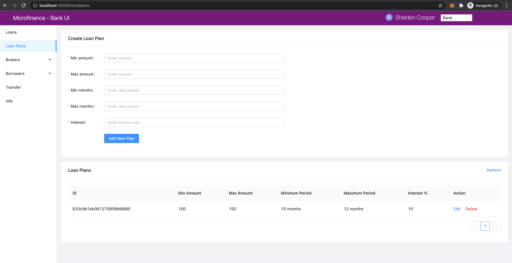
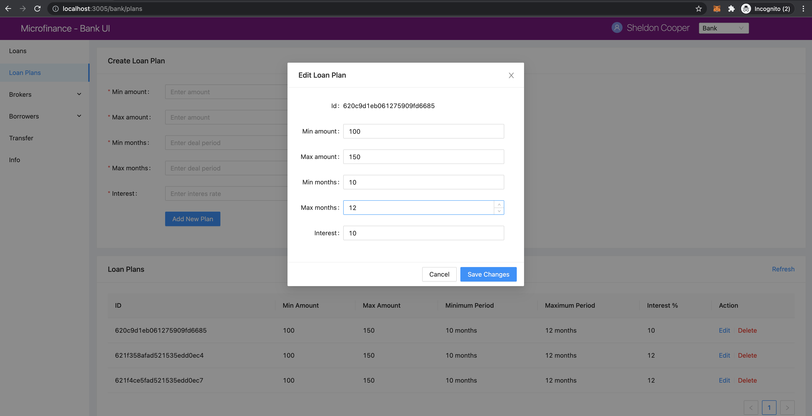

Fetch Loan Plans from Bank Web Server
=====================================

In this section we discuss about ho to fetch Loan Plans from **Bank Web Server**
As we disccuss in the :ref:`create-loan-plan-target`, **Microfinance -Bank UI** displays a ``Loan Plans`` table
at the bottom of the ``Loan Plans`` page.

We illustrate the flow of events from React web app (UI) to 
``bank-web-app/pages/bank/plans.js`` to ``bank-web-app/components/plan/PlansTable.js``.

This plan table will be rendered according to the user role.
for ``Bank`` user role it displays ``Action`` column with ``Edit`` and ``Delete`` options for each Loan Plan.
It will display for ``Broker``s at the bottom of the ``Apply Loan`` page in ``BrokerMenu``.

    .. image:: ../images/apply_loan.png

plans.js
--------

The script of the ``plans.js``. ::

    import React, { useState } from 'react';
    import { Row, Col } from 'antd';
    import PlansTable from '../../components/plan/PlansTable';
    import CreatePlanForm from '../../components/plan/CreatePlanForm';

    function BankPlans() {
        const [togglePlan, setTogglePlan] = useState(true);
        return (
            <Row gutter={[16, 16]}>
                <Col span={24}>
                    <CreatePlanForm setTogglePlan={setTogglePlan} togglePlan={togglePlan} />
                </Col>
                <Col span={24}>
                    <PlansTable togglePlan={togglePlan} />
                </Col>
            </Row>
        );
    }

    export default BankPlans;

In this ``plan.js`` script uses ``PlanTable`` component and pass props ``togglePlan``.
It will render the ``PlansTable`` component in ``bank-web-app/components/plan/PlansTable.js``.

PlansTable.js
-------------

in ``PlansTable.js`` script, first it imports following dependencies. ::

    import React, { useState, useContext, useEffect } from 'react';
    import { Table, Form, InputNumber, Card, Divider, Modal, Button, message } from 'antd';
    import { CloseCircleOutlined } from '@ant-design/icons';
    import { getApi, patchApi, deleteApi } from '../../util/fetchApi';
    import PropTypes from 'prop-types';
    import UserContext from '../../stores/userContext';

* It imports ``getApi``, ``patchApi``, ``deleteApi`` from ``fetchApi`` to get, edit and delete Loan Plans.
* ``PropTypes`` to check prop types in the component.
* ``UserContext`` for access the user.

Then it defines the ``PlansTable`` component as follows. ::

    function PlansTable({ togglePlan }) 

It gets ``togglePlan`` prop when create the component.

``PlansTable`` has following states. ::

    const { user } = useContext(UserContext);
    const [isModalVisible, setIsModalVisible] = useState(false);
    const [data, setData] = useState([]);

* ``user`` state has the selected user role.
* ``isModalVisible`` stores the Loan Plan Edit Modal visibility state.
* ``data`` state contains the Loan Plans details.

following states use when Edit and Delete the Loan Plans. ::

	const [id, setId] = useState(''); // Loan id state.
	const [minAmount, setMinAmount] = useState(''); // Minimum amount of the loan
	const [maxAmount, setMaxAmount] = useState(''); // Maximum amount of the loan
	const [minMonths, setMinMonths] = useState(''); // Minimum duration of the loan in months.
	const [maxMonths, setMaxMonths] = useState(''); // Maximum duration of the loan in months.
	const [interest, setInterest] = useState(''); // Loan interest.

It uses ``cofirm`` Modal component from Ant design to display confirmation messages. ::

  const { confirm } = Modal;

``fetchPlan`` function will load the Loan Plans from **Bank Web Server** using ``getApi`` method from ``fetchApi`` script. ::

  const fetchPlans = async () => {
    try {
      const plans = await getApi({
        url: 'loan-plans',
      });

      setData([]);
      // Add all Loan Plans to the data array.
      for (let i = 0; i < plans.length; i++) {
        const row = {
          key: plans[i]._id,
          id: plans[i]._id,
          minAmount: plans[i].minAmount,
          maxAmount: plans[i].maxAmount,
          minMonths: plans[i].minMonths,
          maxMonths: plans[i].maxMonths,
          interest: plans[i].interest,
        };

        setData((prev) => {
          // Spread operator(...) helps to update the states.
          // Append each Loan Plan to the data array.
          return [...prev, row]; 
        });
      }
    } catch (err) {
      console.log(err);
      message.error('Error occured while loading Loan Plans');
    }
  };

In the above method first it loads the Loan Plans from ``loan-plans`` api end point. ::

    const plans = await getApi({
        url: 'loan-plans',
    });

After reset the ``data`` state it will map the resulting Loan Plans in to a objects and appent in the ``data`` state. ::

    setData([]);
    for (let i = 0; i < plans.length; i++) {
        const row = {
            key: plans[i]._id,
            id: plans[i]._id,
            minAmount: plans[i].minAmount,
            maxAmount: plans[i].maxAmount,
            minMonths: plans[i].minMonths,
            maxMonths: plans[i].maxMonths,
            interest: plans[i].interest,
        };

        setData((prev) => {
            return [...prev, row]; 
        });
    }

The spread operator ``...prev`` will return the exisiting data in the ``data`` state and then append the next Loan Plan 
object to the ``data`` state.

We use ``useEffect`` hook to trigger ``fetchPlans`` function when first time ``PlansTable`` component mount to the UI and
then when ``togglePlan`` state change. As we discuss above ``togglePlan`` is a state value passed from  ``BankPlans`` 
component defined in the ``plans.js``.

When user add new Loan Plan and change the ``togglePlan`` state, this hook helps to reload the Loan Plans table 
in ``PlansTable`` component. ::

  useEffect(() => {
		fetchPlans();
	}, [togglePlan]);

In the middle of this ``PlansTable`` component it defines the ``columns`` object. ::

  const columns = [
    {
      title: 'ID',
      dataIndex: 'id',
      key: 'id',
    },
    {
      title: 'Min Amount',
      dataIndex: 'minAmount',
      key: 'minAmount',
    },
    {
      title: 'Max Amount',
      dataIndex: 'maxAmount',
      key: 'maxAmount',
    },
    {
      title: 'Minimum Period',
      dataIndex: 'minMonths',
      key: 'minMonths',
      render: text => text + ' months',
    },
    {
      title: 'Maximum Period',
      dataIndex: 'maxMonths',
      key: 'maxMonths',
      render: text => text + ' months',
    },
    {
      title: 'Interest %',
      key: 'interest',
      dataIndex: 'interest',
    },
  ];

This column object has all coomon columns details of the ``Loan Plans`` table.
``columns`` is an object array. 
Each object of this array represent on column and all obejcts have ``title``, ``dataIndex`` and ``key`` keys.

* ``title`` - Column name
* ``dataIndex`` - Key name of the data object which will display on this column.
* ``key`` - Unique id for each element in the data array.

In addition to these key values some of the objects has ``render`` value.

This helps to add additional information or make changes to the data which will display in column.
As an example ``Minimum Period`` column has a ``render`` method. ::

  {
    title: 'Minimum Period',
    dataIndex: 'minMonths',
    key: 'minMonths',
    render: text => text + ' months',
  },

``Minimum Period`` contains a integer value in data object.
``render`` method helps to add `` months`` key word to every data onject in the ``Minimum Period`` column.

This columns object array doesn't contain any ``Action`` column.
This ``Action`` column displays only for ``Bank`` users.
We can add ``Action`` column to the ``columns`` object array as follows. ::

  if (user.role === 'bank') {
      columns.push({
          title: 'Action',
          dataIndex: '', // Not specify the Data property. Data object will use in render method.
          key: 'id',
          render: (record) => 
              
                  <a href onClick={() => showModal(record.id)}>Edit</a>
                  <Divider type="vertical" />
                  <a href onClick={() => deletePlan(record.id)} style={{ color: 'red' }}>Delete</a>
              
          ),
      });
  }

Using ``if`` condition first we check the selected user role.
Then we push ``Action`` column to the ``columns`` object array.
This ``Action`` column object has ``title`` value but no ``dataIndex`` value.
Since we don't have any specific data value to display in this column we do not specify the ``dataIndex``

In ``render`` method it will get the ``Loan Plan`` object as ``record`` parameter.
This column displays ``Edit`` and ``Delete`` links.

When user click on the ``Edit`` link it will open a Ant design Modal with the selected Loan Plan details.
It facilitates to edit the each Loan Plan values but ``Loan Plan Id``.

``Delete`` link will open a ``confirm`` Ant design Modal to delete the Loan Plan.

In the return section of the ``PlansTable`` component first it defines the Loan Plans Table in a Ant design ``Card`` component. ::

    <Card
        title="Loan Plans"
        extra={<a href onClick={() => fetchPlans()}>Refresh</a>}
    >
      <Table columns={columns} dataSource={data} />
    </Card>

This card displays ``Loan Plans`` as the card title.
``extra`` prop will display ``Refresh`` link at the right top corner of the ``Card`` coponent.
By clicking this ``Refresh`` link user can update the Loan Plans Table.
``Refresh`` link will trigger the ``fetchPlans`` function.

Later in the ``Table`` Ant design component we pass the ``columns`` and ``dataSource`` prop.
``columns`` prop value set to ``columns`` object array and ``data`` object array set as the ``dataIndex`` prop.

If there are any changes in the ``data`` state may reflect in the Loan Plans Table.

getApi Method of fetchApi.js
-----------------------------

We define the ``getApi`` method in ``fetchApi.js`` as follows. ::

  const getApi = async ({ url, options, params } = mandatory(), cb = f => f)

``getApi`` is a asynchronous function. 
It takes 2 parameters.

As we discussed in the ``postApi`` function, First parameter of the ``getApi`` function 
is a object and it contains the keys ``{url, options, params}``. 
``mandatory`` is the default value for this object.
If any component call this method without this object it will execute the ``mandatory()`` function. ::

  const mandatory = () => {
    return Promise.reject(new Error('Fetch API Missing parameter!'));
  };

The ``mandatory`` function will return a ``Promise`` that rejecting the server call.
This will display an Error message ``Fetch API Missing parameter!`` in the UI.

The second parameter is ``cb`` stands for ``callback`` function.
When any component submits a ``callback`` function to this ``getApi`` function it will trigger this ``callback`` function 
at the end of the ``getApi`` function.
The default value for the ``cb`` is ``f => f`` is a simple arrow funcion which is equal to ``(f) => { return f }``.

in ``getApi`` function, first it defines the ``defaultOptions`` object. ::

  const defaultOptions = {
    method: 'GET',
    headers: {
      'Accept': 'application/json',
      'Content-Type': 'application/json',
    },
  };

This object defines the HTTP Request method ``GET`` and the request headers for the HTTP Request.

Then it will merge the ``defaultOptions`` object and the ``options`` object.
We can override these HTTP Request parameters by passing the ``options`` object. ::

  const opts = merge(defaultOptions, options);

Then it creates the api url using the ``url`` value passed in to the ``getApi`` function. ::

  let uri = API_URL + url;

Unlike ``POST`` HTTP requests ``GET`` requests do not contain body objects in the HTTP request.
Insted we can pass parameters in url.
The following code defines the request url using the ``params`` object passed to the ``getApi`` function. ::

  if (params && Object.keys(params).length > 0) {
    if (opts && opts.method === 'GET') {
      uri += '?' + new URLSearchParams(params);
      console.log(uri);
    }
  }

Then it calls the api using JavaScript ``fetch`` api and wait for the response from the **Bank Web Server**. ::

  const response = await fetch(uri, opts);
  const data = await response.json();

To return results to the caller component it will use the ``callback`` function.
Then return the results as follows. 
Any component in the app can get results through the ``getApi`` function
by passing a ``callback`` function or using ``await`` method. ::

  cb(null, data);
  return data;

If error occured while this transaction it will call the ``callback`` function with error and 
returns a ``Promise.reject`` with the error. ::

  cb(err);
  return Promise.reject(err);

Edit Loan Plans Event Flow
==========================

As we discuss above in ``Action`` column in ``PlansTable`` is enabled for ``Bank`` users.
When ``Bank`` user click the ``Edit`` then ``PlansTable`` component displays a Ant design Modal
with the selected Loan Plan. details.

PlansTable.js
-------------

The render method of the ``Action`` column was defined as follows. ::

  render: (record) => 
      
          <a href onClick={() => showModal(record.id)}>Edit</a>
          <Divider type="vertical" />
          <a href onClick={() => deletePlan(record.id)} style={{ color: 'red' }}>Delete</a>
      
  ),

When user clicks ``Edit`` will trigger the ``showModal`` function and Loan Plan Id passed as a parameter. ::

  const showModal = (planId) => {
    fetchPlanById(planId);
    setIsModalVisible(true);
  };

In the ``showModal`` function, first it will fetch Loan Plan data using ``fetchPlanById`` function.
Then it will change the ``modalVisibility`` state value to ``true`` using its setter method ``setIsModalVisible``. ::

  const fetchPlanById = async (planId) => {
    try {
      const response = await getApi({
        url: 'loan-plans/' + planId, 
      });

      const plan = await response;
      setId(plan._id);
      setMinAmount(plan.minAmount);
      setMaxAmount(plan.maxAmount);
      setMinMonths(plan.minMonths);
      setMaxMonths(plan.maxMonths);
      setInterest(plan.interest);
    } catch (err) {
      console.log(err);
      message.error('Error occured while loading Loan Plan');
    }
  };

``fetchPlanById`` function got the ``planId``, Loan Plan Id as a parameter.
Then it will fetch data from **Bank Web Server** using ``getApi`` of ``fetchApi`` script.

The ``url`` of the api end point consists with ``/loan-plans`` and ``planId``.
**Bank Web Server** will return Loan Plan saved under this ``planId``.

We fetch Loan Plan data from the **Bank Web Server** because the data in the Loan Plans Table could be outdated.

``id``, ``minAmount``, ``maxAmount``, ``minMonths``, ``maxMonths``, and ``interest`` states are updated using the response from 
**Bank Web Server**.

When ``isModalVisible`` state value is ``true`` the above Modal displays in the **Microfinance - Bank UI**.

This Modal is defined in the ``return`` section in the ``PlansTable`` component as follows. ::

  <Modal
    title="Edit Loan Plan"
    visible={isModalVisible} //Change the visibility according to isModalVisibility state.
    onCancel={handleCancel} // Function to be executed when user clicks the Cancel button of the modal.
    // Defines the footer of the modal.
    footer={[
      <Button key="back" onClick={handleCancel}>
        Cancel
      </Button>,
      <Button key="submit" type="primary" onClick={handleOk}>
        Save Changes
      </Button>,
    ]}
  >
    <Form ... >
      ...
    </Form>
  <Modal>

Modal gets some props to define its appearance and behaviour.

* ``title`` - Displays the given title ``Edit Loan Plan`` at the top of the Modal.
* ``visibility`` - Changes the Modal visibility according to ``isModalVisible`` state.
* ``onCancel`` - Triggers the given function ``handleCancel`` when user clicks on the ``cross`` icon in the top right corner of the Modal.
* ``footer`` - Defines the footer components.

There are 2 buttons defined in the footer section of the Modal. 
``Cancel`` button will trigger the ``handleCancel`` function and ``Save Changes`` button triggers the ``handleOk`` function.

In the Modal component there is a ``Form`` component. ::

  <Form ... >
    <Form.Item label="Id">
      {id}
    </Form.Item>
    <Form.Item label="Min amount">
      <InputNumber
        min="0"
        style={{ width: '100%' }}
        placeholder="Enter minimum loan amount"
        value={minAmount}
        onChange={(e) => setMinAmount(e)}
      />
    </Form.Item>
    <Form.Item label="Max amount">
      <InputNumber
        min="0"
        style={{ width: '100%' }}
        placeholder="Enter maximum loan amount"
        value={maxAmount}
        onChange={(e) => setMaxAmount(e)}
      />
    </Form.Item>
    <Form.Item label="Min months">
      <InputNumber
        min="0"
        style={{ width: '100%' }}
        placeholder="Enter minimum loan period"
        value={minMonths}
        onChange={(e) => setMinMonths(e)}
      />
    </Form.Item>
    <Form.Item label="Max months">
      <InputNumber
        min="0"
        style={{ width: '100%' }}
        placeholder="Enter maximum loan period"
        value={maxMonths}
        onChange={(e) => setMaxMonths(e)}
      />
    </Form.Item>
    <Form.Item label="Interest">
      <InputNumber
        min="0"
        style={{ width: '100%' }}
        placeholder="Enter interes rate of loan"
        value={interest}
        onChange={(e) => setInterest(e)}
      />
    </Form.Item>
  </Form>

In this ``Form`` all ``Form.Item`` components display their values using states defined in ``PlansTable`` component.
Any changes in these states will reflect in the ``Form``.
When user edit data, These ``Form.Item`` s will update states as well.

The first ``Form.Item`` component displays Loan Plan Id using ``id`` state in a ``span`` tag. 
This ``id`` state will update when user clicks ``Edit`` and gets the Loan Plan data from the **Bank Web Server**.
This value is not editable.
User cannot edit the Loan Plan Id value.

Second ``Form.Item`` displays the ``minAmount`` state value in ``InputNumber`` component using ``value={minAmount}``.
``onChange={(e) => setMinAmount(e)}`` will update the ``minAmount`` state from the user input when user edit the ``Min Amount`` field.

This mechanism is repeated for remaining 4 ``Form.Item`` components.

After updating the form fields user can click the ``Save Changes`` button at the bottom of the Modal.
As we mentioned before it will trigger the ``handleOk`` function. ::

  const handleOk = async () => {
    try {
      const body = {
        minAmount,
        maxAmount,
        minMonths,
        maxMonths,
        interest,
      };

      const response = await patchApi({
        url: 'loan-plans/' + id,
        params: body,
      });

      message.success('Loan Plan updated successfully');
      setIsModalVisible(false);
      fetchPlans();
    } catch (err) {
      message.error('Error while updating the Loan Plan');
      console.log(err);
    }
  };

In ``handleOk`` function, first it defines Loan Plan object. ::

  const body = {
    minAmount,
    maxAmount,
    minMonths,
    maxMonths,
    interest,
  };

This is a shorthand mechanism to define object in JavaScript.
This method can use for each key and the value of the object has same name.
This is equal to define a obejct as follows. ::

  const body = {
    minAmount: minAmount,
    maxAmount: maxAmount,
    minMonths: minMonths,
    maxMonths: maxMonths,
    interest: interest,
  };

Then it will send the updated Loan PLan object to the **Bank Web Server** using ``patchApi`` function. ::

  const response = await patchApi({
    url: 'loan-plans/' + id,
    params: body,
  });

HTTP PATCH Request contains the editing Loan Plan Id in the url and updated field values in the request body.
After successfully update data in the MongoDB it will 
- show ``Loan Plan updated successfully`` message at the top of the **Microfinance - Bank UI**
- change the visibilty of the ``Loan Plan Edit Modal`` and remove it from the UI.
- fetch Loan Plans from the **Bank Web Server** to update the Loan Plans Table.

patchApi Method of fetchApi.js
------------------------------

We define the ``patchApi`` method in ``fetchApi.js`` as follows. ::

  const patchApi = async ({ url, options, params } = mandatory(), cb = f => f)

``patchApi`` is a asynchronous function. 
It takes 2 parameters.

As we discussed in the ``postApi`` function, First parameter of the ``patchApi`` function 
is a object and it contains the keys ``{url, options, params}``. 
``mandatory`` is the default value for this object.
If any component call this method without this object it will execute the ``mandatory()`` function. ::

  const mandatory = () => {
    return Promise.reject(new Error('Fetch API Missing parameter!'));
  };

The ``mandatory`` function will return a ``Promise`` that rejecting the server call.
This will display an Error message ``Fetch API Missing parameter!`` in the UI.

The second parameter is ``cb`` stands for ``callback`` function.
When any component submits a ``callback`` function to this ``getApi`` function it will trigger this ``callback`` function 
at the end of the ``getApi`` function.
The default value for the ``cb`` is ``f => f`` is a simple arrow funcion which is equal to ``(f) => { return f }``.

in ``patchApi`` function, first it defines the ``defaultOptions`` object. ::

  const defaultOptions = {
    method: 'PATCH',
    headers: {
      'Accept': 'application/json',
      'Content-Type': 'application/json',
    },
  };

We can use HTTP PATCH method to send updates to a API.
This object defines the HTTP Request method ``PATCH`` and the request headers for the HTTP Request.

Then it will merge the ``defaultOptions`` object and the ``options`` object.
We can override these HTTP Request parameters by passing the ``options`` object. ::

  const opts = merge(defaultOptions, options);

Then it creates the api url using the ``url`` value passed in to the ``getApi`` function. ::

  let uri = API_URL + url;

Then adds the ``body`` to the HTTP Request from the ``params`` object.
Before that ``params`` object will convert in to a json object as follows. ::

  if (params && Object.keys(params).length > 0) {
    opts.body = JSON.stringify(params);
  }

Then it calls the api using JavaScript ``fetch`` api and wait for the response from the **Bank Web Server**. ::

  const response = await fetch(uri, opts);
  const data = await response.json();

To return results to the caller component it will use the ``callback`` function.
Then return the results as follows. ::

  cb(null, data);
  return data;

If error occured while this transaction it will call the ``callback`` function with error and 
returns a ``Promise.reject`` with the error. ::

  cb(err);
  return Promise.reject(err);

Delete Loan Plan Event Flow
===========================

The second action displaying in the ``Action`` column  is ``Delete``.
This action is enabled in the Loan Plans table in ``Loan Plan`` page in the ``Bank`` user view.

PlansTable.js
-------------

In ``PlansTable`` component ``Action`` column is defined as foloows. ::

  columns.push({
    title: 'Action',
    dataIndex: '', // Not specify the Data property. Data object will use in render method.
    key: 'id',
    render: (record) => (
      // Data object passed as record parameter.
      
        {/* Pass loan plan id to the showModal and deletePlan methods. */}
        <a href onClick={() => showModal(record.id)}>Edit</a>
        <Divider type="vertical" />
        <a href onClick={() => deletePlan(record.id)} style={{ color: 'red' }}>Delete</a>
      
    ),
  });

It displays ``Delete`` button in red color.
When user click the ``Delete`` tag it will trigger the ``deletePlan`` function.
Loan Plan Id is passed as a parameter to this ``deletePlan`` function.

In ``deletePlan`` function it creates a ``confirm`` type Modal from Ant design Modal compenent.

As shown in the above screenshot we define the icon of this ``confirm`` Modal and it content.
This cofirm modal displays the ``Delete Loan Plan ${planId}`` message including the selected Loan Plan Id. ::

  const deletePlan = (planId) => {
    confirm({
      icon: <CloseCircleOutlined style={{ color: 'red' }} />,
      content: `Delete Loan Plan ${planId}`,
      okText: 'Delete',
      onOk: async () => {
        try {
          const response = await deleteApi({
            url: 'loan-plans/' + planId,
          });
          if (response.status === 200) {
            await message.success('Sucsessfully delete the Loan Plan');
            fetchPlans();
          } else {
            message.error('Error occured while deleting loan plan');
          }
        } catch (err) {
          console.log(err);
          message.error('Error occured while deleting loan plan');
        }
      },
    });
  };

``onOk`` function will be triggered when user clicks the ``Delete`` button in the ``confirm`` Modal.
In this ``onOk`` function it defines the api ``url`` value including the Loan Plan Id.
Then submits the ``DELETE`` HTTP Request to the **Bank Web Server** using ``deleteApi`` function in the ``fetchApi``.

If it gets a success response, 
it will display the ``Sucsessfully delete the loan plan`` message on the top of the **Microfinance - Bank UI** and trigger 
``fetchPlans`` function to update the Loan Plans table.

If there is any error occured while trying to delete the Loan Plan it will display the Error meesage 
on the top of the **Microfinance - Bank UI**.

deleteApi Method of fetchApi.js
-------------------------------

We define the ``patchApi`` method in ``fetchApi.js`` as follows. ::

  const deleteApi = async ({ url, options, params } = mandatory(), cb = f => f)

``deleteApi`` is a asynchronous function. 
It takes 2 parameters.

As we discussed in the ``postApi`` function, First parameter of the ``deleteApi`` function 
is a object and it contains the keys ``{url, options, params}``. 
``mandatory`` is the default value for this object.
If any component call this method without this object it will execute the ``mandatory()`` function. ::

  const mandatory = () => {
    return Promise.reject(new Error('Fetch API Missing parameter!'));
  };

The ``mandatory`` function will return a ``Promise`` that rejecting the server call.
This will display an Error message ``Fetch API Missing parameter!`` in the UI.

The second parameter is ``cb`` stands for ``callback`` function.
When any component submits a ``callback`` function to this ``getApi`` function it will trigger this ``callback`` function 
at the end of the ``getApi`` function.
The default value for the ``cb`` is ``f => f`` is a simple arrow funcion which is equal to ``(f) => { return f }``.

in ``deleteApi`` function, first it defines the ``defaultOptions`` object. ::

  const defaultOptions = {
    method: 'DELETE',
    headers: {
      'Accept': 'application/json',
      'Content-Type': 'application/json',
    },
  };

We can use HTTP DELETE method to delete operations in through API.
This object defines the HTTP Request method ``DELETE`` and the request headers for the HTTP Request.

Then it will merge the ``defaultOptions`` object and the ``options`` object.
We can override these HTTP Request parameters by passing the ``options`` object. ::

  const opts = merge(defaultOptions, options);

Then it creates the api url using the ``url`` value passed in to the ``getApi`` function. ::

  let uri = API_URL + url;

Then adds the ``body`` to the HTTP Request from the ``params`` object.
Before that ``params`` object will convert in to a json object as follows. ::

  if (params && Object.keys(params).length > 0) {
    if (opts && opts.method === 'GET') {
      uri += '?' + new URLSearchParams(params);
      console.log(uri);
    }
  }

Then it calls the api using JavaScript ``fetch`` api and wait for the response from the **Bank Web Server**. ::

  const response = await fetch(uri, opts);
  const data = await response.json();

To return results to the caller component it will use the ``callback`` function.
Then return the results as follows. ::

  cb(null, data);
  return data;

If error occured while this transaction it will call the ``callback`` function with error and 
returns a ``Promise.reject`` with the error. ::

  cb(err);
  return Promise.reject(err);

At the end of the ``PlansTable.js`` script it checks the PropTypes of the ``PlansTable`` component. ::

  PlansTable.propTypes = {
    togglePlan: PropTypes.bool,
  };

``PropTypes`` checks the type of the ``togglePlan`` prop.
If parent component passes any prop value not a boolean type it will give warning in the console.
But this ``togglePlan`` prop is not required prop. 

Complete ``PlansTable.js`` script including all above details. ::

  import React, { useState, useContext, useEffect } from 'react';
  import { Table, Form, InputNumber, Card, Divider, Modal, Button, message } from 'antd';
  import { CloseCircleOutlined } from '@ant-design/icons';
  import { getApi, patchApi, deleteApi } from '../../util/fetchApi';
  import PropTypes from 'prop-types';
  import UserContext from '../../stores/userContext';`

  function PlansTable({ togglePlan }) {
    const { user } = useContext(UserContext); // Access the use role selected from userContext.
    const [isModalVisible, setIsModalVisible] = useState(false); // Edit Loan Plan Modal visibility state.
    const [data, setData] = useState([]); // Stores Loan Plan data.

    const [id, setId] = useState(''); // Loan id state.
    const [minAmount, setMinAmount] = useState(''); // Minimum amount of the loan
    const [maxAmount, setMaxAmount] = useState(''); // Maximum amount of the loan
    const [minMonths, setMinMonths] = useState(''); // Minimum duration of the loan in months.
    const [maxMonths, setMaxMonths] = useState(''); // Maximum duration of the loan in months.
    const [interest, setInterest] = useState(''); // Loan interest.

    const { confirm } = Modal;

    // Get all loan plans from the bank server.
    const fetchPlans = async () => {
      try {

        // Calls http get method to fetch all loan plans from the bank server.
        const plans = await getApi({
          url: 'loan-plans', // Calls <Bank Server URL>/loan-plans api.
        });

        setData([]); // Initialize data array to zero elements to add all Loan Plans from the bank server response.
        // Add all Loan Plans to the data array.
        for (let i = 0; i < plans.length; i++) {
          const row = {
            key: plans[i]._id,
            id: plans[i]._id,
            minAmount: plans[i].minAmount,
            maxAmount: plans[i].maxAmount,
            minMonths: plans[i].minMonths,
            maxMonths: plans[i].maxMonths,
            interest: plans[i].interest,
          };

          setData((prev) => {
            // Spread operator(...) helps to update the states.
            // Append each Loan Plan to the data array.
            return [...prev, row]; 
          });
        }
      } catch (err) {
        console.log(err);
        message.error('Error occured while loading Loan Plans');
      }
    };

    // Get Loan Plan by id from bank server.
    const fetchPlanById = async (planId) => {
      try {
        const response = await getApi({
          // Calls the <Bank Serrver URL>/loan-plans api with planId.
          // Complete URL => <Bank Server URL>/loan-plans/planId
          url: 'loan-plans/' + planId, 
        });

        // Get the Loan Plan from bank server http response and update react component states.
        const plan = await response;
        setId(plan._id);
        setMinAmount(plan.minAmount);
        setMaxAmount(plan.maxAmount);
        setMinMonths(plan.minMonths);
        setMaxMonths(plan.maxMonths);
        setInterest(plan.interest);
      } catch (err) {
        console.log(err);
        message.error('Error occured while loading Loan Plan');
      }
    };

    // Display Loan Plan edit modal.
    // Parameter - planId = Loan Plan Id
    const showModal = (planId) => {
      fetchPlanById(planId); // First fetch the Loan Plan details by its id from the bank server.
      setIsModalVisible(true); // Change Loan Plan edit modal visibility to true.
    };

    // Delete Loan Plan.
    // Parameter - planId = Loan Plan Id
    const deletePlan = (planId) => {
      confirm({
        icon: <CloseCircleOutlined style={{ color: 'red' }} />,
        content: `Delete Loan Plan ${planId}`,
        okText: 'Delete',
        onOk: async () => {
          try {
            // Calls <Bank Server URL>/loan-plans DELETE HTTP method.
            // Complete URL => <Bank Server URL>/loan-plans/planId
            const response = await deleteApi({
              url: 'loan-plans/' + planId,
            });
            if (response.status === 200) {
              await message.success('Sucsessfully delete the Loan Plan');
              fetchPlans(); // Fetch all plans after successfully delete a Loan Plan.
            } else {
              message.error('Error occured while deleting Loan Plan');
            }
          } catch (err) {
            console.log(err);
            message.error('Error occured while deleting Loan Plan');
          }
        },
      });
    };

    // Loan Plan table columns. Each object in the columns array contains:
    // title : Title of the column.
    // dataIndex : Property name of the data object that should display in the column.
    // key : Key of the data object. This should be unique.
    // render : Defined how data should be displayed in the table cell.
    const columns = [
      {
        title: 'ID',
        dataIndex: 'id',
        key: 'id',
      },
      {
        title: 'Min Amount',
        dataIndex: 'minAmount',
        key: 'minAmount',
      },
      {
        title: 'Max Amount',
        dataIndex: 'maxAmount',
        key: 'maxAmount',
      },
      {
        title: 'Minimum Period',
        dataIndex: 'minMonths',
        key: 'minMonths',
        render: text => text + ' months',
      },
      {
        title: 'Maximum Period',
        dataIndex: 'maxMonths',
        key: 'maxMonths',
        render: text => text + ' months',
      },
      {
        title: 'Interest %',
        key: 'interest',
        dataIndex: 'interest',
      },
    ];

    // if Bank user it will append Action column to the table.
    if (user.role === 'bank') {
      columns.push({
        title: 'Action',
        dataIndex: '', // Not specify the Data property. Data object will use in render method.
        key: 'id',
        render: (record) => (
          // Data object passed as record parameter.
          
            {/* Pass loan plan id to the showModal and deletePlan methods. */}
            <a href onClick={() => showModal(record.id)}>Edit</a>
            <Divider type="vertical" />
            <a href onClick={() => deletePlan(record.id)} style={{ color: 'red' }}>Delete</a>
          
        ),
      });
    }

    // Edit Loan Plan modal ok button handler.
    const handleOk = async () => {
      try {
        // Define HTTP request body object
        const body = {
          minAmount,
          maxAmount,
          minMonths,
          maxMonths,
          interest,
        };

        // Use HTTP PATCH method to update the Loan Plan.
        const response = await patchApi({
          // Send HTTP Patch request to <Bank Server URL>/loan-plans/planId api.
          url: 'loan-plans/' + id,
          params: body,
        });

        message.success('Loan Plan updated successfully');
        setIsModalVisible(false); // Chnange modal visibility state.
        fetchPlans(); // Fetch all Loan Plans from the bank server when successfully update a Loan Plan.
      } catch (err) {
        message.error('Error while updating the Loan Plan');
        console.log(err);
      }
    };

    const handleCancel = () => {
      setIsModalVisible(false); // Dismiss the Loan Plan edit Modal.
    };

    useEffect(() => {
      fetchPlans();
    }, [togglePlan]); // Execute fetchPlans function when togglePlan state changes.

    return (
      <>
        <Card
          title="Loan Plans"
          extra={<a href onClick={() => fetchPlans()}>Refresh</a>}
        >
          {/* Ant design table component. */}
          <Table columns={columns} dataSource={data} />
        </Card>
        
        {/* Loan Plan edit modal */}
        <Modal
          title="Edit Loan Plan"
          visible={isModalVisible} //Change the visibility according to isModalVisibility state.
          onCancel={handleCancel} // Function to be executed when user clicks the Cancel button of the modal.
          // Defines the footer of the modal.
          footer={[
            <Button key="back" onClick={handleCancel}>
              Cancel
            </Button>,
            <Button key="submit" type="primary" onClick={handleOk}>
              Save Changes
            </Button>,
          ]}
        >
          {/* Form input fields values set using states defined in the value property
          Update states when user changes the input field values */}
          <Form
            labelCol={{
              span: 5,
            }}
            wrapperCol={{
              span: 18,
            }}
            layout="horizontal"
            size="default"
          >
            <Form.Item label="Id">
              {id}
            </Form.Item>
            <Form.Item label="Min amount">
              <InputNumber
                min="0"
                style={{ width: '100%' }}
                placeholder="Enter minimum loan amount"
                value={minAmount} // Field value set from the minAmount state.
                onChange={(e) => setMinAmount(e)} // When user chnage the field value it will update the minAmount state.
              />
            </Form.Item>
            <Form.Item label="Max amount">
              <InputNumber
                min="0"
                style={{ width: '100%' }}
                placeholder="Enter maximum loan amount"
                value={maxAmount}
                onChange={(e) => setMaxAmount(e)}
              />
            </Form.Item>
            <Form.Item label="Min months">
              <InputNumber
                min="0"
                style={{ width: '100%' }}
                placeholder="Enter minimum loan period"
                value={minMonths}
                onChange={(e) => setMinMonths(e)}
              />
            </Form.Item>
            <Form.Item label="Max months">
              <InputNumber
                min="0"
                style={{ width: '100%' }}
                placeholder="Enter maximum loan period"
                value={maxMonths}
                onChange={(e) => setMaxMonths(e)}
              />
            </Form.Item>
            <Form.Item label="Interest">
              <InputNumber
                min="0"
                style={{ width: '100%' }}
                placeholder="Enter interes rate of loan"
                value={interest}
                onChange={(e) => setInterest(e)}
              />
            </Form.Item>
          </Form>
        </Modal>
      </>
    );
  }

  PlansTable.propTypes = {
    togglePlan: PropTypes.bool,
  };

  export default PlansTable;
