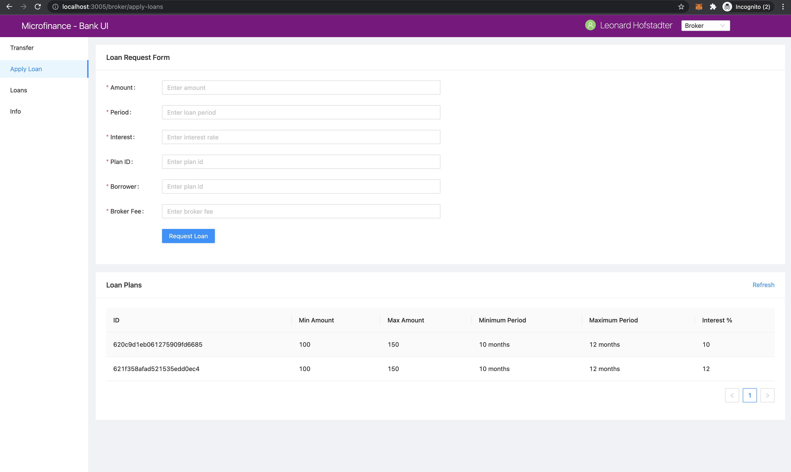

Save Data to Smart Contract
===============================

In this section we discuss about how to save data in smart contract.
As an example we discuss about how to save a loan request in the blockchain.

The **Apply Loan** menu item is listed under the **Loan** menu. Loan can be requested by a Broker.
**Apply Loan** will direct the user to ``/broker/apply-loans`` page.
This means component for the ``apply-loan`` page will resides inside the ``/pages/broker/apply-loan`` javascript file.
Code of the ``apply-loan`` page. ::

    import React from 'react';
    import { Row, Col } from 'antd';
    import LoanForm from '../../components/loan/LoanForm';
    import PlansTable from '../../components/plan/PlansTable';

    function Loans() {
        return (
            <>
                <Row gutter={[16, 16]}>
                    <Col span={24}>
                        <LoanForm />
                    </Col>
                    <Col span={24}>
                        <PlansTable />
                    </Col>
                </Row>
            </>
        );
    }

    export default Loans;

As shown in the above code segment ``Loans`` component will load the ``LoanForm`` 
component from the ``/components/loan/LoanForm/``.

Important functions of the ``LoanForm`` component. ::

    import React, { useState, useContext } from 'react';
    import { Card, Form, InputNumber, Input, Button, message } from 'antd';
    import SmartContractContext from '../../stores/smartContractContext';

    function LoanForm() {
        ...
        const { BankLoanContract } = useContext(SmartContractContext);
        ...
        const createLoanRequest = async (values) => {
            try {
                const accounts = await window.ethereum.enable();

                await BankLoan.methods.applyLoan(
                    values.amount,
                    values.period,
                    values.interest,
                    values.planId,
                    values.borrower,
                ).send({ from: accounts[0] });
                message.success('New loan requested successfully');
            } catch (err) {
                message.error('Error creating loan request');
            }
        };

        return (

            <Card title="Loan Request">
                <Form
                    ...
                    onFinish={createLoanRequest}
                >
                    <Form.Item label="Amount" name="amount" rules={[{ required: true, message: 'Please enter amount!' }]}>
                        <InputNumber ... />
                    </Form.Item>
                    <Form.Item label="Period" name="period" rules={[{ required: true, message: 'Please enter period!' }]}>
                        <InputNumber ... />
                    </Form.Item>
                    <Form.Item label="Interest" name="interest" rules={[{ required: true, message: 'Please enter interest!' }]}>
                        <InputNumber ... />
                    </Form.Item>
                    <Form.Item label="Plan ID" name="planId" rules={[{ required: true, message: 'Please enter plan id!' }]}>
                        <Input ... />
                    </Form.Item>
                    <Form.Item label="Borrower" name="borrower" rules={[{ required: true, message: 'Please enter borrower!' }]}>
                        <Input ... />
                    </Form.Item>
                    <Form.Item ... >
                        <Button type="primary" htmlType="submit">Request loan</Button>
                    </Form.Item>
                </Form>
            </Card>
        );
    }

    export default LoanForm;

In LoanForm it imports the React, useState and useContext first. 
Then imports the neccessary Ant Design components to build the Loan Form UI.
Finally it imports the ``SmartContractContext``. ::

    import React, { useState, useContext } from 'react';
    import { Card, Form, InputNumber, Input, Button, message } from 'antd';
    import SmartContractContext from '../../stores/smartContractContext';

Then it access the ``BankLoan`` smart contract object from the ``SmartContractContext``. ::

    const { BankLoanContract } = useContext(SmartContractContext);

In the larter part of the ``LoanForm`` component it returns a Ant Design Form component.
In this form component it will submit the input field values in to the ``createLoanRequest`` function.
``createLoanRequest`` function pass as the ``onFinish`` function of the Form. ::

    <Form
        ...
        onFinish={createLoanRequest}
    >

In form items we define the input fields to collect the data we need to create a loan request.
When submit the form it will passe the form field values as a object to the ``createLoanRequest`` function.
In ``createLoanRequest`` function we refer this object as ``values`` and we can access the input values
by its name. ::

    <Form.Item label="Amount" name="amount" rules={[{ required: true, message: 'Please enter amount!' }]}>
        <InputNumber ... />
    </Form.Item>
    <Form.Item label="Period" name="period" rules={[{ required: true, message: 'Please enter period!' }]}>
        <InputNumber ... />
    </Form.Item>
    <Form.Item label="Interest" name="interest" rules={[{ required: true, message: 'Please enter interest!' }]}>
        <InputNumber ... />
    </Form.Item>
    <Form.Item label="Plan ID" name="planId" rules={[{ required: true, message: 'Please enter plan id!' }]}>
        <Input ... />
    </Form.Item>
    <Form.Item label="Borrower" name="borrower" rules={[{ required: true, message: 'Please enter borrower!' }]}>
        <Input ... />
    </Form.Item>
    <Form.Item ... >
        <Button type="primary" htmlType="submit">Request loan</Button>
    </Form.Item>

When user click the submit button it will pass input values to the ``createLoanRequest`` function.
This uses Async/await functionality to save data in to the blockchain.
In ``createLoanRequest`` function first it gets account address from the MetaMask.
Then it will pass values to the ``applyLoan`` function of the BankLoan smart contract.
When we save data into the blockchain it will change the blockchain state.
For save methods we use ``send`` method to execute the operation in theblockchain.
For the send method we pass the function caller's address as a parameter ( ``send({from: accounts[0]})``).

When successfully create a Loan Request in the blockchain it will show the success message.
If error occured while saving data in to the blockchain it may execute the catch block and shows the error message. ::

    const createLoanRequest = async (values) => {
        try {
            const accounts = await window.ethereum.enable();

            await BankLoan.methods.applyLoan(
                values.amount,
                values.period,
                values.interest,
                values.planId,
                values.borrower,
            ).send({ from: accounts[0] });
            message.success('New loan requested successfully');
        } catch (err) {
            message.error('Error creating loan request');
        }
    };
