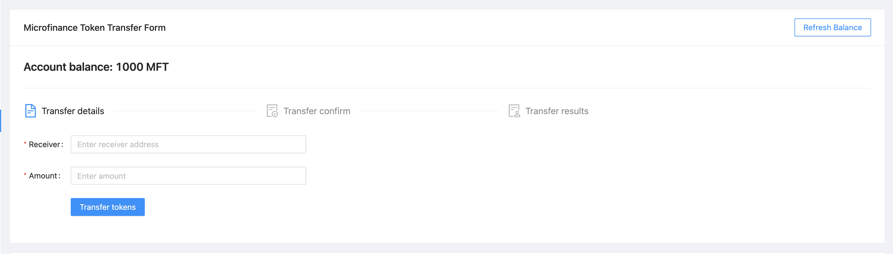

.. _token transfer evet target:

Token Transfer Event Flow
=========================

Token Transfer component is displayed for ``Broker``, ``Borrower`` and ``Bank`` users.

``Bank`` view

``Broker`` view

In these screenshots, browser address bar contains the ``localhost:3005/common/transfer`` value.
Both ``Transfer`` menu item loads the ``bank-web-app/pages/common/transfer.js`` script. ::

  import React from 'react';
  import { Row, Col } from 'antd';
  import TransferController from '../../components/transfer/TransferController';
  import TokenInfo from '../../components/info/TokenInfo';

  function Transfer() {
    return (
      <Row gutter={[16, 16]}>
        <Col span={24}>
          <TransferController />
        </Col>
        <Col span={24}>
          <TokenInfo />
        </Col>
      </Row>
    );
  }

  export default Transfer;

``Transfer`` component displays the ``TransferController`` component from ``bank-web-app/components/transfer/TransferController.js`` first 
and ``TokenInfo`` component in the later part.

``Borrower`` view

In ``Borrower`` view, browser address bar contains the ``localhost:3005/borrower/transfer`` value.
This ``Transfer`` menu item loads the ``bank-web-app/pages/borrower/transfer.js`` script. ::

  import React from 'react';
  import { Row, Col } from 'antd';
  import TransferController from '../../components/transfer/TransferController';
  import LoanPaymentForm from '../../components/payment/LoanPaymentForm';

  function Transfer() {
    return (
      <Row gutter={[16, 16]}>
        <Col span={24}>
          <TransferController />
        </Col>
        <Col span={24}>
          <LoanPaymentForm />
        </Col>
      </Row>
    );
  }

  export default Transfer;

In this ``Transfer`` component it also loads the ``TransferController`` from ``bank-web-app/components/transfer/TransferController.js``.
But later part it loads the ``LoanPaymentForm`` from ``bank-web-app/components/transfer/LoanPaymentForm.js``.

TransferController.js
---------------------

``TransferController`` resides in the ``bank-web-app/components/transfer/`` directory.
in ``TransferController`` component first imports its dependecies. ::

  import React, { useEffect, useState, useContext } from 'react';
  import { Typography, Card, Divider, message, Steps, Col, Row } from 'antd';
  import { FileTextOutlined, FileDoneOutlined, AuditOutlined } from '@ant-design/icons';
  import TransferForm from './TransferForm';
  import TransactionConfirm from './TransactionConfirm';
  import TransactionSuccess from './TransactionSuccess';
  import TransactionFail from './TransactionFail';
  import SmartContractContext from '../../stores/smartContractContext';

In addition to common dependencies like React, Ant Design and Context it imports following components.

* ``TransferForm`` - Collects receiver's wallet address and token amunt details.
* ``TransactionConfirm`` - Displays user input data and gets the user confirmation.
* ``TransactionSuccess`` - Transaction success message
* ``TransactionFail`` - Transaction fail message.

``TransferController`` has following states. ::

  const [balance, setBalance] = useState('0');
  const [symbol, setSymbol] = useState('');
  const [address, setAddress] = useState('');
  const [amount, setAmount] = useState('');
  const [transactionHash, setTransactionHash] = useState('');
  const [isTransactionSuccessful, setIsTransactionSuccessful] = useState(false);
  const [current, setCurrent] = useState(0); 

* ``balance`` - Microfinance token balance of the selected Wallet account in MetaMask.
* ``symbol`` - Microfinance token symbol state.
* ``address`` - Token receiver's address.
* ``amount`` - Transfering token amount.
* ``transactionHash`` - Blockchain transaction hash.
* ``isTransactionSuccessful`` - transaction success state.
* ``current`` - Current step of the token transfering process.

``TransferController`` gets the ``MicroTokenContract`` object from the ``SmartContractContext``. ::

  const { MicroTokenContract } = useContext(SmartContractContext);

Get MetaMask Selected Account balance
~~~~~~~~~~~~~~~~~~~~~~~~~~~~~~~~~~~~~

``getBalance`` function fetch the MetaMask selected account ``MicroToken`` balance. ::

  const getBalance = async () => {
    try {
      const accounts = await window.ethereum.request({ method: 'eth_requestAccounts' });
      const response = await MicroTokenContract.methods.balanceOf(accounts[0]).call();
      setBalance(response);
    } catch (err) {
      console.log(err);
      message.error('Error occured while reading balance');
    }
  };

In ``getBalance`` function fisrt it gets the selected account from the MetaMask.
Then token account balance from ``MictoToken`` smart contract using ``balanceOf`` method and passes MetaMask selected account address.
It uses the ``MicroTokenContract`` object from ``SmartContractContext``. 
When successful it set the response value as the ``balance`` state.

``MictoToken`` smart contract's ``balanceOf`` method described in 
:ref:`balance of target` section.

Get ERC20 Token Symbol
~~~~~~~~~~~~~~~~~~~~~~

``symbol`` method helps to load the Microfinance token symbol from the ``MicroToken`` smart contract.

  const getSymbol = async () => {
    try {
      const response = await MicroTokenContract.methods.symbol().call();
      setSymbol(response);
    } catch (err) {
      message.error('Error occured while reading symbol');
    }
  };

There is no ``symbol`` method defined in the ``MicroToken.sol`` smart contract.
But symbol attribute is defined as a ``public`` attribute.
Getter methods were generated for all the public attributes in smart contract in the compile time and 
methods names are equal to attribute name.
We can use those methods to get the attribute values from smart contracts.

So we use ``symbol()`` method to get the ``Microfinance Token`` symbol from the ``MicroToken`` smart contract.
Response value is set as the ``symbol`` state value in the ``TransferController`` component.

Load Initial Data
~~~~~~~~~~~~~~~~~

Above 2 functions are executed when ``TransferController`` mount in the **Microfinance - Bank UI**.
It uses ``useEffect`` hook to achieve this. ::

  useEffect(() => {
    getBalance();
    getSymbol();
  }, []);

This ``useEffect`` hook is triggered only when ``TransferController`` mount in the **Microfinance - Bank UI**.
It is controlled by second parameter, ``[]`` empty array in the ``useEffect`` hook.
If we add component's states in this array ``useEffect`` triggered every time when those states change.

Acount Balance and Token Symbol displayed in the **Microfinance - Bank UI** as follows.

In the return section of the ``TransferController`` first it defines a Ant Design ``Card`` component as follows. ::

  <Card
    title="Microfinance Token Transfer Form"
    extra={<Button type="primary" ghost onClick={getBalance}>Refresh Balance</Button>}
  >
    {/* This will show the balance state value in the web page */}
    <Title level={4}>Account balance: {balance} {symbol}</Title>
    <Divider />
    ....
  </Card>

In this coponent ``Microfinance Token Transfer Form`` is set as the ``Card`` title.
``Refresh Balance`` button triggers the ``getBalance`` function to reload the account balance on click event.
In the ``Card`` body it displays the Account Balance usign ``balance`` state and ``symbol`` state.
This updates when ``getBalance`` and ``getSymbol`` functions update the states.

Token Transaction Steps
~~~~~~~~~~~~~~~~~~~~~~~

In Token Transaction event it has 3 steps.

1. Transfer Details
2. Transfer Confirm 
3. Trasfer Results

These steps were defined in the ``steps`` array in the ``TransferController`` component. ::

  const steps = [
    {
      title: 'Transfer Details',
      icon: <FileTextOutlined />,
    },
    {
      title: 'Transfer Confirm',
      icon: <FileDoneOutlined />,
    },
    {
      title: 'Transfer Results',
      icon: <AuditOutlined />,
    },
  ];

These ``steps`` are displayed below the Account Balance in the UI.
In the return section of the ``TransferController`` ``steps`` ara mapped to ``Step`` Ant Design component as follows: ::

  <Row>
    <Col lg={24} xl={18} xxl={16} style={{ marginBottom: 25 }}>
      <Steps current={current}>
        {steps.map(item => (
          <Step key={item.title} title={item.title} icon={item.icon} />
        ))}
      </Steps>
    </Col>
  </Row>

``TransferController`` uses ``Step`` Ant Design component to render these steps in the UI.
``current`` state is used to keep the track of current token transaction step.
These Ant Design ``Steps`` are updates according to the ``current`` state value.

Component rendered in the later part of the ``Card`` depends on this ``current`` state value as well.
Following diagram shows the components loaded in each stage of token transfering process.

There are 3 stages in the Token Transfer process and 4 components displayed according to the states of the transaction. ::

  {
    current === 0 &&
    <Row>
      <Col lg={24} xl={18} xxl={16}>
        <TransferForm
          setAddress={setAddress}
          setAmount={setAmount}
        />
      </Col>
    </Row>
  }
  {
    current === 1 &&
    <Row>
      <Col lg={24} xl={18} xxl={16}>
        <TransactionConfirm
          address={address}
          amount={amount}
          confirmTokenTransfer={confirmTokenTransfer}
          prev={prev}
        />
      </Col>
    </Row>
  }
  {
    current === 2 && isTransactionSuccessful &&
    <Row>
      <Col lg={24} xl={18} xxl={16}>
        <TransactionSuccess
          amount={amount}
          address={address}
          transactionHash={transactionHash}
          backToHome={backToHome}
        />
      </Col>
    </Row>
  }
  {
    current === 2 && !isTransactionSuccessful &&
    <Row>
      <Col lg={24} xl={18} xxl={16}>
        <TransactionFail
          backToHome={backToHome}
        />
      </Col>
    </Row>
  }

This conditional rendering part defined in the return section of the ``TransferController`` component.
``TransferController`` passes props to each component in each step.
In the ``Transfer Result`` step, it renders the components depending on the ``isTransactionSuccessful`` state as well.

Complete Transfer Controller Component
~~~~~~~~~~~~~~~~~~~~~~~~~~~~~~~~~~~~~~

Complete ``TransferController`` component: ::

  import React, { useEffect, useState, useContext } from 'react';
  import { Typography, Card, Divider, message, Steps, Col, Row, Button } from 'antd';
  import { FileTextOutlined, FileDoneOutlined, AuditOutlined } from '@ant-design/icons';
  import TransferForm from './TransferForm';
  import TransactionConfirm from './TransactionConfirm';
  import TransactionSuccess from './TransactionSuccess';
  import TransactionFail from './TransactionFail';
  import SmartContractContext from '../../stores/smartContractContext';

  const { Title } = Typography;
  const { Step } = Steps;

  function TransferController() {
    const [balance, setBalance] = useState('0');
    const [symbol, setSymbol] = useState('');
    const [address, setAddress] = useState('');
    const [amount, setAmount] = useState('');
    const [transactionHash, setTransactionHash] = useState('');
    const [isTransactionSuccessful, setIsTransactionSuccessful] = useState(false);

    const { MicroTokenContract } = useContext(SmartContractContext); 

    const [current, setCurrent] = useState(0);

    const getBalance = async () => {
      try {
        const accounts = await window.ethereum.request({ method: 'eth_requestAccounts' });
        const response = await MicroTokenContract.methods.balanceOf(accounts[0]).call();

        setBalance(response);
      } catch (err) {
        console.log(err);
        message.error('Error occured while reading balance');
      }
    };

    const getSymbol = async () => {
      try {
        const response = await MicroTokenContract.methods.symbol().call();
        setSymbol(response);
      } catch (err) {
        message.error('Error occured while reading symbol');
      }
    };

    const loadConfirmPage = () => {
      setCurrent(current + 1);
    };

    const setInitialStates = () => {
      setAddress('');
      setAmount('');
      setIsTransactionSuccessful(false);
      setTransactionHash('');
      setCurrent(0);
    };

    const prev = () => {
      setCurrent(current - 1);
      setInitialStates();
    };

    const backToHome = () => {
      setInitialStates();
    };

    const confirmTokenTransfer = async () => {
      try {
        const accounts = await window.ethereum.request({ method: 'eth_requestAccounts' });
        const response = await MicroTokenContract.methods.transfer(address, amount).send({
          from: accounts[0] });
        setTransactionHash(response.transactionHash);
        setIsTransactionSuccessful(true);
        setCurrent(current + 1); 
        getBalance();
        message.success('Token transferred successfully');
      } catch (err) {
        console.log(err);
        message.error('Error occured while transferring tokens');
        setCurrent(current + 1); 
        setIsTransactionSuccessful(false);
      }
    };

    useEffect(() => {
      getBalance();
      getSymbol();
    }, []);

    useEffect(() => {
      if (amount !== '') {
        loadConfirmPage();
      }
    }, [amount]);

    const steps = [
      {
        title: 'Transfer Details',
        icon: <FileTextOutlined />,
      },
      {
        title: 'Transfer Confirm',
        icon: <FileDoneOutlined />,
      },
      {
        title: 'Transfer Results',
        icon: <AuditOutlined />,
      },
    ];

    return (
      <Card
        title="Microfinance Token Transfer Form"
        extra={<Button type="primary" ghost onClick={getBalance}>Refresh Balance</Button>}
      >
        <Title level={4}>Account balance: {balance} {symbol}</Title>
        <Divider />

        <Row>
          <Col lg={24} xl={18} xxl={16} style={{ marginBottom: 25 }}>
            <Steps current={current}>
              {steps.map(item => (
                <Step key={item.title} title={item.title} icon={item.icon} />
              ))}
            </Steps>
          </Col>
        </Row>
        {
          current === 0 &&
          <Row>
            <Col lg={24} xl={18} xxl={16}>
              <TransferForm
                setAddress={setAddress}
                setAmount={setAmount}
              />
            </Col>
          </Row>
        }
        {
          current === 1 &&
          <Row>
            <Col lg={24} xl={18} xxl={16}>
              <TransactionConfirm
                address={address}
                amount={amount}
                confirmTokenTransfer={confirmTokenTransfer}
                prev={prev}
              />
            </Col>
          </Row>
        }
        {
          current === 2 && isTransactionSuccessful &&
          <Row>
            <Col lg={24} xl={18} xxl={16}>
              <TransactionSuccess
                amount={amount}
                address={address}
                transactionHash={transactionHash}
                backToHome={backToHome}
              />
            </Col>
          </Row>
        }
        {
          current === 2 && !isTransactionSuccessful &&
          <Row>
            <Col lg={24} xl={18} xxl={16}>
              <TransactionFail
                backToHome={backToHome}
              />
            </Col>
          </Row>
        }
      </Card>

    );
  }

  export default TransferController;

Transfer Form Component
-----------------------

``TransferForm`` component is rendered in the first step of the Token Transfer process.
``TransferController`` passes setter functions of ``address`` and ``amount`` states as ``setAddress`` and ``setAmount`` props.

``TransferForm`` defined in the ``bank-web-app/components/transfer/TransferForm.js`` file.
After imports its dependencies ``TransferForm`` component destructure its props as follows. ::

  import React from 'react';
  import { Form, Input, Button, InputNumber } from 'antd';

  function TransferForm({ setAddress, setAmount }) {
    ....
  }

These props are used to update ``address`` and ``amount`` states in the ``TransferController`` component from 
``TransferForm`` component.

In the return section of the ``TransferForm`` component it uses a Ant Design ``Form`` component to collect 
transfer details from user. 
``Form`` component of the ``TransferForm`` component: ::

  return (
    <Form
      ....
      onFinish={onFinish}
    >
      <Form.Item label="Receiver" name="address" rules={[{ required: true, message: 'Please input receiver address!' }]}>
        <Input
          placeholder="Enter receiver address"
        />
      </Form.Item>
      <Form.Item label="Amount" name="amount" rules={[{ required: true, message: 'Please input token amount!' }]}>
        <InputNumber
          min="0" style={{ width: '100%' }} placeholder="Enter amount"
        />
      </Form.Item>
      <Form.Item wrapperCol={{ .... }}
      >
        <Button type="primary" htmlType="submit">Transfer Tokens</Button>
      </Form.Item>
    </Form>
  );

``Form`` component has 2 input fields. Enter Receiver's wallet address and the token amount to be transferred.
When user clicks the ``Transfer Tokens`` button it triggers the ``onFinish`` function and form field values passed as a object. ::

  const onFinish = async (values) => {
    setAddress(values.address);
    setAmount(values.amount);
  };

``onFinish`` function gets the ``values`` object which contains the form field values.
These form field value can be accessed using their names (address and amount).
``address`` and ``amount`` states of the ``TransferController`` will be updated by these values using ``setAddress`` and 
``setAmount`` props by ``onFinish`` function.

There is a ``useEffect`` hook defined in the ``TransferController`` component. ::

  useEffect(() => {
    if (amount !== '') {
      loadConfirmPage();
    }
  }, [amount]);

This ``useEffect`` hook is triggered when ``TransferController`` is mounted to the UI and ``amount`` state changes. 
``loadConfirmPage`` function is triggered from the ``useEffect`` hook.
If condition in the above hook stops triggering ``loadConfirmPage`` function when ``TransferController`` mounts.

When ``TransferForm`` updates the ``amount`` state, it triggers this ``useEffect`` hook and then ``loadConfirmPage`` function. ::

  const loadConfirmPage = () => {
    setCurrent(current + 1);
  };

``loadConfirmPage`` updates the ``current`` state value and ``TransactionConfirm`` component is displayed in the UI.

Transfer Form: 

Complete Transfer Form Component
~~~~~~~~~~~~~~~~~~~~~~~~~~~~~~~~

Complete ``TransferForm`` component: ::

  import React from 'react';
  import { Form, Input, Button, InputNumber } from 'antd';

  function TransferForm({ setAddress, setAmount }) {
    const onFinish = async (values) => {
      setAddress(values.address);
      setAmount(values.amount);
    };

    return (
      <Form
        labelCol={{ lg: 3, xl: 2, xxl: 2 }}
        wrapperCol={{ lg: 14, xl: 12, xxl: 10 }}
        layout="horizontal"
        size="default"
        labelAlign="left"
        onFinish={onFinish}
      >
        <Form.Item label="Receiver" name="address" rules={[{ required: true, message: 'Please input receiver address!' }]}>
          <Input
            placeholder="Enter receiver address"
          />
        </Form.Item>
        <Form.Item label="Amount" name="amount" rules={[{ required: true, message: 'Please input token amount!' }]}>
          <InputNumber
            min="0"
            style={{ width: '100%' }}
            placeholder="Enter amount"
          />
        </Form.Item>
        <Form.Item wrapperCol={{
          lg: { span: 14, offset: 3 },
          xl: { span: 14, offset: 2 },
          xxl: { span: 14, offset: 2 } }}
        >
          <Button type="primary" htmlType="submit">Transfer Tokens</Button>
        </Form.Item>
      </Form>

    );
  }

  export default TransferForm;

Transaction Confirm Component
-----------------------------

When ``current`` state value is ``1`` ``TransferController`` displays ``TransactionConfirm`` component. ::

  {
    current === 1 &&
    <Row>
      <Col lg={24} xl={18} xxl={16}>
        <TransactionConfirm
          address={address}
          amount={amount}
          confirmTokenTransfer={confirmTokenTransfer}
          prev={prev}
        />
      </Col>
    </Row>
  }

``TransferController`` passes ``address`` and ``amount`` state values and ``confirmTokenTransfer`` and ``prev`` functions 
as props to ``TransactionConfirm`` component.
``TransactionConfirm`` component is defined in the ``bank-web-app/components/transfer/TransactionConfirm.js`` file.

In ``TransactionConfirm.js`` script, it first imports its dependecies and then destructure props as follows. ::

  import React from 'react';
  import { Form, Button, Space } from 'antd';

  function TransactionConfirm({ address, amount, confirmTokenTransfer, prev }) {
    ...
  }

``address`` and ``amount`` values are displayed in the ``Form`` defined in the ``TransactionConfirm`` component. ::

  <Form .... >
    <Form.Item label="Receiver">
       { address } 
    </Form.Item>
    <Form.Item label="Amount">
       { amount } 
    </Form.Item>
    <Form.Item wrapperCol={{ .... }}
    >
      <Space direction="horizontal">
        <Button type="primary" onClick={() => confirmTokenTransfer()}>Confirm Transfer</Button>
        <Button onClick={() => prev()}>Back</Button>
      </Space>
    </Form.Item>
  </Form>

When user clicks the ``Confirm Transfer`` button it triggers the ``confirmTokenTransfer`` function passed as prop to the 
``TransactionConfirm`` component.
``Back`` button triggers ``prev`` function.

In ``TransferController`` component ``confirmTokenTransfer`` function transfer tokens from MetaMask selected account to the 
rceiver wallet. ::

  const confirmTokenTransfer = async () => {
    try {
      const accounts = await window.ethereum.request({ method: 'eth_requestAccounts' });
      const response = await MicroTokenContract.methods.transfer(address, amount).send({
        from: accounts[0] });
      setTransactionHash(response.transactionHash);
      setIsTransactionSuccessful(true);
      setCurrent(current + 1);
      getBalance();
      message.success('Token transferred successfully');
    } catch (err) {
      console.log(err);
      message.error('Error occured while transferring tokens');
      setCurrent(current + 1);
      setIsTransactionSuccessful(false);
    }
  };

In ``confirmTokenTransfer`` function first it gets the MetaMask selected account address.
Then calls the ``transfer`` method of the ``MicroToken`` smart contract and passes the ``address`` and ``amount`` state values 
as paramaters. This method calls from the MetaMask selected account.

When transaction successful, it returns the ``transactionHash`` in the response.
``confirmTokenTransfer`` updates the ``transactionHash`` from ``response.transactionHash``.
Then it sets ``isTransactionSuccessful`` state to ``true`` and updates the ``current`` state value.
``current`` value will be updated to ``2``.

When ``current`` state is ``2`` and ``isTransactionSuccessful`` is ``true``, ``TransferController`` displays the 
``TransactionSuccess`` component.

Finally in ``try`` block of the ``confirmTokenTransfer`` function it updates the account balance using ``getBalance`` function and
displays the success message.

In ``catch`` block of the ``confirmTokenTransfer`` function it displays the error message.
Then it updates the ``current`` state and ``isTransactionSuccessful`` state to ``true``.
``current`` value will be updated to ``2``.

When ``current`` state is ``2`` and ``isTransactionSuccessful`` is ``false``, ``TransferController`` displays the 
``TransactionFail`` component.

When user clicks the ``Back`` button in the ``TransactionConfirm`` component, it triggers the ``prev`` function
in ``TransferController`` component. ::

  const prev = () => {
    setCurrent(current - 1);
    setInitialStates();
  };

``prev`` function decreses the ``current`` state value and value will be ``1``.
``setInitialStates`` function resets the ``address`` and ``amount`` states to ``''``. ::

  const setInitialStates = () => {
    setAddress('');
    setAmount('');
    setIsTransactionSuccessful(false);
    setTransactionHash('');
    setCurrent(0);
  };

When ``current`` value is ``1``, ``TransferController`` displays the ``TransactionForm``. 
It facilitate user re-enter the receiver's address and token amount to be transferred.

Complete Transfer Confirm Component
~~~~~~~~~~~~~~~~~~~~~~~~~~~~~~~~~~~

Complete ``TransferConfirm`` component: ::

  import React from 'react';
  import { Form, Button, Space } from 'antd';

  function TransactionConfirm({ address, amount, confirmTokenTransfer, prev }) {
    return (
      <Form
        labelCol={{ lg: 3, xl: 2, xxl: 2 }}
        wrapperCol={{ lg: 14, xl: 12, xxl: 10 }}
        layout="horizontal"
        size="default"
        labelAlign="left"
      >
        <Form.Item label="Receiver">
           { address } 
        </Form.Item>
        <Form.Item label="Amount">
           { amount } 
        </Form.Item>
        <Form.Item wrapperCol={{
          lg: { span: 14, offset: 3 },
          xl: { span: 14, offset: 2 },
          xxl: { span: 14, offset: 2 } }}
        >
          <Space direction="horizontal">
            <Button type="primary" onClick={() => confirmTokenTransfer()}>Confirm Transfer</Button>
            <Button onClick={() => prev()}>Back</Button>
          </Space>
        </Form.Item>
      </Form>

    );
  }

  export default TransactionConfirm;

.. _token transfer success target:

Transaction Success Component
-----------------------------

When ``current`` state is ``2`` and ``isTransactionSuccessful`` is ``true``, ``TransferController`` displays the 
``TransactionSuccess`` component. ::

  {
    current === 2 && isTransactionSuccessful &&
    <Row>
      <Col lg={24} xl={18} xxl={16}>
        <TransactionSuccess
          amount={amount}
          address={address}
          transactionHash={transactionHash}
          backToHome={backToHome}
        />
      </Col>
    </Row>
  }

``TransferController`` passes ``amount``, ``address``, ``transactionHash`` state values and ``backToHome`` function
to the ``TransactionSuccess`` component as props.

``TransactionSuccess`` component is defined in the ``bank-web-app/components/transfer/TransactionSuccess.js`` file.
In this file first it imports its dependecies and then destructure the props as follows. ::

  import React from 'react';
  import { Button, Result, Typography } from 'antd';
  import { CheckCircleOutlined } from '@ant-design/icons';

  function TransactionSuccess({ address, amount, transactionHash, backToHome }) {
    ....
  }

In the return section of the ``TransactionSuccess`` component it displays the success message using 
Ant Design ``Result`` component. ::

  <Result
    status="success"
    title="Transaction successful!"
    extra={[
      <Button type="primary" key="home" onClick={(e) => backToHome(e)}>
        Done
      </Button>,
    ]}
  />

When user clicks the ``Done`` button it triggers the ``backToHome`` function defined in the ``TransferController`` component. ::

  const backToHome = () => {
    setInitialStates();
  };

``backToHome`` triggers ``setInitialStates`` function and it sets all states to their initial values.

Complete Transaction Success Component
~~~~~~~~~~~~~~~~~~~~~~~~~~~~~~~~~~~~~~

Complete ``TransactionSuccess`` component script: ::

  import React from 'react';
  import { Button, Result, Typography } from 'antd';
  import { CheckCircleOutlined } from '@ant-design/icons';

  // React functional component to display transaction success status.
  // backToHome function and transaction details pass as properties.
  function TransactionSuccess({ address, amount, transactionHash, backToHome }) {
    const { Paragraph, Text } = Typography;

    return (
      <>
        <Result
          status="success"
          title="Transaction successful!"
          extra={[
            <Button type="primary" key="home" onClick={(e) => backToHome(e)}>
              Done
            </Button>,
          ]}
        />
        <Paragraph>
          <Text
            strong
            style={{
              fontSize: 16,
            }}
          >
            Transaction receipt
          </Text>
        </Paragraph>
        <Paragraph>
          <CheckCircleOutlined style={{ color: 'green' }} /> Receiver address: {address}
        </Paragraph>
        <Paragraph>
          <CheckCircleOutlined style={{ color: 'green' }} /> Amount: {amount}
        </Paragraph>
        <Paragraph>
          <CheckCircleOutlined style={{ color: 'green' }} /> Transaction hash: {transactionHash}
        </Paragraph>

      </>

    );
  }

  export default TransactionSuccess;

.. figure:: ../images/transfer_3.png

Transaction Fail Component
--------------------------

When ``current`` state is ``2`` and ``isTransactionSuccessful`` is ``false``, ``TransferController`` displays the 
``TransactionFail`` component. ::

  {
    current === 2 && !isTransactionSuccessful &&
    <Row>
      <Col lg={24} xl={18} xxl={16}>
        <TransactionFail
          backToHome={backToHome}
        />
      </Col>
    </Row>
  }

``TransferController`` passes ``backToHome`` function to the ``TransactionFail`` component as a prop.

``TransactionSuccess`` component is defined in the ``bank-web-app/components/transfer/TransactionFail.js`` file.
In this file first it imports its dependecies and then destructure the props as follows. ::

  import React from 'react';
  import { Button, Result } from 'antd';

  function TransactionFail({ backToHome }) {
    ....
  }

In the return section of the ``TransactionFail`` component it displays the error message using 
Ant Design ``Result`` component. ::

  <Result
    status="error"
    title="Transaction failed!"
    extra={[
      <Button type="primary" key="home" onClick={(e) => backToHome(e)}>
        Go Back
      </Button>,
    ]}
  />

When user clicks the ``Go Back`` button it triggers the ``backToHome`` function defined in the ``TransferController`` component. ::

  const backToHome = () => {
    setInitialStates();
  };

``backToHome`` triggers ``setInitialStates`` function and it sets all states to their initial values.

Complete Transaction Fail Component
~~~~~~~~~~~~~~~~~~~~~~~~~~~~~~~~~~~~~~

Complete ``TransactionFail`` component script: ::

  import React from 'react';
  import { Button, Result } from 'antd';

  function TransactionFail({ backToHome }) {
    return (
      <Result
        status="error"
        title="Transaction failed!"
        extra={[
          <Button type="primary" key="home" onClick={(e) => backToHome(e)}>
            Go Back
          </Button>,
        ]}
      />

    );
  }

  export default TransactionFail;

