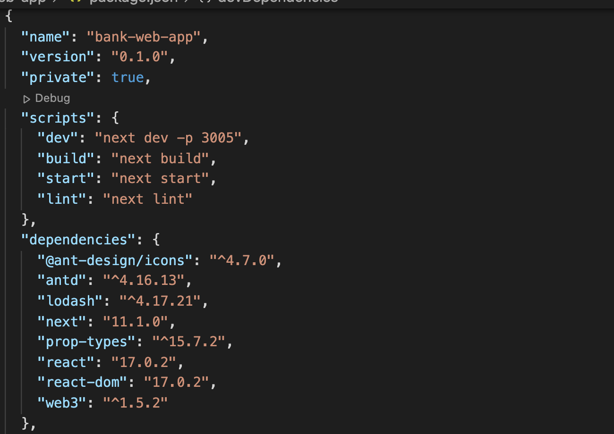
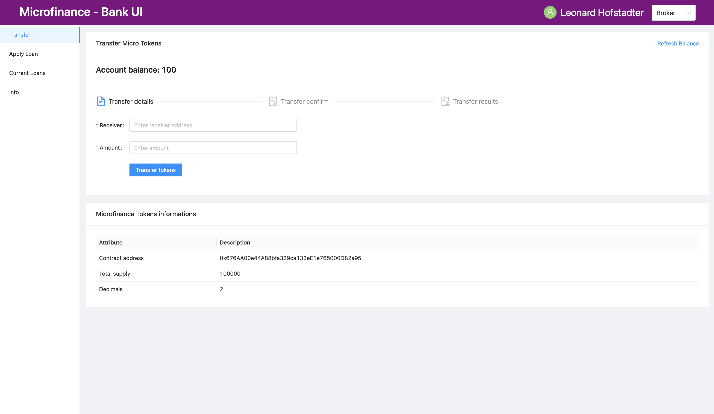

Bank Web Application - ReactApp
===============================

In this section, we are trying to run the ``bank-web-app`` project.
This web application developed using Next.js. 
Next.js is a React Framework for application development. 
It supports developers to build features needed for production.
You can find more about Next.js in their `official website <https://nextjs.org/>`_.

To run the Bank web application, open a new terminal on ``bank-web-app`` directory and execute following code snnipets.
First, we install all dependencies for ReactApp and then we can run it.

Prerequisites
-------------

As shown in the layered architecture Bank web app communicates with both the Blockchain and Bank server.

1. Blockchain - Before start the Bank web application its better to compile and deploy your smart contracts in to the Blockchain.
Bank web application uses the smart contracts' abis, contract addresses form the ``blockchain/build/contracts`` directory.
this ``blockchain/build`` directory will be generated when you compile the smart contracts. 
Smart contracts will be compiled before deploy(migrate) into the Blockchain.

2. Bank Server - Bank web application will fetch data from the Bank web server as well.
Run the Bank web server before run the Bank web application. 
If not there will be some unexpected errors.

Install Bank Web Application Dependencies
-----------------------------------------

Execute all following commands in the terminal you opened in the ``bank-web-app`` directory.

All the **Bank Web Application** dependencies are configured in ``package.json`` file in ``bank-web-app`` 
directory as follows.

You can use the following command to install all dependencies. ::

   npm install

Run Bank Web Application
------------------------

After successfully install all the dependencies run the following command to start the **Bank Web Application**. 
You can use the same terminal in the ``bank-web-app`` directory which was used to run the above command. ::

   npm run dev

This command will start the **Bank Web Application** on network port ``3005`` in your machine. 
Before running this command make sure your network port 
``3005`` is free to use. If any process already running on network port ``3005`` 
you can kill the process and run above command again. 
As shown in the image above this port was configured on the ``package.json`` file in the ``bank-web-app`` directory.
you can replace ``3005`` with any desired port in the ``scripts.dev`` value. 
You can try this method instead of killing the process on prot ``3005`` if it occupied.

If all commands execute successfully you can access the **Bank Web Application** from your browser.
Open a Google Chrome browser, go to ``localhost:3005``, and you can see the following UI.

