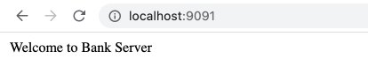
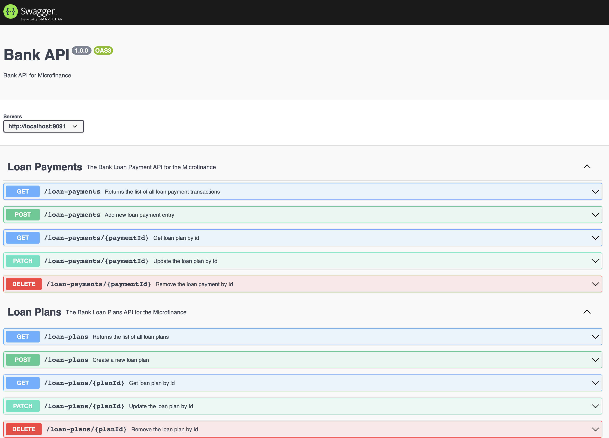

Bank Web Server
===============

Bank server was developed using NodeJs. 
This is a HTTP server and handles the loan plans and loan payments related functionalities.
Project code is inside the ``bank-server`` directory.

Prerequisites
-------------

Before start the Bank server run Mongo DB in background.
Bank server will connect to local Mongo DB running on port ``27017`` default port for the Mongo DB.
In bank server project Mongo DB configures as follows. ::

    const url = 'mongodb://127.0.0.1:27017/bank-db-level1'
    mongoose.connect(
        url,
        { useNewUrlParser: true },
        () => {
            console.log('connected to Bank DB')
    })

This code segment will connects the Bank web server to Mongo DB and ``bank-db-level1`` database. 
If your Mongo DB running on a different host or port you can config it in line number 90 of ``index.js`` file in ``bank-server`` directory.
You can change the db name by replacing the ``bank-db-level1`` in the above code snippet.

Install NPM Dependencies
------------------------

We can use following command to install all dependecies of the ``bank-server`` project. 
First, open a terminal on ``bank-server`` directory and execute the following command. ::

    npm install

This command will generate a ``node_modules`` directory inside the ``bank-server`` directory.

Start Bank Server
-----------------

To run the Bank server change to ``bank-server`` directry and run the follwoing command on the terminal. ::

    npm run start

This will run the Bank web server on port ``9091`` on your computer.
If this port is used by another process on your computer, 
you can change the port in ``index.js`` placed inside the ``bank-server`` directory
You can replace the ``9091`` with any preffered port number in the following code segment 
which is located at the end of the ``index.js``. ::

    //LISTENING
    app.listen(9091)

Check Bank Server Availability
------------------------------

After successfully executes the above code you can check bank server availablity by navigate to ``localhost:9091`` in your browser.
Default setting will run the Bank server on port ``9091``.

It will print the following information on your browser when you navigate to ``localhost:9091``.
If you change the host or port please use the neccassary changes to the URL and check.

Swagger API Documentation
-------------------------

To view the API documentation yoou can navigate to ``localhost:9091/api-docs``.
You can view the following information on your browser.

