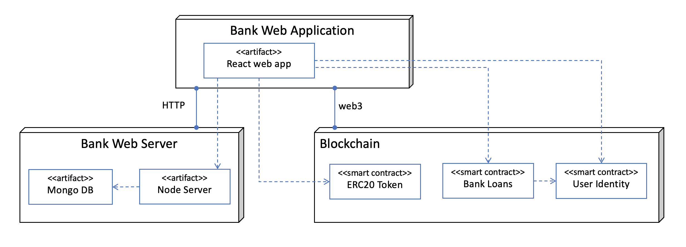

Checking Out the GitLab Project
===============================

You may now clone the “Microfinance” project from GitLab to look at the source code using the following command. 
Open a terminal in any directory in your computer where you wish to clone the project: ::

   git clone https://gitlab.com/gmc123/microfinance.git

There are three projects in the ``microfinance`` root directory. 
We should change the current directory to the ``microfinance`` directory using following command in the current terminal, ::

   cd microfinance/

This will change your directory to the ``microfinance`` directory.  There are three levels of the “Microfinance” project, as explained in `Functionalities <https://microfinance-dapp.readthedocs.io/en/level1/introduction/functionalities.html>`_.

Check the current git branch using the following command. ::

   git branch

It should show you that you are at the ``master`` branch.
We first focus on the ``level1`` branch, the easiest level. Change git branch to ``level1`` branch as follows: ::

   git branch level1
   git branch

.. _project-structure-target:

Project Structure
-------------------

Here is the folder structure of the Microfinance system. It consists of three main projects and one project for documentation as shown below: ::

    Microfinance
    |--bank-server
    |--bank-web-app
    |--blockchain
    |--docs

1. ``bank-server/``: Node Server project for Bank.
2. ``bank-web-app/``: React web application for Bank.
3. ``blockchain/``: Truffle project blockchain smart contracts.
4. ``docs/``: Documentation for readthedocs.org.

Deployment Diagram
-------------------

As shown in the diagram, the Bank has a web application developed using React.
This web app connects using HTTP to the Bank web server, which consists of a Node.js HTTP server component and a Mongo DB database component. 
The Bank web application connects to a blockchain using Web3.

