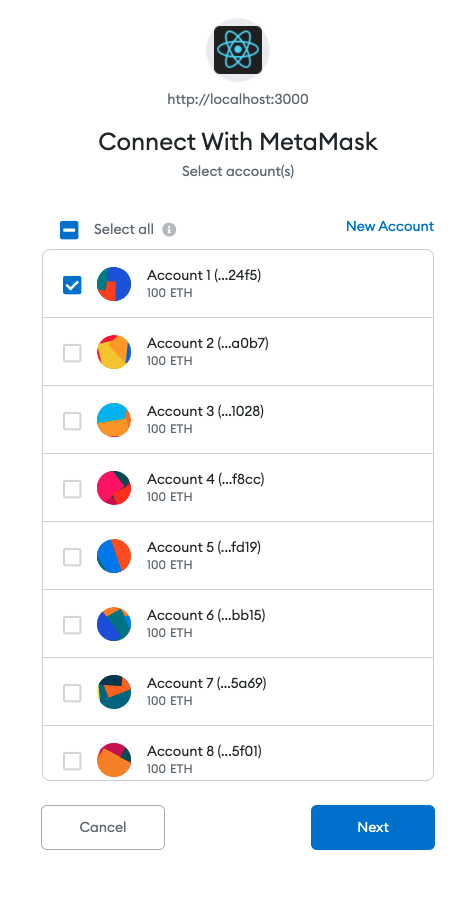
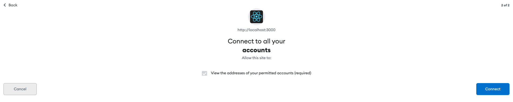

Connecting ReactApps to MetaMask
================================

When you load a ReactApp in the Chrome browser, MetaMask will ask to connect to ReactApp.
It will show the following pop-up window. :

In this window, MetaMask lists down all 10 accounts from Ganache. 
You can select which accounts are willing to connect to ReactApp.
After selecting the accounts you can click ``Next``.
In this example, I select all 10 accounts. Clicking ``Next`` will direct you
to the confirmation page as shown below. 

You can click ``Connect`` at the bottom right corner to connect MetaMask and ReactApp.

You may connect **Bank Web Application** to MetaMask. 
After connecting the web application it will display information fetched from the Blockchain.