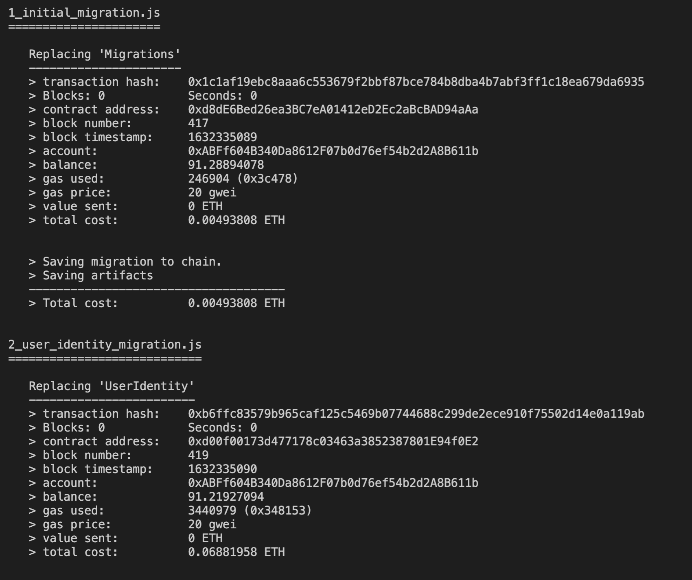
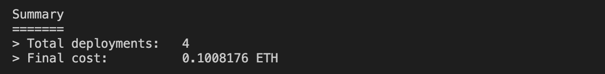

Deploy Smart Contract to the Ganache
====================================

This section describes how to deploy your smart contract into the Ganache private Ethereum blockchain. 
First, run Ganache locally on your machine by clicking the Ganache icon in your computer.
Next, we use Truffle to deploy smart contracts into the Ganache local blockchain. 
The Solidity version is already configured in the ``truffle-config.js`` file.

Run Ganache
-----------

Once you’ve installed Ganache, 
you should see the following screen when you launch it.  Choose the **Quickstart** option:

.. image:: ../images/ganache_accounts.png

In this window, there are 10 wallet account addresses each having ``100ETH``, 
which can be used for testing purposes. Also, 
you can find the ``MNEMONIC`` and ``RPC SERVER`` address which will be used later in this project.

Deploy Smart Contracts using Truffle
-------------------------------------

We execute the following command on the terminal in the project root directory to 
compile and deploy all 3 smart-contracts into the Ganache local Ethereum blockchain. 
This blockchain runs on network ``127.0.0.1`` port ``7545``. 
Before executing the following command, make sure that your Ganache Ethereum blockchain is running on your machine. ::

    truffle migrate --reset

We use the ``--reset`` option to migrate all smart contracts to the blockchain, starting from the beginning instead of running from the 
last completed migration. The following details is shown in the terminal while deploying the smart contracts:

After successfully deploying all the contracts to the blockchain, we have the following:

