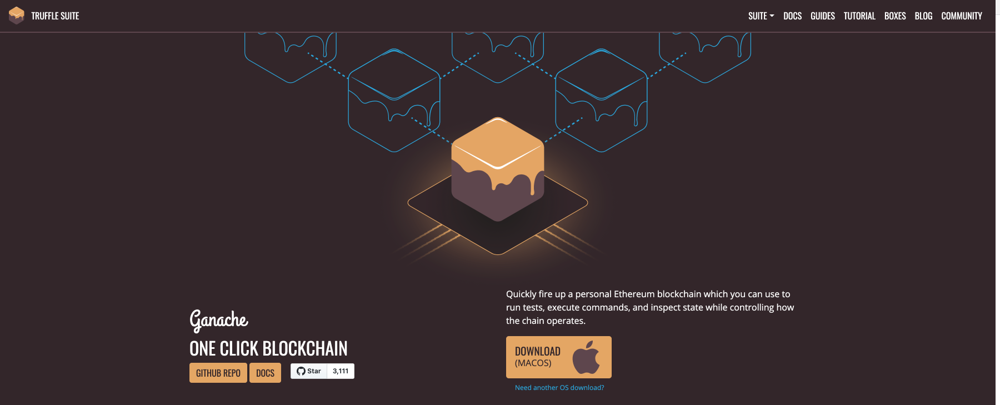
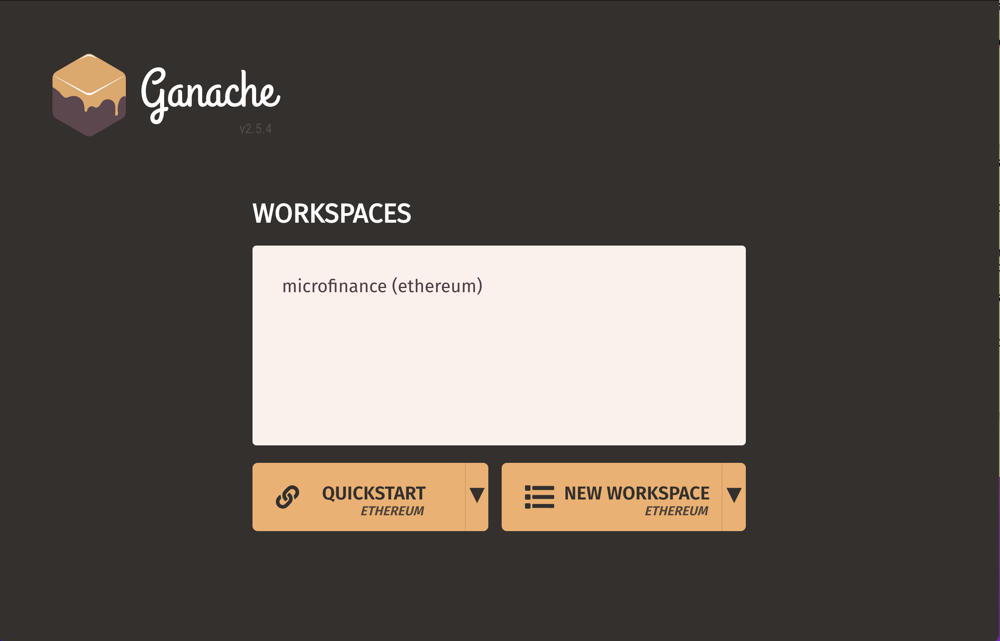
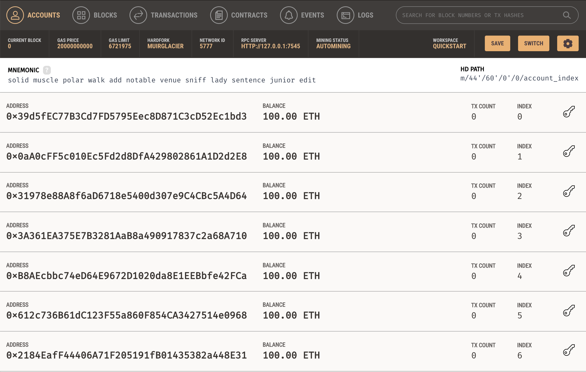
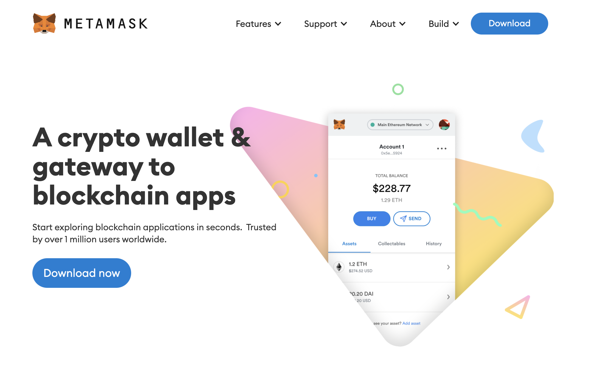

Installation Guide
==================

The following sections describe how to install the tools and dependencies
we need to set up and run this project. You can skip these sections if you have already installed them in your machine.

`https://youtu.be/QqRAgFk5uHw <https://youtu.be/QqRAgFk5uHw>`_

.. raw:: html

    <iframe width="356" height="200" src="https://www.youtube.com/embed/QqRAgFk5uHw" title="YouTube video player" frameborder="0" allow="accelerometer; autoplay; clipboard-write; encrypted-media; gyroscope; picture-in-picture" allowfullscreen></iframe>

.. raw:: html

Install Git
--------------

Git manages code versions for you. 
Use the following command to install Homebrew in macOS. You can find more about Homebrew
`here. <https://brew.sh/>`_ ::

   /bin/bash -c "$(curl -fsSL https://raw.githubusercontent.com/Homebrew/install/HEAD/install.sh)"

Use Homebrew to install ``git`` on the Mac: ::

   brew install git

This is one way to install ``git`` on Mac. More methods 
`here <https://git-scm.com/download/mac>`_.

If you use Windows, you can select and download ``git`` from `this page <https://git-scm.com/downloads>`_. 

Install Node
---------------

You need to install Node Package Manager, or NPM, which comes with Node.js.  
You can see if you have Node.js already installed by typing this in your terminal::

   node -v

If you don't have Node.js already installed, you can visit the `Node.js website <https://nodejs.org/en/>`_ 
to download. 
Both Mac and Windows versions are there. 
It is recommended to use the LTS version of Node. 

Install Node using the downloaded Node installer.

Install Truffle 
------------------

Truffle is a development environment, testing framework, 
and asset pipeline for blockchains using the Ethereum Virtual Machine (EVM). 
Truffle provides important features for smart contract development. In this project, 
we use Truffle for smart contract compilation and blockchain deployment. 
You can find more about Truffle in 
`this site <https://www.trufflesuite.com/docs/truffle/overview>`_.

Install Truffle globally in your machine using the following command::

   npm install -g truffle

This command installs Truffle in both Mac and Windows.

Install Ganache
-------------------

`Ganache <https://www.trufflesuite.com/ganache>`_ is a personal blockchain, which is a local 
development blockchain that mimics the behavior of a public blockchain. 
It can be used as your personal blockchain for Ethereum development. 
It is available on Windows, Mac, and Linux as a desktop application and a command line tool.

You can find the latest release for your operating system 
`here <https://github.com/trufflesuite/ganache/releases>`_. 
Once you have downloaded the archived package, extract the installer and run through the setup steps. 
Once you've installed it, you should see following screen when you open it. Choose the **Quickstart** option:

**Quickstart** gives you a new locally executing blockchain.

Install MetaMask
-------------------

To interact with a blockchain, we need an interface mechanism. We can use a browser for this purpose.
For the Google Chrome browser, we can install a browser extension called Metamask to turn your web browser into a blockchain browser.

To install Metamask, 
`visit this link <https://chrome.google.com/webstore/detail/metamask/nkbihfbeogaeaoehlefnkodbefgpgknn?hl=en>`_ 
or search for the Metamask Chrome plugin in the Google Chrome web store. 
Once you have installed it, be sure to pin it on the browser.
You will see the Metamask fox icon on the top right part of your Chrome browser when it is installed.

Metamask allows one to manage  blockchain accounts once we have connected them to a blockchain, 
as well as manage Ether that we will need to use as transaction fees.

.. _mongo db install target:

Install Mongo DB
----------------

Mongo DB is a database system.  Detailed installation instructions `here. <https://docs.mongodb.com/manual/tutorial/install-mongodb-on-os-x/>`_

**Prerequisites**

Ensure your system meets each of the following prerequisites. 
You only need to perform each prerequisite step once on your system. 
If you have already performed the prerequisite steps as part of an earlier MongoDB 
installation using Homebrew, you can skip to the installation procedure.

**Install Xcode Command-Line Tools**

Homebrew requires the Xcode command-line tools from Apple's Xcode.

- Install the Xcode command-line tools by running the following command in your macOS Terminal: ::

   xcode-select --install

**Install Homebrew**

macOS does not include the Homebrew brew package by default.

 - Install brew using the official `Homebrew installation instructions. <https://brew.sh/#install>`_

**Installing MongoDB Community Edition on macOS**

Follow these steps to install MongoDB Community Edition using Homebrew's brew package manager. 
Be sure that you have followed the installation prerequisites above before proceeding.

1. Tap the MongoDB Homebrew Tap to download the official Homebrew formula for MongoDB and 
the Database Tools, by running the following command in your macOS Terminal: ::

      brew tap mongodb/brew

If you have already done this for a previous installation of MongoDB, you can skip this step.

2. To install MongoDB, run the following command in your macOS Terminal application: ::

      brew install mongodb-community@5.0

3. To run the MongoDB, run the following command in your macOS Terminal application: ::

      brew services start mongodb-community@5.0

Linux and Windows users may follow the `Install MongoDB Community Edition <https://docs.mongodb.com/manual/administration/install-community/>`_
page to install MongoDB on your computer.

MongoDB Compass is a powerful GUI console for querying, aggregating, and analyzing your MongoDB data in a visual environment.

Compass is free for use; its source code is available. It runs on macOS, Windows, and Linux.

You may refer to the `Download and Install Compass <https://docs.mongodb.com/compass/current/install/>`_ page to setup MongoDB Compass in your computer.
