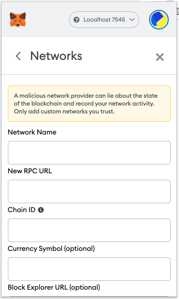

Using Metamask with Ganache
===========================

Ganache is a graphical application that runs a blockchain that can be used for
testing purposes. It runs on network ``127.0.0.1:7545``. You can find more on setting up Metamask in
`here <https://www.trufflesuite.com/docs/truffle/getting-started/truffle-with-metamask>`_.

Setting up Metamask
-------------------

To use Ganache with MetaMask, click the MetaMask icon in your browser and this screen will appear:

.. image:: ../images/metamask_create_password.png
  :width: 300

Click “Import with seed phrase”. In the box marked Wallet Seed, 
enter the Mnemonic displayed in the Ganache app. 
Enter a password below that and click "IMPORT".

.. image:: ../images/metamask_seed_phrase.png
   :width: 400

Now we need to connect MetaMask to the blockchain created by Ganache. 
Click the menu that shows "Main Network" and select Custom RPC.

.. image:: ../images/metamask_select_network.png

When you select the Custome RPC it will pop up the following form.

You can use any name you preferred as Network Name. Then set the following values in the next two boxes.

* New RPC URL - ``http://127.0.0.1:7545``
* Chain ID - ``1337``

You can leave the next two optional fields empty and click Save.

The network name at the top will switch to say your new Network Name. 
Click the cross in the top-right of the current window close out of the page and return to the Accounts page.

Now that we’ve connected MetaMask to Ganache, you will be taken to the accounts screen. 
Each account created by Ganache is given 100 ether. 
The first account should have less than the others because that account supplies the gas for smart contract deployment. 
Since you’ve deployed your smart contract to the network, this account paid for it.

Click the account icon in the upper-right to create new accounts, 
the first 10 of which will correspond to the 10 accounts displayed when you launched Ganache.

.. image:: ../images/metamask_account1.png

