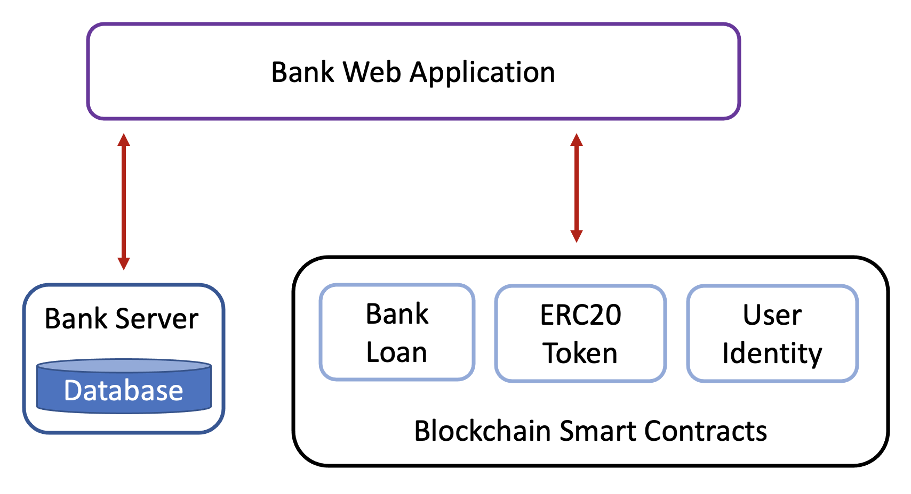

Application Overview
=====================

.. image:: ../images/tcard_microfinance.png

..

The Microfinance project is about issuing new ERC20 tokens and using them as an alternative currency type. 
The new token we introduce in this project is called ``MFT``, MicroFinance Token.
The usage scenario is for these tokens to be used by unbanked people. 
This project has 3 main user roles:

1. ``Bank``: Bank personnels responsible for ERC20 operations.
2. ``Borrower``: Unbanked people who receive tokens as loans from the Bank.
3. ``Broker``: People who connect Borrowers to the Bank.

The project has 3 main projects: 

1. Bank web application - ``bank-web-application``
2. Bank web serve application - ``bank-server``
3. Blockchain (Truffle project for smart contracts) - ``blockchain``

These projects use different software technologies to fulfill different requirements.
The applications are owned by the Bank and used by stakeholders mentioned above.
The projects depend on one another. The following architecture diagram shows the connection among them:

Layered Architecture
--------------------

Layered architecture diagram of the system.

In this system, we use 3 smart contracts deployed in a blockchain. 
The smart contracts are accessed by the Bank web app, which
communicates with the Bank web server and the blockchain.

In the following sections, we discuss how to run these projects, their software dependencies, and functionalities.

Demo Video
----------

.. raw:: html

    <iframe width="356" height="200" src="https://www.youtube.com/embed/QqRAgFk5uHw" title="YouTube video player" frameborder="0" allow="accelerometer; autoplay; clipboard-write; encrypted-media; gyroscope; picture-in-picture" allowfullscreen></iframe>

`https://youtu.be/QqRAgFk5uHw <https://youtu.be/QqRAgFk5uHw>`_

